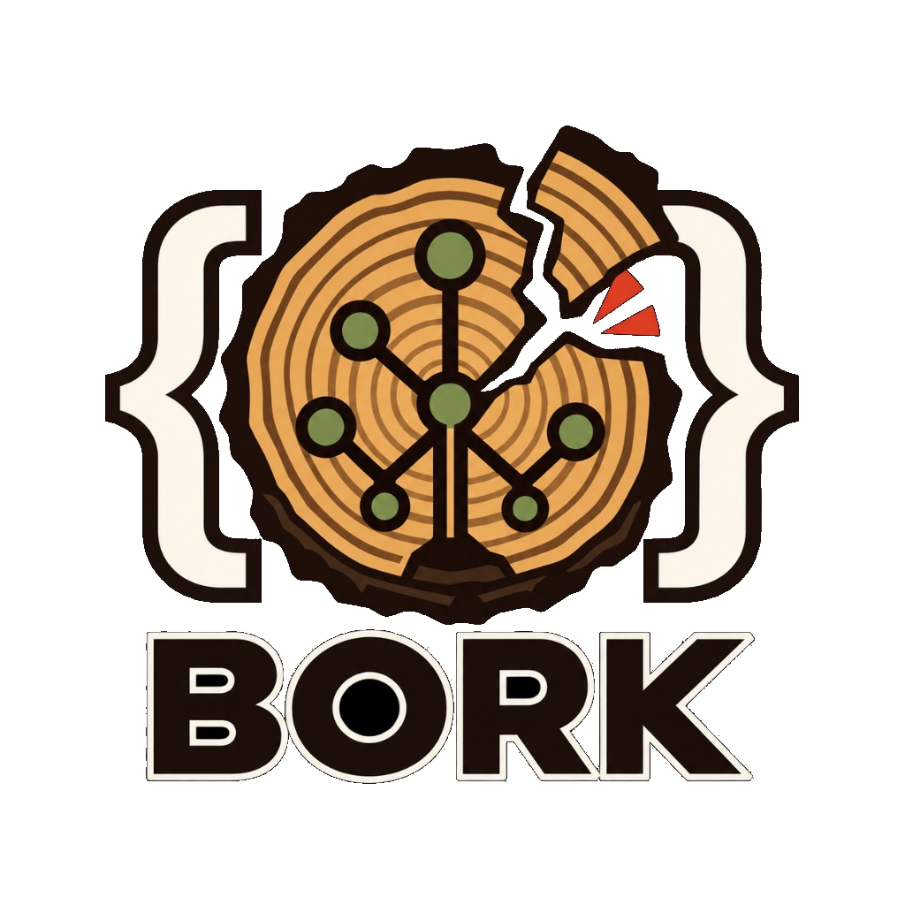

<p align="center">
  
</p>

<p align="center">
  <em>A high-performance, native systems programming language with Kotlin-like expressive syntax, region-based memory management, and zero GC. When your code is invalid... the compiler borks.</em>
</p>

---

## 🧅 Why Bork?

Bork is designed to bridge the gap between high-level developer ergonomics (clean syntax, trailing closures, expressive DSL structures) and bare-metal systems performance (zero Garbage Collector, deterministic cleanup, LLVM code generation). 

Instead of fighting complex, single-variable borrow checkers like Rust's lifetime system, Bork relies on **hierarchical memory regions (arenas)** bound directly to code blocks (`{}`). 

### Core Pillars
1. **Kotlin-Like Ergonomics:** Clean syntax, block-based structure, first-class functions, and seamless DSL-friendly trailing closures.
2. **Region-Based Memory Management:** Curly braces `{}` define memory regions. Everything allocated within a block is cleaned up in bulk when the block closes. Zero manual `free`, zero runtime GC pauses.
3. **Loop Region Resetting:** Loop iterations automatically reset their arena offset, ensuring $O(1)$ memory growth inside heavy loops.
4. **Move & Copy Semantics:** Safe cross-region data flow without pointer invalidation.
5. **Native Performance:** Compiles directly to machine code via **LLVM**, providing C/C++ level execution speeds.

---

## 🚀 Language Syntax Preview

```kotlin
// A function taking types and a closure (lambda) as its last parameter
fun action(a: Int, b: Int, block: (Int, Int) -> Int): Int {
    return block(a, b)
}

fun main() {
    // Region: main block
    {
        var accumulator = 0
        val threshold = 5
        
        // Loop block acts as a repeating sub-region
        for (i in 0..10) {
            // DSL-style closure execution (trailing lambda)
            accumulator = action(accumulator, i) { acc, current ->
                if (current > threshold) {
                    acc + current
                } else {
                    acc
                }
            }
        }
    } 
    // End of main block -> entire arena memory released instantly in bulk.
}
```

---

## Compiler CLI

Checking a program does not require LLVM or the `codegen` Cargo feature:

```bash
cargo run --bin bork -- path/to/file.bork
cargo run --bin bork -- --dump-arenas path/to/file.bork
```

`--dump-arenas` prints the compile-time arena / ownership tree (see [docs/memory-model.md](docs/memory-model.md)).

To build a native executable on Ubuntu, install LLVM 18 and `clang`:

```bash
sudo apt-get update
sudo apt-get install llvm-18-dev clang
cargo run --features codegen -- build file.bork
cargo run --features codegen -- build -o out file.bork
```

The Ubuntu packages are preferred because their dynamic `libLLVM-18` is on the
system library path. Inkwell uses its `llvm18-1-prefer-dynamic` feature because
Ubuntu does not ship the static `libPolly.a`. With a local or non-apt LLVM
installation, set `LLVM_SYS_181_PREFIX` to its LLVM 18 prefix and, if needed,
add the directory containing `libLLVM-18.so` to `LD_LIBRARY_PATH`.

The runtime archive is built automatically. Set `BORK_RUNTIME_LIB` to override
its path when invoking `bork build`, for example when using a separately built
`libbork_runtime.a`.

Run the full test suite, including the `bork_runtime` crate and the
`bork build` golden tests:

```bash
cargo test --workspace --features codegen
```

## Typecheck

`bork file.bork` runs parse, ownership, and full typecheck.
`bork build` currently supports the phase 2 codegen subset — see
`docs/superpowers/specs/2026-09-23-typed-hir-llvm-design.md`.

## Editor / LSP

Parse diagnostics are available through a stdio language server:

```bash
cargo build --bin bork-lsp
# Point your editor's LSP client at: target/debug/bork-lsp
# Language id: bork
# (requires the default `lsp` Cargo feature)
```

On document open/change the server runs `frontend::check` (parse, ownership, typecheck) and
publishes errors as squiggles. Hover shows arena + ownership for bindings. Use
**Bork: Dump Arenas** for the ASCII arena tree (same as `bork --dump-arenas`).

See [docs/memory-model.md](docs/memory-model.md) for Copy/Move and region semantics.

### Cursor

Build and install the local Cursor extension from the repository root:

```bash
cargo build --bin bork-lsp
cd tools/bork-lsp-extension
npm install --omit=dev
npx @vscode/vsce package --allow-missing-repository
cursor --install-extension bork-language-support-0.0.1.vsix --force
```

Open the repository in Cursor and edit `.bork` files. The extension starts
`target/debug/bork-lsp`; if it is missing, it falls back to `cargo run --quiet
--bin bork-lsp`.
