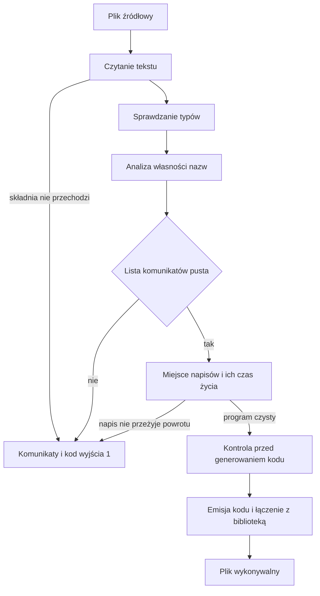

# Rozdział 12. Od pliku źródłowego do gotowego programu

Zanim kompilator wyemituje choć jedną instrukcję, musi odpowiedzieć na kilka pytań, które nie mają ze sobą nic wspólnego poza tym, że dotyczą tego samego pliku. Czy tekst w ogóle układa się w program, czy nazwy mają typy, które do siebie pasują, czy napis nie został użyty po tym, jak jego właściciel już go oddał, i czy bajty, które funkcja chce zwrócić, będą jeszcze żyły po jej powrocie. Każde z tych pytań ma własną fazę, bo pomyłka w odpowiedzi psuje inną rzecz. Zły kształt tekstu uniemożliwia w ogóle zbudowanie drzewa, zły typ psuje późniejsze wywołanie, a napis zwrócony ze zbyt krótkiego regionu psuje pamięć już w działającym procesie.

Ten rozdział obejmuje

- pytanie, na które odpowiada cały przebieg kompilacji, zanim powstanie plik wykonywalny,
- dwa polecenia wiersza poleceń i to, który fragment pracy jest im wspólny,
- trzy struktury, które kompilator niesie między fazami, oraz to, kiedy która z nich znika,
- powód, dla którego błąd własności potrafi pojawić się w wydruku przed błędem typu,
- moment, w którym program uznaje się za czysty i wolno ruszyć z tłumaczeniem na kod maszynowy.

## Po co dzielić jedno uruchomienie na fazy

Pytanie tej części dotyczy wiedzy, bez której nie wolno emitować kodu. Kompilator musi wiedzieć, zanim przetłumaczy program na kod maszynowy, co konkretnie zepsułoby się, gdyby którąś odpowiedź pominął. Bez podziału na fazy jeden błąd składni mieszałby się z błędem typu, a generator kodu próbowałby czytać drzewo, którego w ogóle nie ma. Dlatego Bork prowadzi plik przez stałą kolejność, a każda faza albo dopisuje informację, której poprzednia nie miała, albo odmawia iść dalej.

Najpierw powstaje drzewo składni, czyli struktura, która pamięta kształt tekstu, ale jeszcze nie wie, czy `n` jest liczbą, napisem czy nazwą, której wcale nie zadeklarowano. Potem sprawdzanie typów buduje drugie drzewo, reprezentację pośrednią, w której każde wyrażenie ma już typ. Równolegle w sensie danych, choć chwilę później w czasie, analiza własności buduje raport regionów. Raport nie przydziela przy tym ani jednego bajtu pamięci wykonawczej, tylko zapisuje, która nazwa jest lokalna, która została skopiowana, która jest współdzielona z zewnętrznego bloku, a która została przeniesiona. Gdy obie te fazy milczą, dochodzą jeszcze dwie decyzje o napisach. Jedna mówi, czy blok w ogóle potrzebuje własnego bufora, a druga, czy wartość, którą funkcja zwraca, przeżyje powrót. Dopiero czysty wynik wolno oddać generatorowi kodu.



Rysunek pokazuje drogę, a nie każdą strukturę po drodze. Czytanie tekstu jest jedyną fazą, po której porażce nie ma ani drzewa składni do dalszej pracy, ani raportu regionów. Wszystkie późniejsze odmowy zostawiają raport, bo analiza własności zdążyła go zbudować, nawet jeśli program i tak jest błędny. Plik wykonywalny powstaje wyłącznie na gałęzi, na której lista komunikatów została pusta i uruchomiono polecenie budowania.

## Dwa polecenia, jeden wspólny początek

Pytanie jest tu praktyczne i dotyczy dwóch poleceń, które łatwo pomylić. Chodzi o to, czym różni się samo sprawdzenie pliku od zbudowania programu i dlaczego w ogóle są to dwa polecenia, skoro początek pracy jest ten sam. Samo sprawdzenie odpowiada, czy program jest do przyjęcia. Budowanie, gdy odpowiedź jest twierdząca, tłumaczy go na plik, który da się uruchomić. Gdyby budowanie szło własną, krótszą ścieżką, program z błędem typu mógłby dojść do emisji kodu i zepsuć się dopiero w środku generatora, komunikatem Rusta zamiast komunikatem o Twoim pliku.

Polecenie `bork plik.bork` kończy się na sprawdzeniu. Kod wyjścia 0 oznacza pustą listę komunikatów, a kod 1 oznacza, że coś odrzucono. Polecenie `bork build` woła to samo sprawdzenie, a dopiero przy pustej liście przechodzi przez kontrolę konstrukcji, których generator jeszcze nie umie, przez emisję pośredniego zapisu LLVM i przez wywołanie `clang`, który łączy wynik z biblioteką wykonawczą. Flaga `--dump-arenas` dopisuje drzewo regionów na standardowe wyjście i nie zmienia kodu wyjścia. Działa przy sprawdzeniu, a przy budowaniu tylko wtedy, gdy samo sprawdzenie już przeszło, bo przy błędzie budowanie kończy się wcześniej.

Weźmy program, który dodaje liczby w pętli, wypisuje etykietę ze współdzielonego napisu i zwraca sumę. To jest ten sam plik, który w zestawie przykładów nazywa się `18-trace.bork`. Nadaje się do prześledzenia całego początku kompilacji, bo ma funkcję pomocniczą, pętlę, liczbę kopiowaną przy odczycie i napis czytany z wewnętrznego bloku. Żadna z tych konstrukcji nie jest błędem, więc widać sam opis, który kompilator buduje, gdy nie ma czego odrzucić.

**Listing 12.1.** Program, który przechodzi całe sprawdzenie

```bork
fun add(a: i32, b: i32): i32 {
    return a + b
}

fun main(): i32 {
    var total = 0
    for (i in 0..3) {
        total = add(total, i)
    }
    val label = "sum"
    {
        println(label)
    }
    return total
}
```

Sprawdzenie z wydrukiem regionów kończy się kodem 0 i pokazuje, co analiza własności zapisała, zanim ktokolwiek pomyślał o instrukcjach. Wydruk nie jest jeszcze kodem maszynowym ani nawet decyzją o tym, który blok dostanie bufor. Jest opisem nazw w funkcjach `add` i `main`, i właśnie dlatego da się go czytać razem z listingiem, nazwa po nazwie. Poniższy wycinek pochodzi z uruchomienia `bork --dump-arenas` na tym pliku i kończy się tak samo kodem 0.

```text
Arenas
├── fun add
│   ├── a [Local]
│   └── b [Local]
└── fun main
    ├── total [Local]
    ├── label [Local]
    ├── ForLoop (i)
    │   ├── i [Local]
    │   └── total [Copy]
    └── Block
        └── label [Shared ← fun main]
```

Parametry `a` i `b` są lokalne w `add`, bo funkcja ich nie wynosi na zewnątrz. `total` w pętli jest kopią, bo liczba całkowita kopiuje się przy odczycie, więc pętla może czytać ją wielokrotnie. `label` w zagnieżdżonym bloku jest współdzielony z `main`, bo wewnętrzny blok czyta napis, którego nie zadeklarował. Cały ten wydruk mówi tylko o tym, kto nazwę widzi, i nie jest jeszcze decyzją o buforze pamięci. Budowanie tego samego pliku daje program, który wypisuje `sum` i kończy się kodem 3, bo pętla `0..3` dodaje 0, 1 i 2.

> **NOTA.**
> Wydruk regionów przy udanym sprawdzeniu nie jest jeszcze opisem wygenerowanego kodu. Mówi wyłącznie o tym, jak kompilator sklasyfikował nazwy w tym przebiegu. O tym, czy blok dostanie własne wywołanie wejścia do regionu, decyduje późniejszy krok, opisany w rozdziale 16, i tylko wtedy, gdy lista komunikatów jest pusta. Dopóki w wydruku stoi samo `Shared`, nie wiesz jeszcze, czy ten blok w ogóle alokuje.

## Co zostaje, gdy program jest błędny

Pytanie brzmi, które wyniki faz wolno zachować po odmowie i dlaczego nie wolno zachować wszystkich. Generator kodu potrzebuje reprezentacji pośredniej, w której każde wyrażenie ma typ i nie ma obok listy błędów. Gdyby przy błędzie ta reprezentacja została w strukturze wyniku, późniejszy kod mógłby ją przypadkiem przetłumaczyć. Raport regionów rządzi się inną zasadą i przydaje się do wydruku nawet wtedy, gdy program jest zły, bo pokazuje, jak daleko analiza własności doszła.

Wynik jednego przebiegu, w kodzie źródłowym `CheckResult`, niesie trzy pola i nic więcej. Raport regionów jest obecny zawsze poza jedną sytuacją, mianowicie wtedy, gdy tekst w ogóle się nie sparsuje, bo wtedy nie ma drzewa, po którym analiza mogłaby przejść. Reprezentacja pośrednia jest obecna dokładnie wtedy, gdy lista komunikatów jest pusta. Lista komunikatów zbiera odmowy ze wszystkich faz, które zdążyły ruszyć. Po błędzie składni jest w niej jeden komunikat i oba drzewa są nieobecne. Po błędzie typu, własności albo czasu życia napisu raport zostaje, a reprezentacja pośrednia jest odrzucana, nawet jeśli sprawdzanie typów zdążyło ją w całości zbudować.

Widać to na pliku, który ma naraz błąd własności i błąd typu. Nazwa `s` jest przenoszona, a potem używana w dodawaniu z liczbą. Składnia jest w porządku, więc obie późniejsze fazy mają po czym przejść i każda ma powód do odmowy. Dzięki temu na jednym przebiegu widać i kolejność komunikatów, i drzewo, które zostaje mimo błędów.

**Listing 12.2.** Dwa niezależne błędy w jednym pliku

```bork
fun main() {
    var s = "hi"
    val t = move s
    val u = s + 1
}
```

Uruchomienie `bork --dump-arenas` na tym pliku kończy się kodem 1 i wypisuje obie odmowy, a pod nimi drzewo, które analiza własności zdążyła zbudować. Ścieżka w komunikacie zależy od tego, skąd uruchomiono polecenie, więc w Twoim terminalu będzie inna niż w wycinku poniżej. Treść błędów i kształt drzewa są natomiast stałe, bo wynikają z programu, a nie z katalogu. Oba komunikaty wskazują tę samą kolumnę, bo i przeniesienie, i dodawanie dotyczą tego samego odczytu `s`.

```text
/tmp/borkch/both.bork:4:13: error: ownership: use of `s` after move from fun main
/tmp/borkch/both.bork:4:13: error: type: arithmetic operands must have the same numeric type, got String and i32
Arenas
└── fun main
    ├── s [Moved ← fun main]
    ├── t [Local]
    └── u [Local]
```

Drzewo jest, choć program nie jest czysty, i właśnie dlatego łatwo je pomylić z wynikiem, na którym wolno budować. Nie ma za to reprezentacji pośredniej w wyniku, więc `bork build` nawet nie dochodzi do kontroli przed generowaniem kodu. Gdyby w tym pliku zepsuć nawias albo dokleić drugie `val` w tej samej linii bez nowego wiersza, odpadłoby także drzewo regionów, bo parsowanie zwróciłoby błąd wcześniej i reszta faz w ogóle by nie wystartowała. Różnica między tymi dwoma odmowami jest więc różnicą tego, co kompilator zdążył zapamiętać, a nie różnicą w kodzie wyjścia, bo w obu razach jest to 1.

> **OSTRZEŻENIE.**
> Pusta lista komunikatów nie oznacza, że generator kodu umie już każdą konstrukcję języka. Kontrola tuż przed emisją odrzuca między innymi wartość `None`, funkcję dopisaną na końcu wywołania i zwrot `i64` z `main`. To są odmowy fazy `codegen`, opisane w rozdziale 17, a nie dziury w sprawdzaniu typów. Program, który je zawiera, przechodzi `bork plik.bork` z kodem 0 i odpada dopiero przy `bork build`.

## Dlaczego błąd własności bywa pierwszy

Pytanie, które tu wraca z rozdziału 2, dotyczy kolejności na ekranie. Dlaczego komunikat z fazą `ownership` potrafi stać nad komunikatem z fazą `type`, skoro typy są liczone wcześniej. Kolejność na ekranie jest kolejnością składania listy, a nie kolejnością myślenia kompilatora. Gdyby wypis iść ściśle za czasem, czytelnik musiałby znać wnętrze `check`, żeby rozumieć wydruk. Wydruk jest stabilny, nawet jeśli przez to sprawia wrażenie odwróconego.

Sprawdzanie typów idzie pierwsze, bo analiza własności potrzebuje typów deklaracji w kolejności, w jakiej występują w tekście. Bierze je z wektora, który sprawdzanie typów właśnie wypełniło, i zdejmuje po jednym przy każdej deklaracji. Dlatego typ musi być już policzony, zanim analiza zdecyduje, czy nazwę wolno skopiować. Po obu przejściach lista komunikatów powstaje tak, że najpierw trafiają do niej błędy własności, a potem, na koniec, błędy typów. W listingu 12.2 widać dokładnie ten układ. Użycie `s` po przeniesieniu jest wypisane wcześniej niż skarga, że do napisu dodano liczbę, choć skarga o typie powstała w czasie wcześniej.

Jest jeszcze jeden skutek wspólnego wektora typów. Analiza własności nie zagląda do reprezentacji pośredniej. Widzi drzewo składni i kolejkę typów deklaracji. Dla zwykłych funkcji w `main` oba opisy się zgadzają i testy to pilnują. Dla parametrów funkcji dopisanej na końcu wywołania analiza nie dostaje typu, który sprawdzanie typów właśnie wyliczyło w osobnym zejściu, i zostawia typ nieznany. Rozdział 14 pokazuje, co z tego wynika dla współdzielenia, a rozdział 15 pokazuje to samo od strony typów.

## Kiedy program jest czysty

Pytanie brzmi, co jeszcze musi się udać po typach i własności, zanim wynik wolno nazwać czystym. Sam brak błędów typu i własności nie wystarcza, bo program może poprawnie przenosić nazwy i mimo to zwracać napis, którego bajty umrą razem z buforem wołanej funkcji. Taki błąd nie jest widoczny w drzewie składni, bo drzewo pamięta tylko, że w `return` stoi wywołanie. Wychodzi dopiero wtedy, gdy kompilator wie, w którym regionie wartość powstała i czy wolno ją wynieść do wywołującego.

Gdy lista po typach i własności jest pusta, dochodzą trzy rzeczy, nadal wewnątrz tego samego przebiegu. Najpierw zaznacza się, które bloki w ogóle wołają wejście do regionu przy generowaniu kodu. Potem dopisuje się przy deklaracjach informację, czy napis ma powstać od razu w buforze miejsca, do którego za chwilę zostanie przeniesiony. Na końcu każda funkcja jest sprawdzana pod kątem ucieczki, i dopiero ta trójka domyka sprawdzenie.

Wynik `concat` zwrócony wprost jest odrzucany, podobnie jak próba wyniesienia wartości z regionu zagnieżdżonego dalej, niż pozwala wynik funkcji. Jeśli któraś z tych odmów dojdzie, reprezentacja pośrednia znowu znika z wyniku, a raport regionów zostaje. Szczegóły tych trzech kroków są treścią rozdziału 16. Tutaj ważne jest tylko ich miejsce w kolejce, bo stoją za typami i własnością, a przed jakąkolwiek emisją kodu.

> **WSKAZÓWKA.**
> Gdy `--dump-arenas` pokazuje drzewo, a mimo to kod wyjścia wynosi 1, czytaj komunikat nad drzewem, zanim zaczniesz poprawiać regiony. Drzewo przy błędzie bywa kompletne i przez to wygląda wiarygodnie, ale budowanie i tak się nie zacznie. Najpierw zdejmij odmowę z fazy wypisanej w linii `error`, a dopiero potem wracaj do etykiet przy nazwach.

## Od czystego wyniku do pliku na dysku

Ostatnie pytanie tego rozdziału dotyczy już tylko polecenia `build`. Co dzieje się z czystą reprezentacją pośrednią i dlaczego sam fakt, że sprawdzenie przeszło, nie gwarantuje pliku wykonywalnego. Generator kodu zakłada, że drzewo jest typowane i że błędy języka zostały już zgłoszone. Nie umie jednak każdej konstrukcji, którą język opisuje, więc między czystym wynikiem a emisją stoi jeszcze kontrola. Bez niej nieobsłużony wariant trafiłby do dopasowania, które kończy się awarią procesu kompilatora albo, co gorsza, do ścieżki liczby całkowitej i do złego rzutowania wartości.

Kontrola ogląda kształt programu, zanim powstanie choć jedna instrukcja. Pyta między innymi, czy jest funkcja `main`, czy `main` zwraca `i32` albo nic, czy nie ma wartości `None`, funkcji dopisanej na końcu wywołania ani operatora, którego emisja jeszcze nie tłumaczy. Przy odmowie dostajesz komunikat fazy `codegen` i kod 1, bez pliku wynikowego. Przy zgodzie powstaje zapis LLVM, z niego plik obiektowy, a `clang` linkuje go z `libbork_runtime.a`. Biblioteka wykonawcza wstawia między innymi bufor regionu, wypisywanie i sprawdzenia, które przerywają proces przy dzieleniu przez zero albo przy indeksie poza tablicą. Samo wywołanie `clang` i nazwy symboli są w rozdziale 17. Z punktu widzenia tego rozdziału liczy się podział odpowiedzialności. Fazy wcześniejsze pilnują języka, a kontrola pilnuje, żeby generator nie dostał kształtu, którego jeszcze nie umie.

Na końcu zostaje mapa do kodu, bo cały ten rozdział da się streścić jednym przebiegiem. Funkcja `check` w pliku `src/frontend.rs` układa fazy w opisanej kolejności i zwraca `CheckResult`. Polecenia w `src/main.rs` albo wypisują komunikaty i ewentualnie drzewo regionów, albo, gdy wynik jest czysty, wołają budowanie. Kontrola przed emisją siedzi w `src/codegen/gate.rs`, a złożenie zapisu pośredniego z linkowaniem jest w `src/codegen/llvm/`. Czytanie tekstu, własność, typy i decyzje o napisach mają własne rozdziały dalej w tej części.

## Podsumowanie

- Kompilator odpowiada po kolei na pytania o kształt tekstu, o typy, o własność nazw i o czas życia bajtów napisu, bo każda pominięta odpowiedź psuje inny, późniejszy krok.
- Polecenia `bork plik.bork` i `bork build` zaczynają się od tego samego sprawdzenia, a plik wykonywalny powstaje tylko wtedy, gdy lista komunikatów jest pusta i kontrola przed generowaniem kodu niczego nie odrzuci.
- Raport regionów zostaje także przy błędnym programie, o ile tekst w ogóle się sparsuje, natomiast reprezentacja pośrednia jest w wyniku tylko przy pustej liście komunikatów.
- Błędy własności są wypisywane przed błędami typów, ponieważ tak składa się lista, choć typy liczy się wcześniej, żeby analiza własności mogła zdjąć typ każdej deklaracji.
- Wydruk regionów opisuje klasyfikację nazw, a nie instrukcje, i nie zastępuje kontroli, która tuż przed emisją odrzuca konstrukcje jeszcze nieprzetłumaczone na kod maszynowy.
