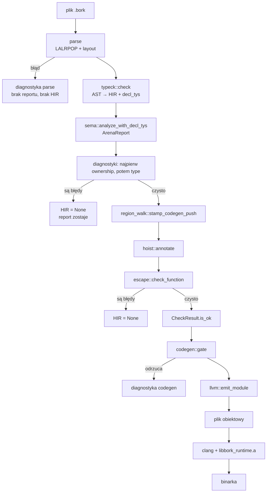
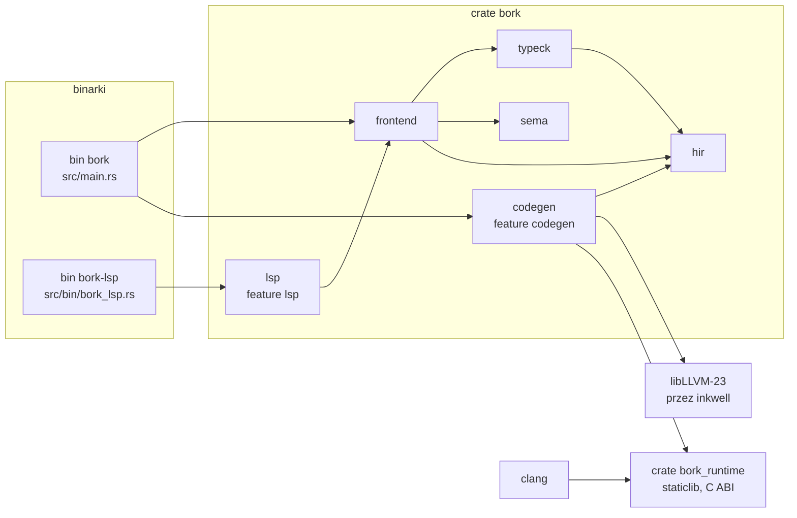

# Rozdział 12. Pipeline od źródła do binarki

## Ten rozdział obejmuje

- Kolejność faz w `frontend::check` i w `codegen::build`
- Co niesie każda struktura danych
- Dlaczego typeck jest przed semą, wbrew starszej specyfikacji
- Kiedy HIR znika, a raport aren zostaje
- Diagram crate'ów i przepływu

## Jedno przejście, dwie bramy

Kompilator nie ma interpretera i nie ma MIR. Są dwie bramy wejścia:
`bork plik.bork` kończy na `frontend::check`, `bork build` woła ten sam
check i potem, tylko przy pustych diagnostykach, bramkę HIR oraz LLVM.



Komentarz na górze `src/frontend.rs` mówi „parse -> typeck -> sema -> HIR”.
To jest skrót. Po czystym typecku i semie dochodzą stempel, hoist i escape.
HIR w `CheckResult` jest obecny **wtedy i tylko wtedy**, gdy lista
diagnostyk jest pusta po escape.

## `CheckResult`

```rust
pub struct CheckResult {
    pub report: Option<ArenaReport>,
    pub hir: Option<HirProgram>,
    pub diagnostics: Vec<Diagnostic>,
}
```

| Pole | Kiedy `Some` / niepuste |
|---|---|
| `report` | parse się udał, także przy błędach typu, własności i escape |
| `hir` | zero diagnostyk |
| `diagnostics` | zbiór ze wszystkich faz, które zdążyły pobiec |

`is_ok()` to pusty wektor, nie osobna flaga.

Kolejność w wektorze: najpierw błędy semy (`from_sema`), potem doklejone
błędy typeck. Typeck **liczył się pierwszy**, bo sema potrzebuje
`decl_tys`. Drukuje się odwrotnie. To nie jest przypadek testu, tylko
`frontend::check` linie 38–42.

## Dlaczego typeck przed semą

Starsza specyfikacja typed HIR (`docs/superpowers/specs/2026-09-23-typed-hir-llvm-design.md`)
opisuje kolejność „najpierw własność, potem typy”. Kod robi odwrotnie.
Sema czyta `Vec<hir::Ty>` w kolejności deklaracji `val`/`var` i zdejmuje
ją `pop_front` przy każdym `VarDecl`. Bez typecku nie wie, czy nazwa jest
Copy. Funkcja `sema::analyze` (używana w części testów) woła typeck
wewnętrznie jeszcze raz. Frontend używa `analyze_with_decl_tys`, żeby nie
płacić dwa razy.

Sema nie dostaje całego HIR. Dostaje AST i cienki wektor typów deklaracji.
Sygnatury wołań (`fun_sigs: HashMap<String, Vec<BindingKind>>`) buduje
sobie z AST, nie z HIR. Kind parametru (`val`/`var`) jest informacją
własności, nie tylko typem.

## Co która struktura pamięta

| Struktura | Pamięta | Nie pamięta |
|---|---|---|
| `ast::Program` | składnię, spany, rodzaje wiązań | typów wywnioskowanych, aren |
| `hir::HirProgram` | typy na wyrażeniach, `UseKind`, `alloc_in_binding` po hoiście | identyfikatorów regionów |
| `sema::ArenaReport` | drzewo regionów, własność nazw, później `codegen_push` | typów HIR w pełni (część typów spłyca się do `Unknown`) |
| moduł LLVM | instrukcje, globalne literały, deklaracje runtime | źródła; diagnostyka jest wcześniej |

Komentarz w `src/hir/mod.rs` jest normą dla reszty kompilatora: „HIR carries
no region identity. Arenas and nesting live in `sema::ArenaReport`”.
Codegen idzie po HIR i po raporcie **równocześnie**, spacerem
`region_walk`. Rozjazd liczby dzieci areny z liczbą miejsc w HIR jest
błędem wewnętrznym (`internal arena schedule mismatch`), nie błędem
użytkownika.

## `bork build` po checku

`codegen::build` (`src/codegen/mod.rs`):

1. Wymaga czystego `CheckResult`. Inaczej zwraca diagnostyki frontendu.
2. `gate(hir)` — czysto składniowy filtr na HIR.
3. `Context::create()`, `emit_module`, `write_object`.
4. `link::link_executable` woła `clang` z plikiem obiektowym i
   `libbork_runtime.a`.

Błąd linkera i brak `clang` to `BuildError::Toolchain`, kod wyjścia 2,
tekst `error: …` bez fazy. Błąd bramki to `BuildError::Diagnostics`, kod 1.

## Diagram zależności crate'ów



`bork_runtime` nie jest zależnością Cargo crate'a `bork` w sensie `use`.
`build.rs` przy feature `codegen` kompiluje go `rustc --crate-type staticlib`
do `libbork_runtime.a` i przekazuje ścieżkę przez `BORK_RUNTIME_LIB`.
Program użytkownika linkuje ten archiwum. Sam kompilator linkuje
`libLLVM-23` dynamicznie (`llvm23-1-force-dynamic`).

Feature `lsp` (domyślny) dokłada `tower-lsp`, `tokio`, `serde_json` i binarkę
`bork-lsp`. Feature `codegen` dokłada `inkwell` i `tempfile`. Da się złożyć
checker bez żadnego z nich (`--no-default-features`). Wtedy `bork build`
odmawia kodem 2.

## Czego w potoku nie ma

Nie ma osobnej reprezentacji MIR, nie ma optymalizatora poza tym, co LLVM
zrobi na module, nie ma passu inliningu domknięć (domknięcia nie dochodzą
do LLVM), nie ma monomorfizacji (nie ma generyków). Hoist jest jedyną
adnotacją middle-endu na HIR i jest lokalny.

`src/arena.rs` nie stoi na tym wykresie jako faza. To bliźniaczy model
płyty 4 KiB. Sema go nie woła. Runtime ma własną kopię stałej.

## Podsumowanie

- Check to parse, typeck, sema, potem przy braku błędów stempel, hoist i escape.
- HIR istnieje w wyniku tylko dla programu bez diagnostyk.
- Raport aren przeżywa błędy semantyczne i ginie tylko przy błędzie parsowania.
- Typeck jest przed semą, bo sema konsumuje typy deklaracji. Starsza specyfikacja opisuje odwrotność.
- HIR nie ma identyfikatorów regionów. Codegen synchronizuje HIR z raportem w `region_walk`.
- Binarka to obiekt LLVM zlinkowany z `libbork_runtime.a` przez `clang`.
