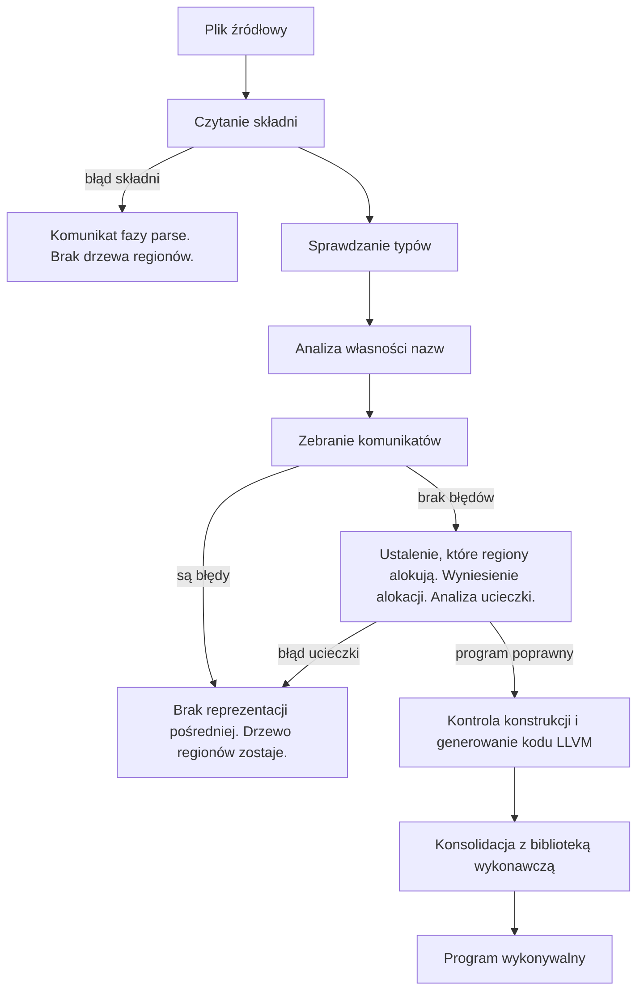
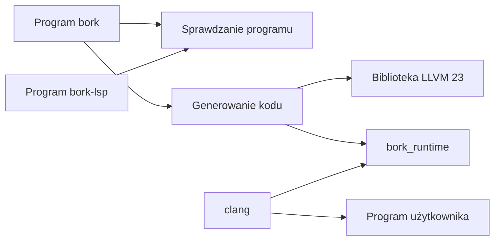

# Rozdział 12. Od pliku źródłowego do gotowego programu

## Ten rozdział obejmuje

- w jakiej kolejności kompilator sprawdza program
- co zapamiętuje każda pośrednia struktura danych
- dlaczego sprawdzanie typów wykonuje się przed analizą własności
- kiedy znika reprezentacja pośrednia, a zostaje drzewo regionów
- jak z poprawnego programu powstaje plik wykonywalny

## Dwa wejścia, jedna wspólna kontrola

Kompilator nie ma interpretera i nie ma osobnej reprezentacji maszynowej niższego poziomu niż LLVM. Są dwa wejścia. Polecenie `bork plik.bork` kończy się na sprawdzeniu. Polecenie `bork build` woła to samo sprawdzenie, a potem, tylko gdy nie ma błędów, tłumaczy program na kod.

Komentarz na początku `src/frontend.rs` streszcza kolejność pracy jako czytanie, sprawdzanie typów, analizę własności i reprezentację pośrednią. To jest skrót. Gdy nie ma błędów, dochodzą jeszcze trzy przejścia. Pierwsze oznacza, które regiony naprawdę potrzebują bufora. Drugie przenosi alokację napisu do areny zmiennej docelowej, jeśli widzi opisany wcześniej układ dwóch instrukcji. Trzecie jest analizą ucieczki. Reprezentacja pośrednia w wyniku sprawdzenia jest obecna tylko wtedy, gdy po analizie ucieczki lista błędów nadal jest pusta.

## Co zwraca sprawdzenie

Funkcja `frontend::check` zwraca strukturę `CheckResult` z trzema polami. Pole `report` to drzewo regionów i jest obecne, gdy składnia się udała, także przy błędach typów, własności i ucieczki. Pole `hir` to reprezentacja pośrednia z typami i jest obecna tylko przy pustej liście błędów, a pole `diagnostics` zbiera komunikaty.

Skrót HIR oznacza tę reprezentację pośrednią. Po angielsku high-level intermediate representation, czyli pośrednią postać programu, która ma już typy, ale nie ma jeszcze instrukcji maszynowych. Dalej piszę o niej jako o reprezentacji pośredniej, a skrót HIR zostawiam przy nazwach typów w kodzie Rusta, bo tak nazywają się struktury `HirProgram` i `HirExpr`.

Kolejność w liście komunikatów jest odwrotna do kolejności pracy. Najpierw dopisywane są błędy analizy własności, potem błędy typów. Sprawdzanie typów wykonało się wcześniej, bo analiza własności potrzebuje typów deklaracji. Wypis idzie w drugą stronę. Robią to linie 38–42 w `src/frontend.rs`.

## Dlaczego typy są przed własnością

Starsza notatka projektowa opisuje kolejność odwrotną, najpierw własność, potem typy. Kod robi inaczej. Analiza własności czyta wektor typów w kolejności deklaracji `val` i `var`. Przy każdej deklaracji zdejmuje kolejny typ. Bez wcześniejszego sprawdzenia typów nie wie, czy nazwa jest kopiowana. Funkcja `sema::analyze`, używana w części testów, uruchamia sprawdzanie typów wewnętrznie jeszcze raz. Ścieżka `frontend::check` używa `analyze_with_decl_tys`, żeby nie płacić dwa razy.

Analiza własności nie dostaje całej reprezentacji pośredniej. Dostaje drzewo składni i cienki wektor typów deklaracji. Sygnatury wywołań buduje sobie z drzewa składni. Informacja, czy parametr jest stały, czy zmienny, jest informacją o własności, nie tylko o typie.

## Co która struktura pamięta

Drzewo składni pamięta kształt zapisu, pozycje w pliku i to, czy nazwa jest stała. Nie pamięta typów wywnioskowanych ani regionów. Reprezentacja pośrednia pamięta typ przy każdym wyrażeniu, sposób użycia nazwy oraz, po wyniesieniu alokacji, nazwę zmiennej, w której arenę mają trafić bajty. Nie pamięta numeru regionu. Drzewo regionów pamięta zagnieżdżenie, własność nazw i później znacznik, czy region dostanie bufor w czasie działania. Nie pamięta pełnych typów reprezentacji pośredniej. Część typów spłaszcza do typu nieznanego. Moduł LLVM pamięta instrukcje i stałe literały. Nie pamięta już tekstu źródłowego. Komunikaty powstają wcześniej.

Komentarz w `src/hir/mod.rs` jest normą dla reszty kompilatora: reprezentacja pośrednia nie niesie tożsamości regionu, bo regiony żyją w drzewie z analizy własności. Generator kodu idzie po obu strukturach równocześnie, wspólnym przejściem po drzewie regionów, czyli funkcją `region_walk`. Gdy liczba dzieci w drzewie regionów nie zgadza się z liczbą miejsc w reprezentacji pośredniej, budowanie kończy się błędem wewnętrznym o niezgodności harmonogramu regionów. To nie jest błąd, który programista Borka popełnił w składni, tylko błąd zgodności dwóch przejść kompilatora.

## Co dzieje się przy budowaniu

Funkcja `codegen::build` w `src/codegen/mod.rs` wymaga czystego wyniku sprawdzenia. W przeciwnym razie zwraca komunikaty wcześniejszych faz. Potem funkcja `gate`, czyli kontrola przed generowaniem kodu, odrzuca konstrukcje spoza obsługiwanego zestawu. Następnie powstaje kontekst LLVM, moduł i plik obiektowy. Na końcu `link::link_executable` woła `clang` z plikiem obiektowym i z archiwum `libbork_runtime.a`.

Błąd konsolidacji i brak `clang` są błędem narzędzia. Kod wyjścia wynosi dwa, a tekst zaczyna się od `error:` bez fazy. Błąd funkcji `gate` jest błędem programu fazy `codegen` i ma kod jeden.

## Jak podzielony jest projekt

`bork_runtime` nie jest zwykłą zależnością, którą kod Rusta importuje słowem `use`. W Cargo jednostka kompilacji nazywa się skrzynką, po angielsku crate. Plik `build.rs`, przy opcji `codegen`, kompiluje skrzynkę `bork_runtime` jako bibliotekę statyczną i przekazuje ścieżkę przez zmienną `BORK_RUNTIME_LIB`. Program użytkownika jest z nią konsolidowany. Sam kompilator ładuje `libLLVM` dynamicznie.

Opcja `lsp` jest domyślna. Dokłada biblioteki serwera językowego i program `bork-lsp`. Opcja `codegen` dokłada Inkwell, czyli bibliotekę Rusta, przez którą kompilator woła LLVM. Da się złożyć sam program sprawdzający, bez żadnej z tych opcji. Wtedy `bork build` odmawia pracy kodem dwa.

## Czego w tej kolejności pracy nie ma

Nie ma osobnego optymalizatora poza tym, co LLVM zrobi z gotowym modułem. Nie ma wklejania funkcji dopisanych na końcu wywołania, bo te funkcje nie dochodzą do LLVM. Nie ma osobnych kopii funkcji dla różnych typów, bo nie ma typów ogólnych. Jedyną adnotacją dokładaną do reprezentacji pośredniej po sprawdzeniu typów jest nazwa zmiennej, w której arenie mają powstać bajty napisu. Jest lokalna i dotyczy dwóch sąsiednich instrukcji.

Plik `src/arena.rs` nie jest jedną z faz tej kolejności. To model bufora o pojemności 4096 bajtów. Analiza własności go nie woła. Biblioteka wykonawcza ma własną kopię stałej pojemności.

## Podsumowanie

- Sprawdzenie czyta składnię, sprawdza typy, analizuje własność, a przy braku błędów ustala bufory regionów, wynosi alokację i sprawdza ucieczkę.
- Reprezentacja pośrednia zostaje w wyniku tylko dla programu bez komunikatów.
- Drzewo regionów przeżywa błędy znaczenia i znika tylko przy błędzie składni.
- Sprawdzanie typów jest przed analizą własności, bo ta druga potrzebuje typów deklaracji. Starsza notatka projektowa opisuje kolejność odwrotną.
- Reprezentacja pośrednia nie ma numerów regionów. Generator kodu uzgadnia ją z drzewem regionów wspólnym przejściem `region_walk`.
- Plik wykonywalny jest obiektem LLVM skonsolidowanym z `libbork_runtime.a` przez `clang`.
