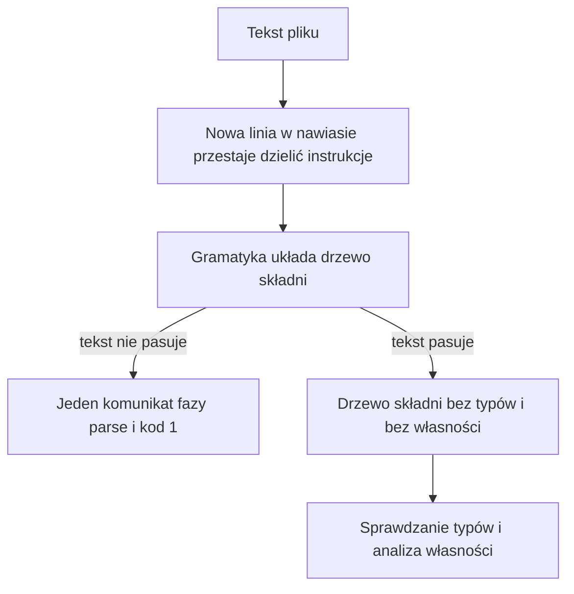

# Rozdział 13. Jak kompilator czyta tekst programu

Generator kodu nie umie czytać znaków. Potrzebuje drzewa, w którym wiadomo, co jest deklaracją, co wywołaniem, a co ciałem pętli, i w którym każde takie miejsce pamięta, w którym bajcie pliku stało. Dopóki tego drzewa nie ma, nie da się zapytać ani o typ nazwy, ani o to, czy napis został przeniesiony. Dlatego pierwsza faza nie tłumaczy programu, tylko rozstrzyga, czy tekst w ogóle jest programem.

Ten rozdział obejmuje

- pytanie, na które odpowiada czytanie tekstu, i co odpada, gdy tekst nie składa się w drzewo,
- powód, dla którego nowa linia kończy instrukcję, ale wewnątrz nawiasów już nie,
- to, co drzewo składni pamięta, oraz to, czego jeszcze świadomie nie wie,
- dwa rodzaje odmowy, z których jedna wskazuje winny symbol, a druga koniec pliku,
- miejsce w źródłach, w którym ta faza się zaczyna i kończy.

## Po co w ogóle budować drzewo

Pytanie tej fazy brzmi, czy ciąg znaków da się odczytać jako program Borka, i które fragmenty są instrukcjami, wyrażeniami oraz deklaracjami. Bez odpowiedzi generator nie ma po czym chodzić, a sprawdzanie typów nie ma czego typować. Gorzej, bo błąd w nawiasie wyglądałby wtedy jak błąd typu albo jak awaria w środku emisji kodu, choć program w ogóle nie powstał. Osobna faza czytania odcina te pomyłki, zanim ktokolwiek zacznie mówić o własności albo o buforze.

Drzewo, które z tego powstaje, nazywa się drzewem składni. W źródłach kompilatora jego typ to `Program` z pliku `src/ast.rs`, ale w tym rozdziale ważniejsze jest to, co ono reprezentuje. Każdy węzeł odpowiada kawałkowi tekstu, a nie kawałkowi pamięci wykonawczej. Węzeł deklaracji pamięta, czy nazwa była `val`, czy `var`, czy podano typ, i jakie wyrażenie stoi po prawej stronie. Węzeł wyrażenia pamięta, czy to literał, nazwa, wywołanie, dodawanie albo przeniesienie zapisane słowem `move`. Nie pamięta, czy ta nazwa jest liczbą, ani czy wolno ją skopiować. To są pytania późniejszych faz, i drzewo zostawia je puste celowo, żeby błąd składni nie udawał błędu typu.



Rysunek podkreśla jedną rzecz, którą łatwo przegapić przy czytaniu komunikatu. Między plikiem a gramatyką jest jeszcze ciche przygotowanie tekstu, opisane w następnej części, i ono nie produkuje własnego komunikatu. Albo gramatyka dostaje tekst, w którym nowa linia w nawiasie już nie kończy instrukcji, albo, gdy coś nie pasuje, cały przebieg kończy się jednym błędem fazy `parse`. Rozdział 12 mówił, że przy tej odmowie nie powstaje raport regionów, i tutaj widać powód. Nie ma drzewa, po którym analiza mogłaby przejść, więc nie ma też czego wypisać pod flagą `--dump-arenas`.

## Dlaczego nowa linia raz dzieli instrukcję, a raz nie

Pytanie brzmi, jak kompilator ma pogodzić dwie rzeczy, których programiści oczekują naraz. Nowa linia w Borku kończy instrukcję, więc nie trzeba średnika, ale wywołanie albo warunek musi dać się złamać między argumentami, tak jak w Kotlinie. Gdyby nowa linia zawsze kończyła instrukcję, zapis `add(` i w następnym wierszu `1, 2)` byłby urwanym wywołaniem. Gdyby nowa linia nigdy jej nie kończyła, dwie deklaracje w kolejnych wierszach skleiłyby się w jedną i błąd wychodziłby dużo później, w typach albo w ogóle w złym drzewie.

Rozwiązanie jest lokalne i dzieje się, zanim gramatyka w ogóle ruszy. Nowa linia, która stoi bezpośrednio w nawiasach okrągłych, jest zamieniana na powrót karetki, czyli na znak, który lekser i tak traktuje jak biały znak bez znaczenia. Nowa linia poza nawiasami zostaje i dalej oddziela instrukcje. Jeśli w nawiasie otworzysz nawias klamrowy, czyli blok, nowe linie wewnątrz tego bloku zostają, bo tam znowu oddzielają instrukcje. Komentarz do końca linii oraz literał napisu są przy tym omijane, żeby nawias w komentarzu albo w tekście `"a(b"` nie zmieniał układu reszty pliku. Zamiana jest bajt za bajt, więc pozycja błędu w komunikacie nadal wskazuje oryginalny plik, a nie przerobioną kopię.

Widać to na funkcji, która łamie argumenty między wierszami. Plik przechodzi sprawdzenie z kodem 0, choć między `add(` a `1` stoi nowa linia. Gdyby ta nowa linia kończyła instrukcję, `val n = add(` zostałoby urwane i kompilator nie doszedłby do liczb w kolejnych wierszach. To, że kod wyjścia jest 0, znaczy właśnie, że przygotowanie tekstu zdążyło potraktować te złamania jak biały znak.

**Listing 13.1.** Wywołanie złamane wewnątrz nawiasów

```bork
fun main(): i32 {
    val n = add(
        1,
        2
    )
    return n
}
fun add(a: i32, b: i32): i32 {
    return a + b
}
```

Ta sama nowa linia postawiona poza nawiasem już dzieli instrukcje, i o to chodzi. Dwie deklaracje w jednym wierszu, bez nowej linii między nimi, nie mają czym się rozdzielić, więc gramatyka odmawia. To jest odwrotna strona tej samej reguły, a nie osobny wyjątek dopisany do średników, których w Borku nie ma. Poniższy plik jest krótki celowo, żeby w komunikacie było widać sam symbol, na którym czytanie stanęło.

**Listing 13.2.** Dwie deklaracje w jednym wierszu

```bork
fun main() { val a = 1 val b = 2 }
```

```text
/tmp/borkch/oneline.bork:1:24: error: parse: unexpected token `val`; expected "!!", "!=", "&&", "(", "*", "+", "-", ".", "..", "/", "<", "<=", "==", ">", ">=", "?.", "?:", "[", "||", "}", "NL"
```

Komunikat wskazuje drugie `val`, bo po prawej stronie pierwszej deklaracji gramatyka skończyła wyrażenie i spodziewała się albo operatora, albo końca instrukcji. Lista oczekiwanych symboli w tym przebiegu jest długa i nie warto jej tu przepisywać. Ważne jest, że stoi w niej także `NL`, czyli właśnie nowa linia, która w tym miejscu rozdzieliłaby dwie deklaracje. Reszta listy to operatory i nawiasy, którymi wyrażenie mogłoby być kontynuowane. Pełny zestaw symboli bierze się z gramatyki w `src/parser.lalrpop`, a nie z ręcznie pisanej listy komunikatów.

> **NOTA.**
> Przygotowanie tekstu nie jest fazą, którą da się włączyć albo wyłączyć flagą. Każde wywołanie `parse` najpierw poprawia nowe linie w nawiasach, a dopiero potem uruchamia gramatykę. Gdy nic w pliku nie wymaga zamiany, do gramatyki idzie oryginalny tekst, i pozycje błędów i tak pozostają zgodne z tym, co widać w edytorze.

## Czego drzewo jeszcze nie wie

Pytanie, które tu zostaje po udanym czytaniu, dotyczy granicy tej fazy. Skoro drzewo już jest, dlaczego kompilator nie próbuje od razu powiedzieć, że `n` jest liczbą albo że napis trzeba przenieść. Dlatego, że kształt i znaczenie to dwa różne pytania, a mieszanie ich w gramatyce psuje komunikaty. Gramatyka miałaby wtedy odrzucać program raz za brakujący nawias, a raz za zły typ, tym samym mechanizmem, i nie byłoby fazy `parse` odróżnionej od fazy `type`.

Drzewo pamięta więc kształt i zakres w pliku. Literał `1` jest węzłem liczby, a nie jeszcze wartością typu `i32`, choć później sprawdzanie typów zwykle właśnie tak go odczyta. Nazwa jest węzłem nazwy, nawet jeśli tej nazwy nigdzie nie zadeklarowano. Słowo `move` przed nazwą jest osobnym kształtem wyrażenia, a nie od razu decyzją, że własność przeszła. Promocja zapisana w tekście też zostaje kształtem, dopóki późniejsza faza nie zdecyduje, co z nią zrobić. Funkcja dopisana na końcu wywołania, w nawiasach klamrowych po argumentach, jest w drzewie zwykłym argumentem tego wywołania. O tym, że generator kodu jej jeszcze nie emituje, drzewo nic nie wie i wiedzieć nie powinno.

Pozostałe kształty, których gramatyka się podejmuje, działają tak samo. Pętla `for`, pętla `while`, instrukcja `if`, blok, indeks tablicy i wywołanie są węzłami z dziećmi, a nie gotowymi instrukcjami maszynowymi. Nie ma sensu wyliczać tu każdej produkcji. Wystarczy wiedzieć, że jeśli tekst przeszedł, każdy z tych węzłów ma zakres, a jeśli nie przeszedł, nie ma żadnego z nich. Lista produkcji jest gramatyką w `src/parser.lalrpop`, a struktury węzłów są w `src/ast.rs`.

> **WSKAZÓWKA.**
> Gdy komunikat ma fazę `parse`, nie szukaj błędu w typach ani w `move`, nawet jeśli tekst wygląda sensownie. Najpierw sprawdź, czy instrukcje są rozdzielone nową linią i czy nawiasy się domykają. Dopiero plik, który przechodzi czytanie, warto oddać analizie własności.

## Dwa sposoby, w jakie czytanie odmawia

Pytanie brzmi, dlaczego jeden błąd składni wskazuje konkretny symbol, a inny potrafi wskazać sam koniec pliku. Oba kończą przebieg, bo przy błędzie czytania nie startują typy ani własność, ale powstają inaczej i inaczej pokazują miejsce. Gdyby wszystkie odmowy wyglądały tak samo, dałoby się ufać kolumnie w każdej linii `parse`. Tak nie jest, i warto to zobaczyć na przykładzie, zanim zaczniesz poprawiać plik według numeru linii.

Pierwszy sposób to odmowa gramatyki na nieznanym symbolu albo na nieoczekiwanym końcu pliku, i listing 13.2 jest właśnie tego rodzaju. Pozycja `1:24` obejmuje token `val`, którego w tym miejscu nie dało się wstawić, a treść mówi, czego gramatyka się spodziewała. Podobnie zachowuje się urwane wyrażenie, na przykład niedomknięty nawias. Komunikat zostaje jeden, fazy `ownership` i `type` nie dochodzą, i `--dump-arenas` nie ma czego wypisać poza tą jedną linią błędu, bo raportu regionów nie ma.

Drugi sposób dotyczy kształtu, który da się sparsować jako wyrażenie, ale nie jako cel przypisania. Po lewej stronie `=` musi stać nazwa albo nazwa z indeksem. Liczba, wywołanie albo inne wyrażenie jest składniowo wyrażeniem, więc gramatyka je czyta, a potem świadomie podnosi błąd. Ten błąd jest dopięty do końca pliku, a nie do złej lewej strony, bo tak skonstruowane jest zgłoszenie w gramatyce. W przebiegu poniżej plik ma trzy wiersze, a komunikat wskazuje wiersz 4 i kolumnę 1, czyli miejsce tuż za ostatnim znakiem.

**Listing 13.3.** Przypisanie, którego lewa strona nie jest nazwą

```bork
fun main() {
    1 = 2
}
```

```text
/tmp/borkch/badassign.bork:4:1: error: parse: assignment target must be a name or name[index]
```

Treść mówi, co jest nie tak, i tej treści warto zaufać. Numerowi wiersza w tym jednym rodzaju błędu ufać nie należy, bo nie wskazuje `1`. To ograniczenie sposobu, w jaki błąd użytkownika gramatyki jest dziś zamieniany na diagnostykę, a nie reguła języka, która zabraniałaby liczb po lewej stronie gdzie indziej niż na końcu pliku. Inne odmowy czytania, te od nieznanego symbolu, wskazują sam symbol, tak jak w listingu 13.2.

> **OSTRZEŻENIE.**
> Błąd czytania jest w jednym przebiegu zawsze tylko jeden. Kompilator nie próbuje dojść do następnej instrukcji i zebrać kolejnych pomyłek składni, więc plik z dwoma urwanymi nawiasami pokaże tylko pierwszą. Poprawka pierwszej odmowy potrafi odsłonić następną, i to nie znaczy, że kompilator zmienił zdanie o reszcie programu.

Na końcu mapa, zgodnie z tym, że nazwy funkcji nie zastępują opisu. Wejście fazy to `parse` w `src/lib.rs`. Zamiana nowej linii w nawiasie na powrót karetki jest w `normalize_parenthesized_newlines` w `src/layout.rs`. Gramatyka, łącznie z odmową dla złej lewej strony przypisania, jest w `src/parser.lalrpop`. Drzewo, które przy sukcesie dostają sprawdzanie typów i analiza własności, jest zdefiniowane w `src/ast.rs`.

## Podsumowanie

- Czytanie tekstu odpowiada na pytanie, czy plik da się ułożyć w drzewo składni, bo bez tego drzewa późniejsze fazy nie mają czego sprawdzać i nie powinny udawać, że program istnieje.
- Nowa linia kończy instrukcję, natomiast nowa linia bezpośrednio w nawiasach okrągłych jest przed gramatyką zamieniana na biały znak, żeby wywołanie dało się złamać między argumentami bez zmiany pozycji błędów.
- Drzewo pamięta kształt i zakres w pliku, a nie typ nazwy ani to, czy nazwę wolno skopiować, i tę niewiedzę zostawia świadomie kolejnym fazom.
- Nieznany symbol jest wskazywany w miejscu, w którym stoi, a błąd lewej strony przypisania jest dziś dopięty do końca pliku, więc przy tej jednej odmowie liczy się treść komunikatu.
- Jedna odmowa czytania kończy przebieg, bez raportu regionów i bez reprezentacji pośredniej, zgodnie z kolejnością opisaną w rozdziale 12.
