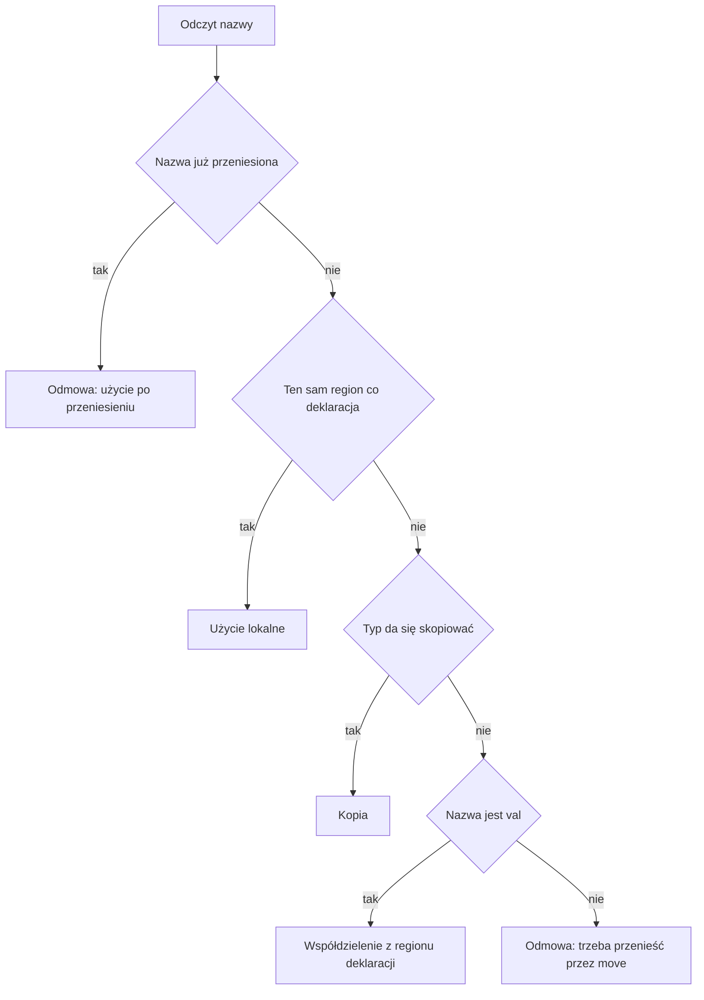

# Rozdział 14. Jak kompilator sprawdza własność nazw

Liczbę całkowitą wolno przeczytać wiele razy, bo odczyt nic nie zabiera. Napis albo tablica tak się nie zachowują. Ich bajty mają jednego właściciela, i drugi odczyt albo musi być jawnym przeniesieniem, albo, w przypadku niezmiennej nazwy czytanej z zewnętrznego bloku, świadomym współdzieleniem. Gdyby kompilator pominął to rozróżnienie, generator kodu albo skopiowałby deskryptor napisu w dwa miejsca, które oba uważają się za właściciela, albo pozwoliłby użyć nazwy, która już nic nie trzyma.

Ten rozdział obejmuje

- pytanie, na które odpowiada analiza własności, i co psuje się w programie, gdy odpowiedzi brakuje,
- cztery odpowiedzi, które kompilator może dać o odczycie nazwy, oraz kiedy która obowiązuje,
- zakaz przenoszenia nazwy z zewnątrz pętli do jej wnętrza,
- to, jak instrukcja `if` scala ślady przeniesienia z obu gałęzi,
- miejsce w źródłach, do którego warto zajrzeć po przeczytaniu reguł, a nie zamiast nich.

## Po co w ogóle pytać, kto nazwę posiada

Pytanie tej fazy brzmi, co wolno zrobić z nazwą w miejscu, w którym tekst jej używa. Wolno ją przeczytać na miejscu, wolno skopiować, wolno współdzielić z bloku, który ją zadeklarował, albo trzeba ją przenieść, a po przeniesieniu już nie wolno jej tknąć. Bez tej odpowiedzi późniejszy kod nie wie, czy odczyt `s` jest nieszkodliwy, czy właśnie oddaje jedyne prawo do bajtów. Sprawdzanie typów tego nie rozstrzyga, bo napis i liczba potrafią mieć poprawny typ w wyrażeniu, które i tak łamie własność.

Analiza nie przydziela pamięci i nie woła funkcji wykonawczych. Buduje raport regionów, czyli drzewo, którego korzeniami są funkcje, a dziećmi bloki, pętle i gałęzie warunku. Przy nazwie zapisuje, jak została użyta. Region w tym raporcie nie jest buforem o stałej pojemności. Bufor, jeśli w ogóle powstanie, jest decyzją późniejszą, opisaną w rozdziale 16. Tutaj region jest tylko zakresem, w którym nazwa została zadeklarowana albo odczytana, i etykietą, którą zobaczysz w wydruku, na przykład `fun main` albo `Block`.



Rysunek jest całą polityką odczytu, skróconą do pytań, które naprawdę zmieniają wynik. Kopiują się nienullowalne typy pierwotne, takie jak `i32`, `i64`, `f64` i `bool`. Napis, tablica i typ z pytajnikiem się nie kopiują. Typ, którego ta analiza nie dostała z kolejki typów deklaracji, też nie jest traktowany jak kopia, nawet jeśli sprawdzanie typów w swoim drzewie widzi liczbę. Ten rozjazd dotyczy parametrów funkcji dopisanej na końcu wywołania i wraca w rozdziale 15. W zwykłym `main`, przy deklaracjach z kolejki, oba opisy się zgadzają.

## Cztery odpowiedzi i jeden ślad w wydruku

Pytanie, które tu warto rozebrać na przykładzie, brzmi, jak te cztery odpowiedzi wyglądają w programie, a nie w diagramie. Weźmy najpierw odczyt, który jest legalny, bo niezmienny napis z `main` jest tylko czytany w bloku wewnętrznym. To jest plik `10-shared.bork` z zestawu przykładów. Sprawdzenie kończy się kodem 0, a wydruk pokazuje współdzielenie, nie przeniesienie.

**Listing 14.1.** Niezmienny napis czytany w bloku wewnętrznym

```bork
fun main() {
    val s = "x"
    {
        println(s)
    }
}
```

```text
Arenas
└── fun main
    ├── s [Local]
    └── Block
        └── s [Shared ← fun main]
```

`Local` przy deklaracji znaczy, że w swoim regionie nazwa jest zwykłym właścicielem. `Shared` przy odczycie w bloku znaczy, że blok nie przejął bajtów, tylko czyta nazwę zadeklarowaną w `fun main`. `println` jest funkcją wbudowaną i ten odczyt przez współdzielenie przyjmuje. Gdyby `s` było `var`, a nie `val`, ten sam tekst zostałby odrzucony, bo zmienna nazwa, która nie jest kopią, nie wchodzi do obcego regionu bez `move`.

**Listing 14.2.** Zmienna nazwa użyta w bloku bez przeniesienia

```bork
fun main() {
    var s = "hi"
    {
        val t = s
    }
}
```

```text
/tmp/borkch/needmove.bork:4:17: error: ownership: `s` is not Copy; move it into `Block` with `move`
Arenas
└── fun main
    ├── s [Local]
    └── Block
        └── t [Local]
```

Komunikat mówi wprost, co zrobić. Trzeba napisać `val t = move s`, i wtedy własność przechodzi do `t`, a `s` jest od tej pory zużyte. Drugi odczyt `s` po takim przeniesieniu dostaje osobną odmowę, tę o użyciu po przeniesieniu, którą listing 12.2 już pokazał na dodawaniu. Wydruk przy błędzie i tak powstaje, bo tekst się sparsuje. Nie wolno go czytać jako zgody na budowanie. Kod wyjścia jest 1, a reprezentacji pośredniej w wyniku nie ma.

Pozostałe odmowy odczytu działają według tego samego rysunku. Użycie nazwy, której nie zadeklarowano, jest błędem własności o nieznanej nazwie. Przeniesienie nazwy, która już została przeniesiona, mówi, skąd poszło pierwsze przeniesienie. Pełna lista komunikatów jest w `classify_use` i w funkcjach obok, w pliku `src/sema/policy.rs`, i nie wnosi nowych pytań ponad te z rysunku.

> **NOTA.**
> Słowo region w tym rozdziale znaczy węzeł raportu, a nie bufor wykonawczy o pojemności 4096 bajtów. Ten drugi byt też bywa w kodzie nazywany areną i jest opisany przy bibliotece wykonawczej. Wydruk `--dump-arenas` pokazuje węzły raportu, czyli zakresy nazw, a nie zawartość bufora.

## Dlaczego pętla nie może przejąć nazwy z zewnątrz

Pytanie brzmi, co złego jest w przeniesieniu, które w pojedynczym bloku byłoby legalne, gdy to przeniesienie stoi w pętli. Pętla wykonuje ciało wiele razy, więc przeniesienie, które wygląda niewinnie w jednym obrocie, powtórzy się w następnym. Pierwszy obrót oddałby własność, a drugi próbowałby oddać ją jeszcze raz, z nazwy, która już nic nie trzyma. Kompilator nie czeka na drugi obrót w działającym programie. Widzi przeniesienie nazwy zadeklarowanej poza pętlą i odmawia od razu, bo żaden poprawny przebieg wielokrotny nie istnieje.

**Listing 14.3.** Przeniesienie nazwy zewnętrznej w pętli

```bork
fun main() {
    var s = "hi"
    for (i in 0..2) {
        val t = move s
    }
}
```

```text
/tmp/borkch/loopmove.bork:4:22: error: ownership: cannot move `s` inside a loop: it would already be moved on later iterations
Arenas
└── fun main
    ├── s [Local]
    └── ForLoop (i)
        ├── i [Local]
        └── t [Local]
```

`i` jest lokalne w pętli i jest kopią, gdyby je odczytać w zagnieżdżonym bloku, bo zakres liczbowy daje wartości kopiowalne. Zakaz dotyczy `s`, które pochodzi z `main`. To samo tyczy się pętli `while`. Nazwę zadeklarowaną w samym ciele pętli wolno w tym ciele przenosić, bo każdy obrót tworzy ją od nowa. Wydruk powyżej pokazuje `t` jako lokalne właśnie dlatego, że deklaracja stoi w pętli. Odmowa dotyczy źródła przeniesienia, nie celu.

> **OSTRZEŻENIE.**
> Zakaz nie zależy od tego, ile razy pętla naprawdę się wykona. Nie obchodzi go warunek, który w praktyce wykonałby się raz, ani `break` po pierwszym przeniesieniu. Analiza nie próbuje udowodnić, że pętla kręci się najwyżej jeden raz, i każdy `move` nazwy z zewnątrz w `for` albo w `while` jest odrzucany.

## Jak warunek scala dwa ślady przeniesienia

Pytanie brzmi, co kompilator ma powiedzieć o nazwie po instrukcji `if`, skoro jedna gałąź mogła ją przenieść, a druga nie. Gdyby uznać nazwę za zużytą już po jednej gałęzi, legalny program, w którym druga gałąź nazwę zostawia, też zostałby odrzucony. Gdyby nigdy nie uznawać jej za zużytą, program, który przenosi ją w obu gałęziach, a potem używa za warunkiem, przeszedłby sprawdzenie i zepsuł się dopiero w ruchu. Analiza uznaje nazwę za zużytą dopiero wtedy, gdy nie ma gałęzi, która by ją zachowała. Po `if` z `else` nazwa jest zużyta wtedy, gdy była zużyta już przed warunkiem albo gdy przeniosły ją obie gałęzie.

Dlatego przeniesienie w obu gałęziach, a potem kolejne przeniesienie za warunkiem, jest odrzucane. W przebiegu poniżej komunikat mówi, że `s` zostało już przeniesione z `fun main`. Plik jest krótki, żeby widać było samą regułę scalania, bez drugiego, niezależnego błędu w gałęzi. Druga gałąź też używa `move`, więc po warunku nie zostaje żadna ścieżka, na której `s` jeszcze żyje.

**Listing 14.4.** Przeniesienie w obu gałęziach

```bork
fun main() {
    var s = "hi"
    if (1 > 0) {
        val t = move s
    } else {
        val u = move s
    }
    val v = move s
}
```

```text
/tmp/borkch/ifboth2.bork:8:18: error: ownership: cannot move `s`: already moved from fun main
```

Przeniesienie tylko w jednej gałęzi, przy nieszkodliwej drugiej, nie zostawia nazwy zużytej za warunkiem, i kolejne `move` po takim `if` przechodzi sprawdzenie. Instrukcja `if` bez `else` jest jeszcze ostrożniejsza w drugą stronę. Ślad przeniesienia z samej gałęzi nie jest przenoszony do kodu za warunkiem, więc nazwa po jednostronnym `if` zostaje w stanie sprzed tej instrukcji. To jest reguła scalania, a nie pozwolenie, żeby w gałęzi użyć nazwy już wcześniej przeniesionej. Jeśli nazwa była zużyta, zanim warunek się zaczął, po warunku też jest zużyta.

Na końcu zostaje mapa do kodu, już po regułach, a nie zamiast nich. Wejście analizy to `analyze_with_decl_tys` w `src/sema/analyze.rs`, wołane z `check` po sprawdzeniu typów, bo potrzebuje kolejki typów deklaracji. Cztery odpowiedzi o odczycie liczy `classify_use` w `src/sema/policy.rs`. Scalanie śladu po `if` jest w `apply_moved_merge` w `src/sema/env.rs`. Zagnieżdżony blok, w którym jedyną instrukcją jest kolejny blok, jest spłaszczany przez `peel_blocks` w `src/sema/mod.rs`, żeby puste owinięcie klamrami nie tworzyło osobnego regionu. Wydruk, który widziałeś w listingach, składa `src/dump.rs`.

## Podsumowanie

- Analiza własności odpowiada, czy odczyt nazwy jest lokalny, jest kopią, jest współdzieleniem, czy wymaga przeniesienia, bo bez tego generator nie wie, kto trzyma bajty napisu.
- Kopiują się nienullowalne typy pierwotne, a napis, tablica i typ z pytajnikiem wymagają albo współdzielenia niezmiennej nazwy, albo jawnego `move`.
- Po przeniesieniu nazwy drugi odczyt jest odrzucany, a przeniesienie nazwy zadeklarowanej poza pętlą jest odrzucane od razu, bo kolejny obrót nie miałby już czego przenieść.
- Po `if` z `else` nazwa jest zużyta za warunkiem tylko wtedy, gdy przeniosły ją obie gałęzie albo była zużyta już wcześniej, a samo `if` bez `else` nie wynosi śladu przeniesienia na zewnątrz.
- Raport regionów opisuje zakresy nazw i zostaje także przy błędzie, natomiast nie jest buforem pamięci i nie zastępuje decyzji z rozdziału 16 o tym, gdzie napis fizycznie powstanie.
