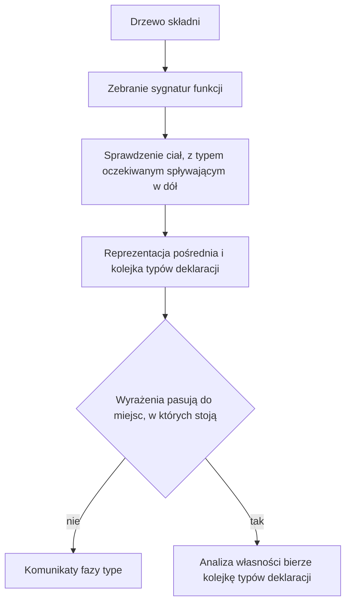

# Rozdział 15. Jak kompilator sprawdza typy

Drzewo składni wie, że w pliku jest dodawanie, ale nie wie, czy wolno dodać te dwie rzeczy do siebie. Wie, że jest deklaracja, ale nie wie, czy prawa strona pasuje do typu napisanego po dwukropku. Gdyby generator kodu dostał takie drzewo wprost, musiałby sam zgadywać, czy literał `1` jest wartością `i32`, czy `i64`, i każda pomyłka kończyłaby się złą instrukcją albo awarią przy rzutowaniu wartości. Sprawdzanie typów zdejmuje to zgadywanie, zanim ktokolwiek emituje kod, i zostawia drugie drzewo, w którym typ jest już wpisany przy każdym wyrażeniu.

Ten rozdział obejmuje

- pytanie, na które odpowiada sprawdzanie typów, i dlaczego nie wystarczy do tego samo drzewo składni,
- sposób, w jaki oczekiwany typ spływa w dół wyrażenia i zmienia odczyt literału,
- odmowy, które zostają nawet wtedy, gdy literał da się dopasować, na przykład pustą tablicę i zapis do `val`,
- granicę między tą fazą a analizą własności, która idzie tuż po niej,
- miejsce w źródłach, w którym powstaje reprezentacja pośrednia.

## Po co wpisywać typ przy każdym wyrażeniu

Pytanie tej fazy brzmi, jaki typ ma każde wyrażenie i czy w miejscu, w którym stoi, taki typ jest dopuszczalny. Bez tej odpowiedzi nie da się odróżnić dodawania dwóch liczb od dodawania liczby do napisu, ani zwrotu `i32` z funkcji, która obiecała `i64`. Błąd wyszedłby dopiero przy emisji, często jako wewnętrzna panika kompilatora, a nie jako komunikat o Twoim pliku. Osobna faza zamienia te pomyłki w diagnostykę fazy `type` i, gdy nic nie odrzuci, w drzewo, któremu generator może ufać.

To drugie drzewo nazywa się reprezentacją pośrednią. W kodzie nosi skrót HIR, od angielskiego high-level intermediate representation, i ten skrót zostaje w nazwach struktur `HirProgram` oraz `HirExpr`. W dalszych zdaniach pada sama nazwa reprezentacja pośrednia, bez powtarzania skrótu. Każde wyrażenie niesie w niej typ, zakres w pliku i rodzaj wyrażenia. Sprawdzanie typów buduje ją zawsze, nawet gdy zbierze błędy. Do wyniku przebiegu, opisanego w rozdziale 12, trafia ona tylko wtedy, gdy lista komunikatów na końcu jest pusta. Dzięki temu generator nie dostaje drzewa, obok którego leżą odmowy.

<!-- figura: Rysunek 15.1. Od drzewa składni do reprezentacji pośredniej -->


Rysunek 15.1 zaczyna się od sygnatur, bo ciało funkcji wolno sprawdzać dopiero wtedy, gdy wiadomo, jakie funkcje w ogóle istnieją i co przyjmują. Przy okazji kompilator odmawia ponownego zdefiniowania funkcji wbudowanej, takiej jak `println` albo `concat`, bo te nazwy są już zajęte przez język. Dopiero po zebraniu sygnatur sprawdzanie schodzi do ciał. Kolejka typów deklaracji, którą rysunek stawia obok reprezentacji pośredniej, jest osobnym produktem tej samej fazy. Analiza własności zdejmuje z niej typ przy każdej deklaracji, w kolejności tekstu, i dlatego sprawdzanie typów musi skończyć się wcześniej, choć jego komunikaty są dopisywane do wydruku na końcu.

## Dlaczego literał `1` nie ma jednego typu

Pytanie, które najłatwiej pomylić z prostą tabelą, brzmi, skąd bierze się typ liczby zapisanej bez przyrostka. W wielu językach `1` jest zawsze `i32` albo zawsze `int`, a resztę załatwia rzutowanie. Bork robi inaczej tam, gdzie otoczenie już wie, jakiego typu liczbowego się spodziewa. Oczekiwany typ spływa w dół, do literału, i literał przyjmuje właśnie ten typ, o ile jest liczbowy. Gdy otoczenie nic nie oczekuje, literał zostaje `i32`. Dzięki temu da się podać `1` funkcji, która chce `i64`, bez dopisku przy literale, a jednocześnie gołe `val n = 1` nie staje się niespodziewanie typem szerszym.

Widać to na parze programów, które różnią się tylko tym, czy do funkcji trafia literał, czy nazwa już zadeklarowana. Funkcja `f` chce `i64` i zwraca `i32`, żeby wynik dało się zwrócić z `main`. Pierwszy plik powinien przejść, bo literał stoi dokładnie w miejscu, które oczekuje szerszego typu. Drugi powinien odpaść, bo nazwa zdążyła dostać typ `i32`, zanim ktokolwiek poprosił o `i64`.

**Listing 15.1.** Literał w miejscu, które oczekuje `i64`

```bork
fun f(x: i64): i32 {
    return 0
}
fun main(): i32 {
    return f(1)
}
```

Ten plik przechodzi sprawdzenie z kodem 0. Literał `1` stoi w argumencie, argument oczekuje `i64`, więc `1` jest wartością `i64`, a nie `i32`, które dostałby w gołej deklaracji. Ta sama liczba zapisana najpierw do nazwy bez adnotacji jest już `i32`, i tej nazwy nie wolno potem wstawić w miejsce `i64`, bo nazwa ma typ ustalony przy deklaracji. Oczekiwany typ nie wraca wstecz do wcześniejszej linii.

**Listing 15.2.** Nazwa typu `i32` w miejscu, które oczekuje `i64`

```bork
fun f(x: i64): i32 {
    return 0
}
fun main(): i32 {
    val n = 1
    return f(n)
}
```

```text
/tmp/borkch/namearg.bork:6:14: error: type: argument 1 to `f` has type i32, expected i64
```

Komunikat nazywa argument, typ zastany i typ oczekiwany. Kompilator nie próbuje przy tym sam rzutować `n` na szerszy typ. Gdyby to zrobił, błąd w szerokości liczby chowałby się w milczącym przekształceniu i wychodził dopiero w wyniku, który nie mieści się w tym, co programista napisał. Ten sam mechanizm dotyczy także instrukcji zwrotu. Wyrażenie `return 1` w funkcji o wyniku `i64` przechodzi, bo oczekiwany typ dociera do literału, natomiast `val n = 1 + 2` i potem `return n` z takiej funkcji już nie, bo suma bez oczekiwanego typu jest `i32`.

> **WSKAZÓWKA.**
> Gdy komunikat mówi, że zastany typ to `i32`, a oczekiwany to `i64`, sprawdź, czy wartość powstała w miejscu bez adnotacji i bez kontekstu liczbowego. Literał wpisany od razu w argument albo w `return` często przyjmie szerszy typ, a ta sama cyfra zapisana wcześniej do `val` już nie.

## Co pozostaje błędem, choć otoczenie coś oczekuje

Pytanie brzmi, których braków kompilator nie uzupełni, nawet gdy oczekiwany typ spływa w dół. Nie każdy węzeł da się uratować kontekstem. Pusta tablica nie ma ani typu elementu, ani długości, a wpisanie ich z powietrza, bez adnotacji przy nazwie, zgadłoby strukturę, której w tekście nie ma. Zapis do nazwy zadeklarowanej jako `val` jest z kolei błędem niezależnie od typu, bo `val` nie jest miejscem, do którego wolno przypisać po raz drugi. Oba przypadki warto zobaczyć, bo wyglądają jak coś, co „dałoby się wywnioskować”, a jednak są odrzucane.

**Listing 15.3.** Pusta tablica bez adnotacji

```bork
fun main() {
    val a = []
}
```

```text
/tmp/borkch/emptyarr.bork:2:13: error: type: empty array literal requires an explicit type, e.g. `val a: [i32; 0] = []`
```

Komunikat podaje kształt adnotacji, który tę samą pustą tablicę przeprowadza przez sprawdzenie. Chodzi o to, że długość i typ elementu są częścią typu tablicy w Borku, a nie szczegółem, który wolno dopisać później w generatorze. Plik z adnotacją `[i32; 0]` przy tej samej pustej tablicy kończy się kodem 0, co potwierdza, że brakuje informacji w tekście, a nie że pusta tablica jest w ogóle zabroniona. Podobnie odrzucany jest zapis do `val`, i tu oczekiwany typ w ogóle nie wchodzi w grę.

**Listing 15.4.** Drugi zapis do niezmiennej nazwy

```bork
fun main(): i32 {
    val n = 1
    n = 2
    return n
}
```

```text
/tmp/borkch/valas.bork:3:5: error: type: cannot assign to immutable `val` binding `n`
```

Pozostałe odmowy tej fazy są tego samego rodzaju. Warunek pętli albo `if` musi być `bool`, zwrot musi pasować do typu funkcji, a dwa operandy dodawania muszą być tym samym typem liczbowym. Lista operatorów nie wnosi tu nowego mechanizmu. Gdy typy operandów się rozmijają, komunikat podaje oba, tak jak przy dodawaniu liczby do napisu, i na tym kończy się ta gałąź. Pełne zestawienie miejsc, w których typ oczekiwany jest porównywany z typem zastanym, jest w `src/typeck/stmt.rs` i w katalogu `src/typeck/expr/`.

> **NOTA.**
> Sprawdzanie typów nie pyta, czy nazwę wolno skopiować albo przenieść. Wyrażenie `move` i promocja zapisana w tekście stają się w reprezentacji pośredniej zwykłą nazwą z dopiskiem, jakiego użycia sprawdzanie się dopatrzyło. Odmowę, że nazwa została użyta po przeniesieniu, zgłasza analiza z rozdziału 14, nawet jeśli typ tego wyrażenia jest poza tym w porządku.

## Gdzie ta faza się kończy, a gdzie tylko zapisuje

Pytanie brzmi, czego świadomie nie ma w komunikatach fazy `type`, choć reprezentacja pośrednia już coś o tym pamięta. Generator kodu później ufa rodzajowi użycia zapisanemu przy nazwie, gdy kopiuje deskryptor napisu albo liczbę. Ten zapis nie jest jednak werdyktem własności. Werdykt własności przychodzi z osobnego przejścia po drzewie składni i potrafi, przy funkcji dopisanej na końcu wywołania, widzieć typ nieznany tam, gdzie sprawdzanie typów widzi kopię. Dwa przejścia mają dwa środowiska, i rozdział 14 pokazał skutek od strony współdzielenia. Tutaj ten sam skutek widać od strony kolejki. Parametry takiej funkcji nie trafiają do kolejki typów deklaracji, którą zdejmuje analiza, więc analiza nie dostaje typu wyliczonego w zagnieżdżonym zakresie.

Dla zwykłych funkcji i dla `main` oba opisy trzymają się razem, i testy kompilatora tego pilnują. Warto o rozjeździe wiedzieć tylko po to, żeby wydruk regionów przy błędzie w funkcji dopisanej na końcu wywołania nie wyglądał jak sprzeczność z komunikatem o typie. To wciąż ten sam program, czytany dwa razy, z inną ilością informacji o parametrach. Żadna z tych faz nie naprawia drugiej w locie.

Na końcu zostaje mapa do kodu. Wejście fazy to `check` w `src/typeck/mod.rs`. Oczekiwany typ jest argumentem sprawdzenia wyrażenia w `src/typeck/expr/mod.rs` i schodzi do literałów, wywołań i operandów. Porównanie typu zastanego z oczekiwanym przy deklaracji, zwrocie i przypisaniu jest w `src/typeck/stmt.rs`. Struktury reprezentacji pośredniej, razem z rodzajem użycia nazwy, są w `src/hir/`. Kolejka typów deklaracji opuszcza tę fazę jako drugi wynik `check` i jest zużywana przez analizę własności, zanim powstanie wydruk, o którym mówił rozdział 12.

## Podsumowanie

- Sprawdzanie typów wpisuje typ przy każdym wyrażeniu i odrzuca miejsce, w którym typ zastany nie pasuje do oczekiwanego, bo generator kodu nie powinien tego zgadywać sam.
- Literał liczby przyjmuje typ liczbowy oczekiwany przez otoczenie, a w braku takiego otoczenia zostaje `i32`, więc `f(1)` przy parametrze `i64` przechodzi, a nazwa zadeklarowana jako gołe `1` już nie.
- Pusta tablica bez adnotacji i drugi zapis do `val` są odrzucane także wtedy, gdy reszta otoczenia ma jasny typ, bo kompilator nie dopisuje długości tablicy ani nie zdejmuje niezmienności.
- Ta faza nie rozstrzyga własności, tylko zapisuje rodzaj użycia nazwy w reprezentacji pośredniej, a odmowy o przeniesieniu zostawia analizie z poprzedniego rozdziału.
- Reprezentacja pośrednia trafia do wyniku przebiegu tylko przy pustej liście komunikatów, natomiast kolejka typów deklaracji jest budowana zawsze i zasila analizę własności.
