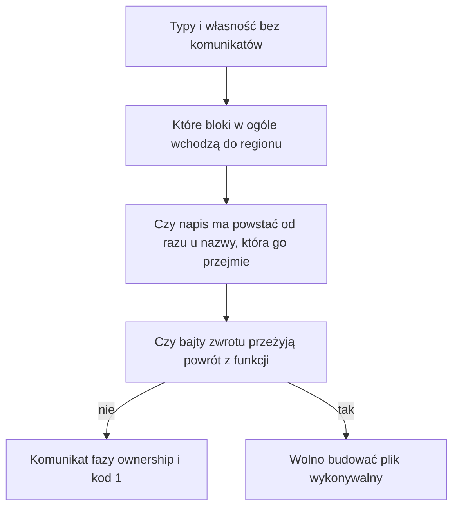

# Rozdział 16. Jak kompilator wybiera miejsce na napis

Analiza własności potrafi powiedzieć, że nazwa została przeniesiona, i na tym poprzestać. Nie mówi jeszcze, w którym buforze powstaną bajty napisu ani czy te bajty będą żyły dość długo, żeby funkcja mogła je zwrócić. Gdyby pominąć te pytania, program z poprawnym `move` i tak mógłby oddać napis, którego pamięć znika razem z blokiem albo razem z wołaną funkcją. Dlatego po czystym sprawdzeniu typów i własności kompilator zadaje jeszcze trzy pytania o miejsce, i dopiero ich odpowiedzi wolno uznać za koniec sprawdzenia.

Ten rozdział obejmuje

- pytanie, które bloki w ogóle muszą wejść do własnego regionu przy wykonaniu,
- pytanie, czy napis deklarowany tylko po to, by zaraz oddać go nazwie zewnętrznej, ma powstać od razu u niej,
- pytanie, czy bajty zwracane z funkcji przeżyją powrót,
- pełny przykład, w którym napis nadpisuje nazwę z zewnątrz i nadal da się go wypisać,
- odmowę zwrotu wyniku `concat`, z prawdziwym komunikatem tej fazy.

## Po co pytać o miejsce, skoro własność już jest sprawdzona

Pytanie tej części brzmi, gdzie mają leżeć bajty wartości, która nie jest kopią, i jak długo to miejsce wolno im zajmować. Liczba całkowita nie ma tego problemu, bo mieści się w samej wartości i kopiuje się przy odczycie. Napis i tablica trzymają treść inaczej, bo leży ona w buforze regionu, a nazwa pamięta tylko opis, gdzie ta treść jest i jak jest długa. Gdy region się kończy, bufor wraca, i każdy opis, który wciąż na niego wskazuje, staje się pustym adresem. Własność z rozdziału 14 pilnuje, żeby dwóch właścicieli nie było naraz. Ten rozdział pilnuje, żeby jedyny właściciel nie przeżył swojego bufora.

Te trzy pytania padają tylko wtedy, gdy lista komunikatów po typach i własności jest pusta. Przy błędzie składni, typu albo przeniesienia kompilator nie wybiera miejsca na napis, bo i tak nie będzie generował kodu. Gdy pytania padną i któreś odpowie odmową, reprezentacja pośrednia znika z wyniku tak samo jak przy błędzie typu, a raport regionów zostaje. Komunikat takiej odmowy ma fazę `ownership`, nie osobną nazwę, bo z punktu widzenia wydruku to wciąż skarga o czas życia bajtów, a nie o kształt tekstu.



Rysunek jest kolejnością w jednym przebiegu, a nie trzema niezależnymi narzędziami. Wejście do regionu przy wykonaniu jest potrzebne tylko blokowi, który naprawdę coś alokuje. Blok, który jedynie czyta liczbę albo współdzieli napis zadeklarowany wyżej, nie dostaje własnego bufora, bo nie miałby czego w nim położyć. To jest pierwsza odpowiedź i ona nie zmienia tekstu programu. Zaznacza tylko, które węzły raportu mają przy generowaniu kodu wołać wejście i wyjście regionu.

## Gdzie powstaje napis, który zaraz zmienia właściciela

Pytanie brzmi, co zrobić z napisem, który w tekście stoi w bloku wewnętrznym, ale jego jedynym dalszym życiem jest nazwa z bloku zewnętrznego. Gdyby bajty powstały w buforze wewnętrznym, koniec bloku zwolniłby je, zanim zewnętrzna nazwa skończyłaby z nich korzystać. Dałoby się to odrzucić, i część takich zapisów rzeczywiście jest odrzucana. Da się też zauważyć, że nazwa wewnętrzna jest tylko przystankiem, i położyć bajty od razu w regionie nazwy, która je przejmuje. Kompilator robi to drugie wtedy, gdy układ instrukcji jest jednoznaczny.

Jednoznaczny układ da się rozpoznać po dwóch sąsiednich instrukcjach. Deklaracja, której prawa strona jest napisem albo wywołaniem, stoi tuż przed przypisaniem, a to przypisanie przenosi właśnie tę nazwę do nazwy widocznej na zewnątrz. Wtedy deklaracja dostaje dopisek, że alokacja ma iść do tamtej nazwy zewnętrznej. Inne układy tego dopisku nie dostają. Zwykłe przypisanie literału do nazwy zewnętrznej, bez pośredniej deklaracji, rozwiązuje się inaczej, ale z tego samego powodu. Literał jest kładziony w regionie nazwy, która go przyjmuje, a nie w bloku, w którym akurat stoi znak równości.

Widać to na programie, który nadpisuje `outer` literałem z bloku i potem ten napis wypisuje. Plik `15-assign-up.bork` przechodzi sprawdzenie z kodem 0. Samo sprawdzenie nie wypisuje miejsca alokacji, bo wydruk regionów tego nie pokazuje, więc o tym, że bajty przeżyły blok, rozstrzyga dopiero uruchomienie. Poniższy tekst jest całym programem, bez skrótów.

**Listing 16.1.** Nadpisanie nazwy zewnętrznej literałem z bloku

```bork
fun main() {
    var outer = "a"
    {
        outer = "b"
    }
    println(outer)
}
```

Zbudowany program wypisuje `b` i kończy się kodem 0. Literał `"a"` żyje tylko do przypisania, a `"b"` musi przeżyć koniec bloku, bo `println` stoi już w `main`. Gdyby bajty `"b"` zostały w buforze bloku, wypisanie po klamrze byłoby czytaniem zwolnionej pamięci. Dlatego miejsce tego literału jest region `outer`, a blok wewnętrzny nie staje się właścicielem treści. Podobny efekt daje `promote` w pliku `14-promote.bork`, który też przechodzi sprawdzenie. Słowo `promote` mówi w tekście to, co przy zwykłym literale kompilator uzupełnia sam.

> **NOTA.**
> Dopisek o alokacji przy deklaracji nie jest widoczny w `--dump-arenas`. Wydruk regionów pokazuje, kto nazwę posiada, a nie to, w czyim buforze powstaną bajty. O tym drugim mówi dopiero ten rozdział, i tylko dla programu, który typy oraz własność już przepuściły.

## Czego nie wolno zwrócić

Pytanie brzmi, które napisy wolno oddać wywołującemu, a które umarłyby razem z funkcją, która je stworzyła. Parametr i lokalna nazwa, zwrócone wprost, są dozwolone, i tak samo dozwolony jest literał napisu. Kompilator zakłada wtedy, że treść da się utrzymać tak długo, jak wynik. Inaczej jest z wartością, która powstaje w czasie wywołania i nie ma własnej, trwalszej nazwy. Wynik `concat` powstaje właśnie w ten sposób i nie ma trwalszej nazwy, która utrzymałaby jego treść. Jego bajty leżą w regionie wołanej funkcji, a ten region kończy się przy powrocie, więc opis zwrócony na zewnątrz wskazywałby bufor, którego już nie ma.

**Listing 16.2.** Zwrot wyniku `concat`

```bork
fun shout(): String {
    return concat("a", "b")
}
fun main(): i32 {
    return 0
}
```

```text
/tmp/borkch/retconcat.bork: error: ownership: returning the result of `concat` is not supported yet: returned `String` bytes must outlive the callee arena
```

Komunikat nie podaje w tym przebiegu numeru wiersza, tylko plik i treść, i ta treść wystarcza, żeby wiadomo było, czego nie robić. Bajty wyniku `concat` musiałyby przeżyć region wołanego, a dzisiejsza implementacja tego nie zapewnia, więc zwrot jest odrzucany, zamiast budować program, który zepsuje się przy odczycie. Zwrot przez `move` albo `promote` jest odrzucany osobnym komunikatem, który każe napisać `return s` dla parametru albo lokalu, ewentualnie zwrócić sam literał. To nie jest sprzeczność z listingiem 16.1. Tam napis zostawał w tej samej funkcji, w nazwie, która go przeżywa. Tutaj miałby opuścić funkcję razem z buforem, który właśnie się kończy.

Pozostałe odmowy tej kontroli są o tym samym. Przypisanie do nazwy wartości, której bajty żyją w regionie wewnętrznym, kończącym się wcześniej niż ta nazwa, jest odrzucane, gdy nie da się położyć ich od razu u celu. Gałąź `if`, która przenosi napis i sama jest wartością warunku, też nie może oddać bajtów swojego regionu, bo ten region znika razem z gałęzią. Pełna lista takich miejsc jest w `check_function` w pliku `src/escape.rs`. Nie wnosi ona nowego pytania ponad to, czy opis napisu nie przeżywa bufora, w którym leżą jego bajty.

> **OSTRZEŻENIE.**
> To, że `return s` dla lokalnego napisu przechodzi sprawdzenie, nie znaczy, że każdy sposób oddania tego samego napisu jest równoważny. `return move s` jest dziś odrzucany, choć własnościowo wygląda jak przekazanie jedynego właściciela. Komunikat mówi, jakiej formy zwrotu kompilator oczekuje, i tej formy trzeba się trzymać.

Na końcu mapa, już po tym, co fazy rozstrzygają. Zaznaczenie, które bloki wchodzą do regionu przy generowaniu kodu, robi `stamp_codegen_push` w `src/region_walk.rs`. Dopisek, że deklaracja ma alokować u nazwy zewnętrznej, wpisuje `annotate` w `src/hoist.rs`. Kontrolę zwrotów i przypisań, które przeżyłyby swój bufor, robi `check_function` w `src/escape.rs`. Wszystkie trzy woła `check` w `src/frontend.rs`, i tylko na pustej liście komunikatów z typów oraz własności.

## Podsumowanie

- Po czystych typach i własności kompilator pyta jeszcze, które bloki alokują, gdzie mają powstać bajty napisu przejmowanego przez nazwę zewnętrzną i czy zwrot przeżyje powrót z funkcji.
- Blok, który niczego nie alokuje, nie dostaje własnego bufora przy wykonaniu, bo region w raporcie nie jest jeszcze pamięcią, tylko zakresem nazw.
- Literał albo przeniesienie, którego jedynym dalszym życiem jest nazwa z szerszego zakresu, powstaje w regionie tej nazwy, dlatego program z listingu 16.1 wypisuje `b` już po zamknięciu bloku.
- Zwrot wyniku `concat` oraz zwrot przez `move` są odrzucane, bo bajty nie przeżyłyby regionu wołanej funkcji, natomiast zwrot lokalnej nazwy albo literału jest dozwolony.
- Odmowy tej fazy mają w wydruku fazę `ownership` i usuwają reprezentację pośrednią z wyniku, więc budowanie się nie zaczyna, dopóki miejsce na napis nie jest rozstrzygnięte.
