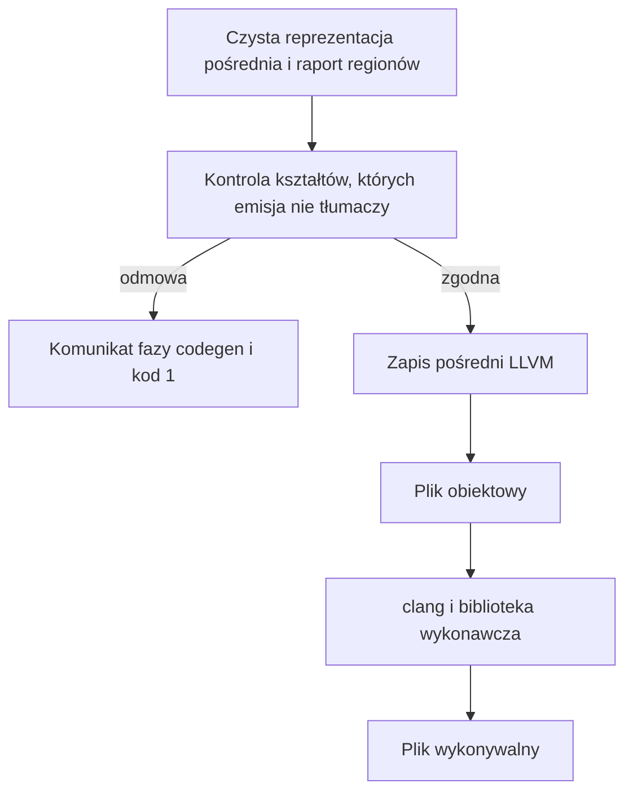

# Rozdział 17. Jak powstaje kod maszynowy

Czyste sprawdzenie mówi tylko tyle, że program jest do przyjęcia jako tekst Borka. Nie jest jeszcze plikiem, który da się uruchomić. Między jednym a drugim stoi tłumaczenie na kod maszynowy, i to tłumaczenie ma własne odmowy, bo generator nie umie każdej konstrukcji, którą wcześniejsze fazy już opisują. Gdyby puścić je wszystkie do emisji, część skończyłaby się czytelnym komunikatem, a część awarią procesu kompilatora, ze śladem stosu Rusta zamiast wskazania na Twój plik.

Ten rozdział obejmuje

- pytanie, co jeszcze musi się udać po czystym sprawdzeniu, zanim powstanie plik wykonywalny,
- kontrolę, która odrzuca kształty nieobsłużone przez emisję, zanim ta emisja w ogóle ruszy,
- sposób, w jaki napis jest reprezentowany w kodzie pośrednim, i z czym ten kod jest łączony,
- awarię, która dziś zastępuje komunikat przy przekazaniu napisu do funkcji napisanej przez programistę,
- program z rozdziału 12 doprowadzony aż do uruchomienia.

## Po co osobna kontrola tuż przed emisją

Pytanie tej fazy brzmi, czy czystą reprezentację pośrednią da się przetłumaczyć na kod, który ten kompilator naprawdę umie wyemitować. Sprawdzanie typów odpowiada, czy program ma sens w języku. Nie odpowiada, czy dana konstrukcja ma już ścieżkę w generatorze. Wartość `None`, operator `?:`, funkcja dopisana na końcu wywołania albo zwrot `i64` z `main` są w języku opisane i przez sprawdzenie przechodzą. Emisja tych konstrukcji na razie nie tłumaczy. Bez kontroli przed generowaniem kodu taki plik wszedłby w dopasowanie, które albo skarży się za późno, albo bierze wartość za liczbę i rzutuje ją źle.

Kontrola ogląda kształt drzewa, a nie treść napisu w pamięci. Szuka między innymi braku funkcji `main`, niedozwolonego wyniku `main`, wartości `None` i `Some`, operatora `?:`, dostępu do pola, wykrzykników `!!` oraz funkcji dopisanej na końcu wywołania. Gdy coś znajdzie, dostajesz komunikat fazy `codegen` i kod wyjścia 1, bez pliku wynikowego. Pozostałe odmowy tej kontroli, na przykład nieobsłużony operator dwuargumentowy, działają tak samo. Pełna lista kształtów jest w funkcji `gate` w pliku `src/codegen/gate.rs`.

**Listing 17.1.** Wartość `None`, którą sprawdzenie przyjmuje, a budowanie odrzuca

```bork
fun main(): i32 {
    val n: i32? = None
    return 0
}
```

```text
/tmp/borkch/none.bork:2:19: error: codegen: `None` is not supported by codegen
```

Sam `bork` na tym pliku, bez słowa `build`, kończy się kodem 0, bo typy i własność są w porządku. Odmowa pojawia się dopiero przy budowaniu. To samo dotyczy pliku `24-main-i64.bork`, który jest w zestawie przykładów. Sprawdzenie przechodzi, a budowanie mówi `` `main` returning `i64` is not supported by codegen yet ``. Plik bez funkcji `main` w ogóle, `25-no-main.bork`, pada komunikatem `` `fun main` is required to build an executable ``. Ograniczenie wyniku dotyczy właśnie `main`, które w kodzie maszynowym jest funkcją `main` z C i ma zwracać `i32`. Funkcja pomocnicza może liczyć na `i64`. `main` zadeklarowane bez typu wyniku jest zamieniane na `i32` równe zero.

<!-- figura: Rysunek 17.1. Od czystego programu do pliku wykonywalnego -->


Rysunek 17.1 stawia kontrolę przed zapisem pośrednim celowo. Zapis pośredni powstaje dopiero dla programu, który kontrola przepuściła, a plik obiektowy powstaje z tego zapisu przez maszynę docelową LLVM. Na końcu `clang` łączy plik obiektowy z biblioteką `libbork_runtime.a`. Bez tej biblioteki wygenerowany kod nie miałby bufora regionu, wypisywania ani sprawdzeń, które przerywają proces przy dzieleniu przez zero i przy indeksie poza tablicą.

> **NOTA.**
> Dodawanie i porównywanie liczb zmiennoprzecinkowych przechodzi sprawdzenie typów, a przy budowaniu pada inaczej niż `None`. Komunikat mówi o wewnętrznej niezgodności harmonogramu regionów i o tym, że operator zmiennoprzecinkowy nie jest jeszcze obsługiwany po przejściu regionów. To wciąż odmowa fazy `codegen`, tylko zgłoszona już w czasie emisji, nie w kontroli kształtów.

## Jak napis wygląda w kodzie pośrednim

Pytanie brzmi, co generator właściwie emituje dla napisu, skoro w Borku napis nie jest liczbą. W zapisie pośrednim LLVM napis i wycinek tablicy są strukturą z dwóch pól. Pierwsze jest wskaźnikiem na bajty, drugie jest długością typu `i64`. Nie ma na końcu bajtu zerowego, bo długość jest osobno, i właśnie ten opis widzi biblioteka wykonawcza, gdy wypisuje napis. Liczby całkowite i logiczne zostają liczbami LLVM, bez takiej struktury. Dzięki temu kopiowanie liczby jest kopiowaniem wartości, a kopiowanie napisu, tam gdzie analiza na to pozwala, jest kopiowaniem dwóch pól, nie treści.

Funkcje inne niż `main` dostają w module nazwy z przedrostkiem `bork.`, żeby nie zderzyły się z nazwami z biblioteki C. Funkcja `main` zostaje w module pod zwykłą nazwą `main`, bez przedrostka. Wejście do regionu, wyjście z niego, czyszczenie bufora i alokacja w buforze są wywołaniami biblioteki wykonawczej, odpowiednio `bork_arena_push`, `bork_arena_pop`, `bork_arena_reset` i `bork_arena_alloc`. Wypisanie liczby i napisu idzie przez `bork_println_i64` oraz `bork_println_str`. Pojemność jednego bufora to 4096 bajtów i ta stała żyje w bibliotece, czyli w procesie uruchomionego programu, a nie w analizie własności. Pozostałe symbole biblioteki są wołane analogicznie, gdy emisja potrzebuje dzielenia z kontrolą zera albo odczytu tablicy z kontrolą indeksu. Ich deklaracje są przy emisji w `src/codegen/llvm/context.rs`, a ciała w `crates/bork_runtime/src/lib.rs`.

Weźmy znowu program z listingu 12.1, ten z pętlą i etykietą `sum`. Budowanie tego pliku kończy się kodem 0. Uruchomiony plik wypisuje `sum` i kończy się kodem 3, bo dodaje 0, 1 i 2. Po drodze generator widzi kopię liczby `total` w pętli i współdzielenie napisu `label` w bloku, czyli dokładnie to, co wydruk regionów pokazał w rozdziale 12, i tłumaczy to na odczyt liczby oraz na wypisanie dwóch pól deskryptora. Nie ma tu `None`, nie ma zwrotu innego niż `i32` i nie ma przekazania napisu do funkcji napisanej obok `println`, więc kontrola i emisja mają ścieżkę, którą umieją dojść do końca.

> **WSKAZÓWKA.**
> Gdy `bork plik.bork` milczy, a `bork build` wypisuje fazę `codegen`, nie szukaj błędu typu. Szukaj konstrukcji, której emisja jeszcze nie tłumaczy, albo braku `main` w kształcie, którego generator oczekuje. Poprawka typu nic tu nie zmieni, dopóki kształt zostaje ten sam.

## Gdzie kompilator sam się wywraca

Pytanie, które zostaje po kontrolach, brzmi, czy każda nieobsłużona wartość kończy się komunikatem, czy któraś wywraca sam kompilator. Przekazanie napisu do funkcji napisanej przez programistę jest właśnie takim wyjątkiem. Przechodzi ono sprawdzenie, przechodzi kontrolę kształtów i wywraca emisję. Kontrola widzi zwykłe wywołanie, bo nie pyta, czy argument jest strukturą LLVM. Emisja próbuje potraktować ten argument jak liczbę, a dostaje strukturę `{ ptr, i64 }`, i proces kompilatora kończy się awarią.

**Listing 17.2.** Napis przekazany do funkcji użytkownika

```bork
fun f(var a: String) {
    println(a)
}

fun main() {
    f("hello")
}
```

Budowanie tego pliku, `26-pass-string.bork`, nie daje linii `error: codegen`. Proces kompilatora kończy się kodem 101. Miejsce w źródłach to `src/codegen/llvm/expr.rs`, okolice wywołania, które oczekuje wartości całkowitej, a dostaje strukturę. W przebiegu, z którego pochodzi ten opis, komunikat panic wskazuje wiersz 901 tego pliku i mówi, że znaleziona wartość jest strukturą, a oczekiwano wariantu całkowitego. To jest błąd kompilatora, nie reguła języka, i `println` oraz `concat` tej ścieżki nie biorą, bo są obsłużone osobno, bez rzutowania argumentu na liczbę.

> **OSTRZEŻENIE.**
> Awaria z kodem 101 nie jest diagnostyką, którą edytor umie pokazać jako błąd w pliku. Dopóki emisja wywołania nie rozróżnia liczby od deskryptora napisu, taki program trzeba rozpoznać po śladzie, a nie po fazie `codegen`. Funkcje wbudowane są bezpieczną drogą wypisania napisu. Funkcja z parametrem typu `String` dziś nią nie jest.

Na końcu zostaje mapa do kodu. Kontrola kształtów jest w `gate` w `src/codegen/gate.rs`. Złożenie modułu LLVM, łącznie z wymaganiem `main`, jest w `emit_module` w `src/codegen/llvm/mod.rs`. Reguła, że `main` zwraca `i32`, jest w `declare_function` w `src/codegen/llvm/emit_fn.rs`. Deskryptor `{ ptr, i64 }` jest budowany w `src/codegen/llvm/context.rs`. Rzutowanie, które przy napisie w argumencie funkcji użytkownika oczekuje liczby, jest w `src/codegen/llvm/expr.rs`.

## Podsumowanie

- Plik wykonywalny powstaje tylko z czystej reprezentacji pośredniej, i tylko wtedy, gdy kontrola przed emisją nie odrzuci kształtu, którego generator jeszcze nie tłumaczy.
- Wartość `None`, zwrot `i64` z `main` i brak `main` przechodzą sprawdzenie, a padają przy budowaniu komunikatem fazy `codegen`, bez pliku wynikowego.
- Napis w kodzie pośrednim jest parą wskaźnika i długości, a `clang` łączy wynik z biblioteką wykonawczą, która daje bufor regionu, wypisywanie i sprawdzenia indeksu oraz dzielenia.
- Dodawanie i porównywanie liczb zmiennoprzecinkowych jest odrzucane dopiero przy emisji, komunikatem o nieobsłużonym operatorze po przejściu regionów, mimo że typy były poprawne.
- Przekazanie napisu do funkcji napisanej przez programistę nie daje komunikatu, tylko awarię procesu kompilatora z kodem 101, bo emisja bierze deskryptor za liczbę.
