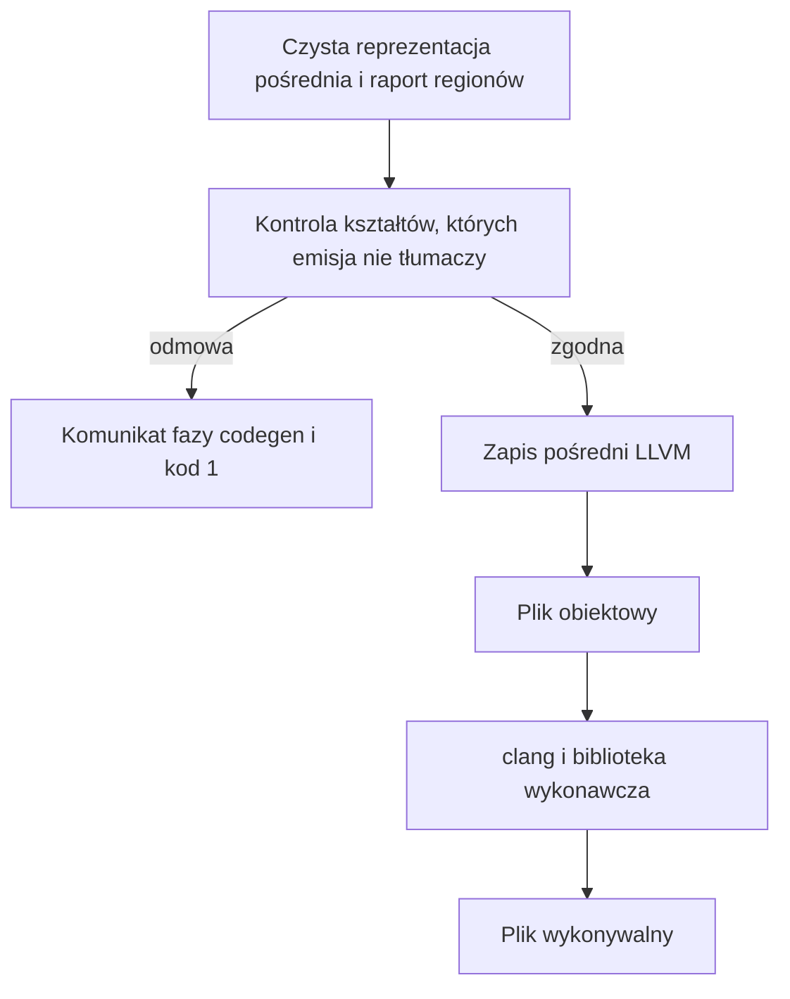

# Rozdział 17. Jak powstaje kod maszynowy

Czyste sprawdzenie mówi tylko tyle, że program jest do przyjęcia jako tekst Borka. Nie jest jeszcze plikiem, który da się uruchomić. Między jednym a drugim stoi tłumaczenie na kod maszynowy, i to tłumaczenie ma własne odmowy, bo generator nie umie każdej konstrukcji, którą wcześniejsze fazy już opisują. Gdyby puścić je wszystkie do emisji, część skończyłaby się czytelnym komunikatem, a część awarią procesu kompilatora, ze śladem stosu Rusta zamiast wskazania na Twój plik.

Ten rozdział obejmuje

- pytanie, co jeszcze musi się udać po czystym sprawdzeniu, zanim powstanie plik wykonywalny,
- kontrolę, która odrzuca kształty nieobsłużone przez emisję, zanim ta emisja w ogóle ruszy,
- sposób, w jaki napis jest reprezentowany w kodzie pośrednim, i z czym ten kod jest łączony,
- ograniczenia i znane błędy codegenu, w tym porównania liczb zmiennoprzecinkowych,
- program z rozdziału 12 doprowadzony aż do uruchomienia.

## Po co osobna kontrola tuż przed emisją

Pytanie tej fazy brzmi, czy czystą reprezentację pośrednią da się przetłumaczyć na kod, który ten kompilator umie wyemitować. Sprawdzanie typów odpowiada, czy program ma sens w języku; nie gwarantuje obsługi każdego kształtu przez generator. Nullable `String?` i wartości typów prostych poza `unit` są obsługiwane dla `None`, `Some`, `?:`, `!!` oraz `==`/`!=`. Tablice nullable odrzuca sprawdzanie typów, a nullable `unit` i typy funkcji nie mają reprezentacji. Funkcja dopisana na końcu wywołania oraz niedozwolony wynik `main` nadal są odrzucane.

Kontrola ogląda kształt drzewa, a nie treść napisu w pamięci. Szuka między innymi braku funkcji `main`, niedozwolonego wyniku `main`, nieobsługiwanych operatorów, dostępu do pola i funkcji dopisanej na końcu wywołania. `None`, `Some`, `?:` i `!!` przechodzą bramkę, gdy ich typ nullable ma reprezentację. Gdy kontrola odrzuci program, dostajesz komunikat fazy `codegen` i kod wyjścia 1, bez pliku wynikowego. Pełna lista kształtów jest w funkcji `gate` w pliku `src/codegen/gate.rs`.

**Listing 17.1.** Nullable napis: zbudowanie, asercja i wypisanie wartości

```bork
fun main() {
    val s: String? = Some("x")
    println(s!!)
}
```

```text
x
```

Listing odpowiada fixture `nullable_assert.bork`: sprawdzenie i budowanie przechodzą, a program wypisuje `x`. Brak funkcji `main` i niedozwolony typ jej wyniku nadal są odmowami codegenu; `main` bez jawnego typu wyniku jest zamieniane na `i32` równe zero.

<!-- figura: Rysunek 17.1. Od czystego programu do pliku wykonywalnego -->

```mermaid
flowchart TD
    czyste["Czysta reprezentacja pośrednia i raport regionów"] --> kontrola["Kontrola kształtów, których emisja nie tłumaczy"]
    kontrola -->|odmowa| stop["Komunikat fazy codegen i kod 1"]
    kontrola -->|zgodna| llvm["Zapis pośredni LLVM"]
    llvm --> obiekt["Plik obiektowy"]
    obiekt --> clang["clang i biblioteka wykonawcza"]
    clang --> bin["Plik wykonywalny"]
```

Rysunek 17.1 stawia kontrolę przed zapisem pośrednim celowo. Zapis pośredni powstaje dopiero dla programu, który kontrola przepuściła, a plik obiektowy powstaje z tego zapisu przez maszynę docelową LLVM. Na końcu `clang` łączy plik obiektowy z biblioteką `libbork_runtime.a`. Bez tej biblioteki wygenerowany kod nie miałby bufora regionu, wypisywania ani sprawdzeń, które przerywają proces przy dzieleniu przez zero i przy indeksie poza tablicą.

> **NOTA.**
> Arytmetyka `f32`/`f64` ma ścieżkę w `emit_float_binary`. Porównanie przechodzi sprawdzanie typów, ale dispatcher wybiera ścieżkę na podstawie typu wyniku, którym jest `bool`, i przekazuje float do `value_as_int`. Odtworzenie porównania `f64` kończy się paniką kompilatora (`FloatValue` zamiast `IntValue`). To usterka codegenu, nie reguła typów. Float jako argument funkcji jest osobno odrzucany przez `coerce_value_to_ty`.

## Jak napis wygląda w kodzie pośrednim

Pytanie brzmi, co generator właściwie emituje dla napisu, skoro w Borku napis nie jest liczbą. W zapisie pośrednim LLVM napis i wycinek tablicy są strukturą z dwóch pól. Pierwsze jest wskaźnikiem na bajty, drugie jest długością typu `i64`. Nie ma na końcu bajtu zerowego, bo długość jest osobno, i właśnie ten opis widzi biblioteka wykonawcza, gdy wypisuje napis. Liczby całkowite i logiczne zostają liczbami LLVM, bez takiej struktury. Dzięki temu kopiowanie liczby jest kopiowaniem wartości, a kopiowanie napisu, tam gdzie analiza na to pozwala, jest kopiowaniem dwóch pól, nie treści.

Funkcje inne niż `main` dostają w module nazwy z przedrostkiem `bork.`, żeby nie zderzyły się z nazwami z biblioteki C. Funkcja `main` zostaje w module pod zwykłą nazwą `main`, bez przedrostka. Wejście do regionu, wyjście z niego, czyszczenie bufora i alokacja w buforze są wywołaniami biblioteki wykonawczej, odpowiednio `bork_arena_push`, `bork_arena_pop`, `bork_arena_reset` i `bork_arena_alloc`. Wypisanie liczby i napisu idzie przez `bork_println_i64` oraz `bork_println_str`. Pojemność jednego bufora to 4096 bajtów i ta stała żyje w bibliotece, czyli w procesie uruchomionego programu, a nie w analizie własności. Pozostałe symbole biblioteki są wołane analogicznie, gdy emisja potrzebuje dzielenia z kontrolą zera albo odczytu tablicy z kontrolą indeksu. Ich deklaracje są przy emisji w `src/codegen/llvm/context.rs`, a ciała w `crates/bork_runtime/src/lib.rs`.

Weźmy znowu program z listingu 12.1, ten z pętlą i etykietą `sum`. Budowanie tego pliku kończy się kodem 0. Uruchomiony plik wypisuje `sum` i kończy się kodem 3, bo dodaje 0, 1 i 2. Po drodze generator widzi kopię liczby `total` w pętli i współdzielenie napisu `label` w bloku, czyli dokładnie to, co wydruk regionów pokazał w rozdziale 12, i tłumaczy to na odczyt liczby oraz na wypisanie dwóch pól deskryptora. Nie ma tu `None`, nie ma zwrotu innego niż `i32` i nie ma przekazania napisu do funkcji napisanej obok `println`, więc kontrola i emisja mają ścieżkę, którą umieją dojść do końca.

> **WSKAZÓWKA.**
> Gdy `bork plik.bork` milczy, a `bork build` wypisuje fazę `codegen`, nie szukaj błędu typu. Szukaj konstrukcji, której emisja jeszcze nie tłumaczy, albo braku `main` w kształcie, którego generator oczekuje. Poprawka typu nic tu nie zmieni, dopóki kształt zostaje ten sam.

## Deskryptory napisów i wyniki historyczne

Starszy wynik z dodatku `WYNIKI.md` pokazuje awarię przy przekazaniu napisu do funkcji użytkownika. Obecny `coerce_value_to_ty` przekazuje deskryptor `{ ptr, i64 }` bez rzutowania go na liczbę. Ponownie zbudowałem poniższy listing z `codegen`: sprawdzenie i budowanie zakończyły się kodem 0, program wypisał `hello` i zakończył się kodem 0. Wiersz z kodem 101 w tabeli pozostaje wynikiem historycznym.

**Listing 17.2.** Napis przekazany do funkcji użytkownika — przebieg historyczny

```bork
fun f(var a: String) {
    println(a)
}

fun main() {
    f("hello")
}
```

Wynik zapisany dla `26-pass-string.bork` pochodzi ze starszej wersji kompilatora: wtedy proces kończył się kodem 101, bo emisja traktowała deskryptor jak liczbę. Bieżący listing został uruchomiony ponownie i przechodzi; odróżniaj jego rezultat od starego wiersza tabeli.

> **OSTRZEŻENIE.**
> Nie przenoś wyniku historycznej paniki na obecny kod. Jeśli podobna awaria wróci, szukaj w emisji wywołania i w konwersji argumentu; sama zgodność `frontend::check` nie dowodzi, że codegen działa.

Parametr `&T` ma w emiterze reprezentację tej samej wartości deskryptorowej co jego typ wewnętrzny — nie tworzy dodatkowego wskaźnika do deskryptora. Przykłady `&[T; N]` z odczytem i zapisem elementów są częścią korpusu `programs/build/borrow/`. Nie ma osobnej instrukcji LLVM odpowiadającej operatorowi `&`; to adnotacja semantyczna i jawny kontrakt parametru.

Na końcu zostaje mapa do kodu. Kontrola kształtów jest w `gate` w `src/codegen/gate.rs`. Złożenie modułu LLVM, łącznie z wymaganiem `main`, jest w `emit_module` w `src/codegen/llvm/mod.rs`. Nullable loweruje `src/codegen/llvm/nullable.rs`, a deskryptor `{ ptr, i64 }` powstaje w `src/codegen/llvm/context.rs`. Konwersja argumentów jest w `src/codegen/llvm/expr.rs`.

## Podsumowanie

- Plik wykonywalny powstaje tylko z czystej reprezentacji pośredniej, i tylko wtedy, gdy kontrola przed emisją nie odrzuci kształtu, którego generator jeszcze nie tłumaczy.
- Nullable `String?` i wartości typów prostych poza `unit` są obsługiwane; nullable tablice odrzuca sprawdzanie typów, a nullable `unit` i typy funkcji nie mają reprezentacji.
- Napis w kodzie pośrednim jest parą wskaźnika i długości, a `clang` łączy wynik z biblioteką wykonawczą, która daje bufor regionu, wypisywanie i sprawdzenia indeksu oraz dzielenia.
- Arytmetyka zmiennoprzecinkowa ma ścieżkę emisji; porównanie floatów przechodzi sprawdzanie typów, ale obecnie panikuje w codegenie.
- Float jako argument funkcji pozostaje nieobsługiwany. Deskryptory napisów przechodzą do funkcji użytkownika; ich dawna panika 101 jest historyczna.
- Pożyczone parametry `&T` są obsługiwane, a `&[T; N]` może czytać i zapisywać elementy bufora.
