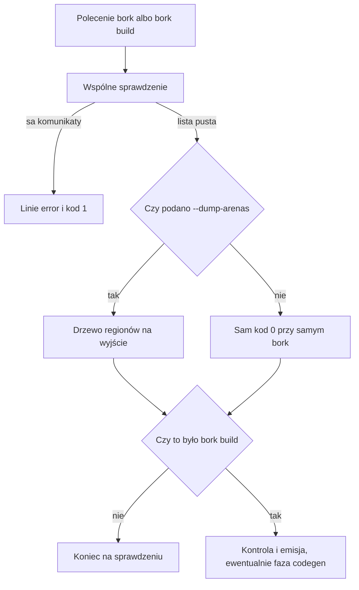

# Rozdział 18. Komunikaty błędów, polecenia i edytor

Komunikat jest, obok wydruku regionów, jedynym śladem fazy, która odmówiła. Programista widzi jedną linię i ma z niej wyczytać, czy zepsuł tekst, typ, własność, czy kształt, którego generator jeszcze nie tłumaczy. Edytor dostaje to samo sprawdzenie, ale w innym opakowaniu, bo protokół edytora liczy wiersze i kolumny, a kompilator w środku liczy bajty. Gdy te dwa opisy się rozjadą, podkreślenie w edytorze wskaże nie ten znak, albo faza zniknie z treści i zostanie sam tekst, z którego nie wiadomo, którą warstwę poprawiać.

Ten rozdział obejmuje

- kształt linii, którą wypisuje polecenie w terminalu, i cztery fazy, które mogą w niej stanąć,
- dwa polecenia oraz flagę wydruku regionów, włącznie z tym, kiedy wydruk w ogóle powstaje,
- różnicę między pozycją bajtową a pozycją, której oczekuje edytor,
- tekst podpowiedzi po najechaniu na nazwę, z prawdziwym wynikiem tej funkcji,
- polecenie edytora, które oddaje ten sam drzewiasty wydruk co flaga w terminalu.

## Jak czytać jedną linię błędu

Pytanie brzmi, co w linii komunikatu jest miejscem w pliku, co jest fazą, a co jest treścią, którą naprawdę trzeba przeczytać. Bez tego podziału łatwo poprawiać typ tam, gdzie zepsuła się składnia, albo szukać `move` tam, gdzie generator nie umie `None`. Linia z terminala ma stały układ. Zaczyna się od ścieżki pliku, potem jest wiersz i kolumna, gdy kompilator ma zakres, następnie słowo `error`, nazwa fazy i treść. Kod wyjścia przy każdej takiej odmowie wynosi 1, także wtedy, gdy komunikatów jest kilka.

Fazy są cztery i każda odpowiada innej części tej książki. Faza `parse` jest odmową czytania tekstu z rozdziału 13. Faza `type` jest odmową sprawdzania typów z rozdziału 15. Faza `ownership` jest odmową własności z rozdziału 14 albo odmową czasu życia bajtów z rozdziału 16, bo zwrot wyniku `concat` też jest wypisywany jako `ownership`. Faza `codegen` jest odmową budowania z rozdziału 17 i nie pojawia się przy samym sprawdzeniu, tylko przy `bork build`. Kolejność na ekranie, gdy w jednym pliku są i własność, i typ, jest taka, że `ownership` stoi wyżej, o czym mówił rozdział 12. Nie znaczy to, że własność była liczona pierwsza.

Weźmy plik z dwoma błędami naraz, ten sam, który listing 12.2 rozbierał od strony struktur wyniku. W tym rozdziale liczy się sama linia, którą widać w terminalu, a nie to, które drzewo zostało w pamięci. Oba komunikaty da się rozłożyć na te same pola, i właśnie ten rozkład jest narzędziem, a nie ozdobą wydruku. Poprawka, która zmienia tylko jedno z tych pól, zostawia drugą linię bez zmiany.

**Listing 18.1.** Dwie linie i dwie fazy w jednym uruchomieniu

```bork
fun main() {
    var s = "hi"
    val t = move s
    val u = s + 1
}
```

```text
/tmp/borkch/both.bork:4:13: error: ownership: use of `s` after move from fun main
/tmp/borkch/both.bork:4:13: error: type: arithmetic operands must have the same numeric type, got String and i32
```

Obie linie wskazują tę samą kolumnę, bo oba błędy dotyczą odczytu `s` w dodawaniu. Pierwsza każe zająć się tym, że nazwa już została przeniesiona. Druga każe zająć się tym, że do napisu dodano liczbę. Poprawienie tylko dodawania, na przykład zamiana na coś, co przyjmuje napis, zostawi błąd własności, i odwrotnie. Ścieżka na początku linii zależy od tego, skąd uruchomiono polecenie, i w Twoim terminalu będzie inna. Reszta linii jest własnością programu, nie katalogu.

> **WSKAZÓWKA.**
> Gdy w linii nie ma wiersza i kolumny, tylko ścieżka, dwukropek i od razu `error`, zakres diagnostyki był pusty. Tak bywa przy zwrocie wyniku `concat` i przy części odmów budowania, na przykład przy braku `main`. Treść nadal mówi, co jest nie tak. Nie da się wtedy skoczyć do kolumny, bo kompilator jej nie zapisał.

## Co robią polecenia, a czego nie powtarzają

Pytanie brzmi, które polecenie dochodzi do której fazy, skoro początek pracy jest wspólny. Polecenie `bork plik.bork` kończy się na sprawdzeniu. Wypisuje komunikaty faz `parse`, `ownership` i `type`, a kod 0 oznacza, że lista była pusta. Polecenie `bork build` woła to samo sprawdzenie i, tylko przy pustej liście, dochodzi do kontroli oraz emisji, więc dopiero ono może wypisać fazę `codegen`. Flaga `--dump-arenas` dopisuje drzewo regionów na standardowe wyjście i nie zmienia kodu wyjścia. Przy błędzie składni drzewa nie ma, co widać po tym, że wydruk urywa się na jednej linii `parse`. Przy błędzie typu albo własności drzewo jest, i właśnie dlatego łatwo uznać je za zgodę. Zgoda jest dopiero przy kodzie 0.

Nie ma osobnego polecenia, które uruchamiałoby same typy albo samą własność. Jedno sprawdzenie zawsze idzie tak daleko, jak da się dojść, i zbiera, co zdąży. Dlatego plik z błędem składni nie pokaże przy okazji błędu typu, nawet jeśli dalej w tekście typy też są złe. Po poprawieniu nawiasu następne uruchomienie może pokazać fazę `type` albo `ownership`, i to nie jest zmiana zdania kompilatora o starym błędzie. To jest pierwsza faza, która w ogóle dostała drzewo.



Rysunek rozdziela milczenie od sukcesu budowania. Kod 0 przy samym `bork` znaczy, że program jest czysty, a nie że powstał plik wykonywalny. Kod 0 przy `bork build` znaczy, że plik powstał, o ile po drodze nie było awarii procesu, takiej jak w rozdziale 17 przy napisie przekazanym do funkcji użytkownika. Ta awaria nie ma linii `error`. Ma kod 101 i ślad, i edytor jej nie podkreśli, bo nie jest diagnostyką.

> **NOTA.**
> Flaga `--dump-arenas` przy budowaniu działa tylko wtedy, gdy sprawdzenie już przeszło. Przy komunikacie z fazy `type` albo `ownership` budowanie kończy się przed emisją, ale samo polecenie `bork --dump-arenas plik.bork` drzewo jeszcze wypisze, bo wydruk nie wymaga czystego wyniku, tylko sparsowanego tekstu.

## Co z tego samego sprawdzenia dostaje edytor

Pytanie brzmi, czym diagnostyka w edytorze różni się od linii w terminalu, skoro obie biorą się z tego samego przebiegu. Różnią się opakowaniem, a nie samym werdyktem sprawdzenia. Serwer języka Borka czyta standardowe wejście i pisze na standardowe wyjście, według protokołu, którego używają edytory, i przy każdej zmianie dokumentu woła to samo sprawdzenie co polecenie `bork`. Pozycje w protokole są parą wiersza i kolumny liczonych od zera, a w kompilatorze zakres jest parą bajtów w pliku. Serwer przelicza bajty na tę parę, zanim wyśle diagnostykę. Dzięki temu podkreślenie pada na znak, a nie na surowy offset, którego edytor nie umie pokazać.

Treść, którą edytor dostaje w polu komunikatu, zaczyna się od nazwy fazy, potem jest dwukropek i ta sama reszta, którą widzisz po `error:` w terminalu. Źródło diagnostyki jest ustawione na `bork`. Nie ma w tej treści ścieżki pliku, bo ścieżkę niesie sam dokument otwarty w edytorze. Stąd linia terminala i dymek w edytorze da się złożyć w jedną informację, ale nie wyglądają jak kopia jeden do jednego. Błąd składni, który w gramatyce jest dopięty do końca pliku, tak jak zła lewa strona przypisania z rozdziału 13, w edytorze też wskaże koniec, bo przeliczenie nie wymyśla zakresu, którego kompilator nie zapisał.

Osobno od diagnostyki edytor może zapytać o nazwę pod kursorem. Odpowiedź nie jest typem w sensie reprezentacji pośredniej. Jest zdaniem o regionie i o tym, jak nazwa została sklasyfikowana. Dla parametru `x` w funkcji `fun add(x: Int): Int { return x }` odpowiedź, liczona tą samą funkcją, której używa serwer, wygląda tak.

```text
`x` in arena `fun add`
Ownership: Local
```

`Local` znaczy tutaj to samo co w wydruku regionów. Nazwa jest używana w regionie, w którym została zadeklarowana. Dla napisu czytanego z bloku zewnętrznego w tym miejscu stałoby `Shared`, razem z etykietą regionu deklaracji, a dla nazwy po `move` stałoby `Moved`. Ta podpowiedź nie zastępuje komunikatu błędu i nie mówi, czy program w ogóle da się zbudować. Przy programie, który się nie sparsuje, nie ma raportu, więc nie ma też na co najechać.

> **OSTRZEŻENIE.**
> Podpowiedź bierze raport regionów, a nie reprezentację pośrednią, więc przy funkcji dopisanej na końcu wywołania potrafi pokazać współdzielenie tam, gdzie sprawdzanie typów widzi kopię. To jest ten sam rozjazd, który rozdziały 14 i 15 opisują przy kolejce typów deklaracji. Nie traktuj tekstu podpowiedzi jako drugiego, niezależnego sprawdzenia typów.

Na końcu zostaje mapa, włącznie z tym, czego w terminalu nie widać. Składanie linii `ścieżka:wiersz:kolumna: error: faza: treść` jest przy poleceniach w `src/main.rs`, a same fazy i treść bez ścieżki powstają w `src/diag.rs`. Serwer edytora jest w `src/bin/bork_lsp.rs` i korzysta z `src/lsp.rs`. Przeliczenie bajtów na pozycję protokołu oraz doklejenie nazwy fazy na początek treści robi `frontend_diagnostic_to_lsp`. Tekst po najechaniu na nazwę składa `hover_for_analysis`. Polecenie `bork.dumpArenas`, zarejestrowane w tym serwerze, oddaje ten sam drzewiasty wydruk co `--dump-arenas`, już dla dokumentu otwartego w edytorze, a nie dla ścieżki podanej w terminalu.

## Podsumowanie

- Linia w terminalu składa się ze ścieżki, zwykle wiersza i kolumny, słowa `error`, nazwy fazy i treści, a kod wyjścia przy odmowie wynosi 1.
- Fazy `parse`, `type`, `ownership` i `codegen` wskazują odpowiednio czytanie tekstu, typy, własność albo czas życia bajtów oraz budowanie, i nie wolno ich czytać jako kolejności liczenia w czasie.
- Polecenie `bork` kończy się na sprawdzeniu, `bork build` dochodzi do emisji tylko przy pustej liście, a `--dump-arenas` dokłada drzewo regionów, o ile tekst w ogóle się sparsuje.
- Edytor dostaje ten sam werdykt, ale pozycję przeliczoną z bajtów na wiersz i kolumnę protokołu oraz treść zaczynającą się od nazwy fazy.
- Najechanie na nazwę pokazuje region i klasyfikację własności, na przykład `Local` dla parametru używanego w jego własnej funkcji, i nie jest osobnym sprawdzeniem typów.
