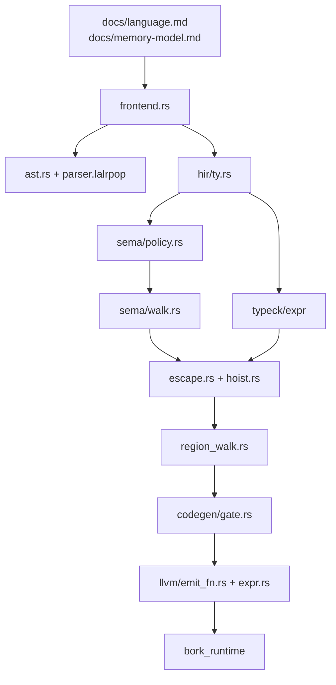

# Rozdział 19. Mapa repozytorium

## Ten rozdział obejmuje

- Drzewo katalogów, które ma znaczenie
- Odpowiedzialność modułów jednym zdaniem
- Historię, która tłumaczy, dlaczego kod leży warstwami
- Kolejność czytania, gdy chcesz zrozumieć całość
- Pliki, które wyglądają na dokumentację, a są z innego etapu

## Drzewo

```text
Cargo.toml                 workspace: bork + crates/bork_runtime
build.rs                   lalrpop; przy codegen także staticlib runtime
src/lib.rs                 parse(), reeksporte, próbki MVP i PROCESS_USER
src/main.rs                CLI check i build
src/bin/bork_lsp.rs        binarka serwera
src/parser.lalrpop         gramatyka
src/ast.rs                 AST
src/layout.rs              nowe linie w nawiasach
src/span.rs                Span, SpannedName
src/diag.rs                Diagnostic
src/frontend.rs            check()
src/typeck/                AST → HIR
src/hir/                   Hir* i Ty
src/sema/                  ArenaReport, walk, policy
src/escape.rs              głębokość bajtów (prywatny moduł)
src/hoist.rs               alloc_in_binding
src/region_walk.rs         wspólny spacer (prywatny)
src/dump.rs                ASCII aren
src/builtins.rs            print, println, concat
src/arena.rs               model 4 KiB, nie faza potoku
src/lsp.rs                 adapter protokołu
src/codegen/               bramka, regiony, link, llvm/
crates/bork_runtime/       C ABI płyt i druku
tests/parser.rs            parse
tests/arrays.rs            tablice przez check
tests/build.rs             bork build i uruchomienie binarki
tools/bork-lsp-extension/  klient VS Code / Cursor
docs/language.md           opis powierzchni
docs/memory-model.md       model pamięci
docs/superpowers/          specyfikacje i plany, część nieaktualna
TODO.md                    dług po tablicach i region_walk
scripts/bundle-llvm.sh     kopiowanie libLLVM obok bork
```

Moduły prywatne (`escape`, `region_walk`, `layout`, `builtins`) są
widoczne w crate, nie w API `bork::*`. Z zewnątrz wchodzisz przez
`parse`, `frontend`, `sema`, `hir`, `typeck`, `dump`, `diag`, `lsp`,
`codegen`, `arena`, `span`, `ast`.

## Jedno zdanie na moduł

| Moduł | Zdanie |
|---|---|
| `ast` | Nietypowane drzewo po parserze |
| `layout` | Zamiana `\n` na `\r` w nawiasach, bez ruszania długości |
| `span` | Para bajtów |
| `diag` | Faza, treść, span |
| `frontend` | Skleja fazy w `CheckResult` |
| `typeck` | Produkuje HIR i błędy typu |
| `hir` | Typowane drzewo bez identyfikatorów regionów |
| `sema` | Drzewo aren i błędy nazw |
| `escape` | Odrzuca bajty, które przeżyłyby swoją płytę |
| `hoist` | Dwie sąsiednie linie → alokacja u celu |
| `region_walk` | Jeden spacer HIR z raportem |
| `dump` | Drzewo na tekst |
| `builtins` | Trzy intrinsics |
| `arena` | Bump 4096 i pula, referencyjny model |
| `codegen` | Bramka, obiekt LLVM, `clang` |
| `codegen::llvm` | Inkwell: funkcje, wyrażenia, tablice, uchwyty aren |
| `lsp` | Pozycje UTF-16, hover, dump |
| `bork_runtime` | Płyty i druk dla zlinkowanego programu |

## Jak repo rosło

Kolejność na `main`, skrócona do rzeczy, które widać w kodzie, nie do
listy PR:

1. Parser LALRPOP i AST, próbka z trailing closure (`MVP_SAMPLE`).
2. LSP najpierw od samego parse. Dziś serwer woła pełny `check`.
3. Składnia nullable, napisów, `Some`/`None`.
4. Sema regionów, `--dump-arenas`, hover własności.
5. Wyrażeniowy `move` i `val`/`var` na parametrach.
6. Typowany HIR i `frontend::check` (`Phase` w diagnostyce).
7. LLVM, `bork build`, runtime, bramka.
8. Sink, hoist, `promote`, `concat`, escape.
9. Tablice `[T; N]`, wycinki, `while`/`break`/`continue`, `&&`/`||`,
   wspólny `region_walk`.
10. Pin LLVM 23 i skrypt pakowania `libLLVM`.

Specyfikacje w `docs/superpowers/specs/` opisują kroki 1, 4, 5, 6 i
projekt LSP. Nie opisują tablic ani `while`. `TODO.md` jest świeższy niż
te specyfikacje i mówi wprost, żeby plany w `docs/superpowers/plans/`
przenieść albo usunąć, gdy zostaną wchłonięte. Czytaj je jako historię
decyzji, nie jako kontrakt. Rozjazdy są w dodatku C.

## Kolejność czytania

Gdy celem jest „rozumiem, co się dzieje z plikiem `.bork`”:

1. `docs/language.md` i `docs/memory-model.md` — powierzchnia i model.
   Potem ta książka tam, gdzie dokument się rozjeżdża (`concat` na `var`).
2. `src/lib.rs` — `parse` i dwie próbki. Próbka MVP to test „parser i sema
   dają radę”, nie test codegen.
3. `src/frontend.rs` — cały potok w 60 liniach.
4. `src/ast.rs` równolegle z początkiem `parser.lalrpop` (produkcje
   `Program`, `Stmt`, `Expr`). Nie czytaj 400 linii gramatyki ciągiem,
   dopóki nie znasz enumów.
5. `src/hir/ty.rs` — `is_copy` i `uses_arena_storage`. To dwa predykaty,
   do których wraca reszta.
6. `src/sema/policy.rs` — `classify_use`. Potem `sema/walk.rs` tylko wokół
   `open_ordinary`, `Assign` i `If`.
7. `src/typeck/expr/control.rs` i `expr/call.rs` — miejsca, gdzie język
   jest najbardziej „kotlinowy”.
8. `src/escape.rs` funkcja `place` i `src/hoist.rs` funkcja `try_hoist`.
   Są krótkie.
9. `src/region_walk.rs` od `RegionVisitor` i `stamp_codegen_push`, nie od
   makr kursora. Makra `arena_cursor` są mechaniką pożyczania. `TODO.md`
   sam proponuje je kiedyś zastąpić typem kursora.
10. `src/codegen/gate.rs`, potem `codegen/mod.rs` (`build`), potem
    `llvm/mod.rs` (`emit_module`), potem `llvm/emit_fn.rs` i
    `llvm/expr.rs`. `array/emit.rs` na końcu, gdy wiesz, jak wygląda
    deskryptor.
11. `crates/bork_runtime/src/lib.rs` — 150 linii, cały runtime.
12. `tests/build.rs` — co naprawdę zwraca proces.

Gdy celem jest tylko język, zatrzymaj się po punkcie 7 i czytaj testy
`sema` oraz `typeck` zamiast LLVM.



## Pułapki nawigacji

- `src/arena.rs` i `ArenaNode` to nie jest ta sama arena. Pierwsza ma
  `offset` i 4096 bajtów. Druga ma dzieci i wiązania.
- `sema::analyze` i `frontend::check` nie są wymienne. Pierwsza liczy
  typeck wewnętrznie. Druga podaje `decl_tys`.
- `UseKind` w HIR i `Ownership` w raporcie mają podobne nazwy (`Copy`,
  `Shared`, `Move`) i nie są tym samym typem.
- Feature `codegen` wyłącza pół plików z kompilacji. Ostrzeżenia
  `dead_code` na `region_walk` bez tego feature są oczekiwane: spacer
  jest wtedy używany tylko przez stempel, a część metod tylko przez LLVM.
- `docs/superpowers/plans/` potrafi opisywać LLVM 18. `Cargo.toml` pinuje
  Inkwell z feature `llvm23-1-force-dynamic`. Wierz manifeście.

## Podsumowanie

- Potok mieści się w `frontend.rs`. Reszta katalogu `src/` to fazy.
- Czytaj `policy.rs` przed `walk.rs`, a `ty.rs` przed jednym i drugim.
- Specyfikacje w `docs/superpowers` są historią. `TODO.md` i kod są stanem.
- `arena.rs` nie stoi na ścieżce checku.
- Testy `tests/build.rs` są definicją tego, co binarka robi, nie komentarze w LLVM.
