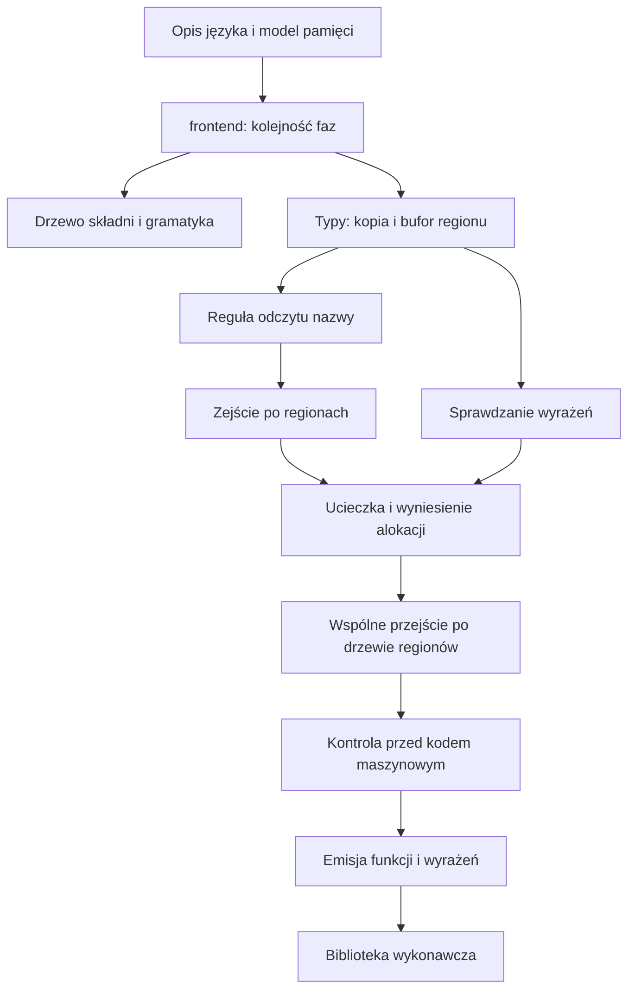

# Rozdział 19. Jak czytać repozytorium

## Ten rozdział obejmuje

- które katalogi mają znaczenie przy czytaniu kompilatora
- za co odpowiada każdy większy plik
- w jakiej kolejności rosły warstwy, które widać w kodzie
- od czego zacząć, gdy chcesz zrozumieć drogę pliku źródłowego
- które dokumenty wyglądają na opis bieżącego kodu, a opisują wcześniejszy etap

## Katalogi, które mają znaczenie

W korzeniu plik `Cargo.toml` opisuje przestrzeń roboczą: skrzynkę `bork` i skrzynkę `crates/bork_runtime`. Plik `build.rs` uruchamia generowanie parsera. Przy opcji `codegen` buduje też statyczną bibliotekę wykonawczą. Plik `src/lib.rs` wystawia funkcję `parse`, eksporty modułów i próbki używane w testach. Plik `src/main.rs` jest wierszem poleceń. Plik `src/bin/bork_lsp.rs` jest binarką serwera. Gramatyka jest w `src/parser.lalrpop`. Drzewo składni jest w `src/ast.rs`. Zamiana nowych linii w nawiasach jest w `src/layout.rs`. Zakres źródłowy jest w `src/span.rs`. Komunikat jest w `src/diag.rs`. Sklejenie faz jest w `src/frontend.rs`.

Sprawdzanie typów leży w `src/typeck/`, reprezentacja pośrednia w `src/hir/`, a analiza własności w `src/sema/`. Analiza ucieczki jest w `src/escape.rs`, wyniesienie alokacji w `src/hoist.rs`, a wspólne przejście po drzewie regionów w `src/region_walk.rs`. Wydruk drzewa jest w `src/dump.rs`, funkcje wbudowane w `src/builtins.rs`, a model bufora 4096 bajtów, którego analiza własności nie używa, w `src/arena.rs`. Adapter protokołu edytora jest w `src/lsp.rs`, generowanie kodu w `src/codegen/`, a biblioteka wykonawcza w `crates/bork_runtime/`.

Testy czytania składni są w `tests/parser.rs`. Testy tablic przez samo sprawdzenie są w `tests/arrays.rs`. Testy budowania i uruchamiania binarki są w `tests/build.rs`. Klient edytora jest w `tools/bork-lsp-extension/`. Opis języka jest w `docs/language.md`. Model pamięci jest w `docs/memory-model.md`. Starsze specyfikacje i plany są w `docs/superpowers/`. Lista znanych braków jest w `TODO.md`. Skrypt kopiujący bibliotekę LLVM obok binarki `bork` jest w `scripts/bundle-llvm.sh`.

Moduły `escape`, `region_walk`, `layout` i `builtins` są prywatne. Widać je wewnątrz skrzynki, a nie w publicznym API. Z zewnątrz wchodzisz przez `parse`, `frontend`, `sema`, `hir`, `typeck`, `dump`, `diag`, `lsp`, `codegen`, `arena`, `span` i `ast`.

## Za co odpowiada każdy moduł

Moduł `ast` trzyma nietypowane drzewo po parserze. Moduł `layout` zamienia znak nowej linii na znak powrotu karetki wewnątrz nawiasów i nie zmienia długości pliku. Moduł `span` trzyma parę przesunięć bajtowych. Moduł `diag` trzyma fazę, treść i zakres. Moduł `frontend` skleja fazy w wynik sprawdzenia. Moduł `typeck` produkuje reprezentację pośrednią i błędy typu. Moduł `hir` trzyma typowane drzewo bez numerów regionów. Moduł `sema` buduje drzewo regionów i błędy nazw. Plik `escape.rs` odrzuca bajty, które byłyby użyte po zwolnieniu ich bufora. Plik `hoist.rs` rozpoznaje dwie sąsiednie instrukcje i ustawia miejsce alokacji. Plik `region_walk.rs` jest jednym przejściem po reprezentacji pośredniej razem z raportem regionów. Plik `dump.rs` zamienia drzewo na tekst. Plik `builtins.rs` deklaruje `print`, `println` i `concat`. Plik `arena.rs` opisuje bufor i pulę jako model w kompilatorze. Katalog `codegen` ma kontrolę przed generowaniem kodu, emisję LLVM i konsolidację. Katalog `codegen/llvm` tłumaczy funkcje, wyrażenia, tablice i uchwyty regionów przez bibliotekę Inkwell. Moduł `lsp` liczy pozycje UTF-16, podpowiedź i wydruk. Skrzynka `bork_runtime` trzyma bufory i wypisywanie dla zlinkowanego programu.

## Jak rosły warstwy widoczne w kodzie

Kolejność na gałęzi `main`, skrócona do rzeczy, które widać w źródłach, jest następująca. Najpierw był parser i drzewo składni, z próbką funkcji dopisanej na końcu wywołania. Serwer edytora najpierw wołał samo czytanie składni. Dziś woła pełne sprawdzenie. Potem doszła składnia wartości pustych, napisów oraz słów `Some` i `None`. Potem analiza regionów, wydruk drzewa i podpowiedź własności. Potem wyrażeniowe `move` oraz `val` i `var` na parametrach. Potem typowana reprezentacja pośrednia i funkcja `frontend::check` z fazą w komunikacie. Potem LLVM, polecenie `bork build`, biblioteka wykonawcza i kontrola przed generowaniem kodu. Potem miejsce przeznaczenia alokacji, wyniesienie, słowo `promote`, funkcja `concat` i analiza ucieczki. Potem tablice o długości w typie, wycinki, pętle `while` z `break` i `continue`, koniunkcja i alternatywa oraz wspólne przejście po drzewie regionów. Na końcu przypięcie LLVM 23 i skrypt pakowania biblioteki.

Specyfikacje w `docs/superpowers/specs/` opisują wczesne kroki i projekt serwera. Nie opisują tablic ani pętli `while`. Plik `TODO.md` jest świeższy i mówi wprost, żeby plany w `docs/superpowers/plans/` przenieść albo usunąć, gdy zostaną wchłonięte. Czytaj je jako historię decyzji. Kontraktem jest kod. Dodatek C wymienia miejsca, w których dokument i kod mówią co innego.

## Od czego zacząć czytanie

Gdy celem jest zrozumienie, co dzieje się z plikiem o rozszerzeniu `.bork`, idź w tej kolejności.

Najpierw przeczytaj `docs/language.md` i `docs/memory-model.md`, a potem tę książkę w miejscach, gdzie dokument rozmija się z kompilatorem. Najważniejszy przykład to `concat` na dwóch zmiennych napisowych. Potem otwórz `src/lib.rs` i zobacz funkcję `parse` oraz dwie próbki. Próbka pierwszej wersji sprawdza, że parser i analiza własności dają radę. Nie jest testem generowania kodu. Potem przeczytaj `src/frontend.rs`. Cała kolejność faz mieści się tam w kilkudziesięciu liniach.

Drzewo składni w `src/ast.rs` czytaj równolegle z początkiem gramatyki, czyli z produkcjami programu, instrukcji i wyrażenia. Nie czytaj kilkuset linii gramatyki ciągiem, dopóki nie znasz wariantów drzewa. Potem przeczytaj `src/hir/ty.rs`, zwłaszcza `is_copy` i `uses_arena_storage`. Do tych dwóch predykatów wraca reszta kompilatora. Potem `src/sema/policy.rs` i funkcję `classify_use`. Zejście w `src/sema/walk.rs` czytaj najpierw wokół otwarcia zwykłego regionu, wokół przypisania i wokół warunku.

Wyrażenia w `src/typeck/expr/control.rs` i `src/typeck/expr/call.rs` pokazują miejsca, w których składnia najbardziej przypomina Kotlina. Funkcja `place` w `src/escape.rs` i funkcja `try_hoist` w `src/hoist.rs` są krótkie. Przejście w `src/region_walk.rs` zacznij od typu, który odwiedza węzły, i od oznaczenia pobrania bufora, a nie od makr kursora. Makra `arena_cursor` są mechaniką pożyczania w Ruście. Plik `TODO.md` sam proponuje je kiedyś zastąpić typem kursora.

Kontrolę przed generowaniem kodu czytaj w `src/codegen/gate.rs`, potem wejście budowania w `src/codegen/mod.rs`, potem `emit_module` w `src/codegen/llvm/mod.rs`, potem emisję funkcji i wyrażeń. Emisję tablic zostaw na koniec, gdy wiesz, jak wygląda deskryptor. Biblioteka wykonawcza w `crates/bork_runtime/src/lib.rs` ma około stu pięćdziesięciu linii i jest całym kodem wykonawczym. Testy w `tests/build.rs` mówią, co naprawdę zwraca proces.

Gdy celem jest tylko język, zatrzymaj się przed generowaniem kodu i czytaj testy analizy własności oraz sprawdzania typów.

## Pułapki przy nawigacji

Plik `src/arena.rs` i węzeł `ArenaNode` nie są tym samym obiektem. Pierwszy ma przesunięcie i pojemność 4096 bajtów. Drugi ma dzieci i wiązania w drzewie regionów.

Funkcja `sema::analyze` i funkcja `frontend::check` nie są wymienne. Pierwsza liczy sprawdzanie typów wewnętrznie jeszcze raz. Druga podaje gotowy wektor typów deklaracji.

Rodzaj użycia w reprezentacji pośredniej i rodzaj własności w raporcie mają podobne nazwy, między innymi kopia, współdzielenie i przeniesienie. Nie są tym samym typem w Ruście.

Opcja `codegen` wyłącza część plików z kompilacji, gdy jest wyłączona. Ostrzeżenia o martwym kodzie w przejściu po drzewie regionów bez tej opcji są oczekiwane, bo przejście jest wtedy używane przez oznaczenie regionów, a część metod tylko przez emisję LLVM.

Plany w `docs/superpowers/plans/` potrafią opisywać LLVM 18. Plik `Cargo.toml` przypina Inkwell z opcją `llvm23-1-force-dynamic`. Wierz manifestowi.

## Podsumowanie

- Kolejność faz mieści się w `src/frontend.rs`. Reszta katalogu `src` to poszczególne fazy.
- Regułę odczytu nazwy czytaj przed zejściem po regionach, a predykaty typu przed jednym i przed drugim.
- Specyfikacje w `docs/superpowers` są historią. Plik `TODO.md` i kod są stanem.
- Plik `src/arena.rs` nie stoi na ścieżce sprawdzenia.
- Testy w `tests/build.rs` definiują to, co robi binarka. Komentarze przy emisji LLVM tego nie zastępują.
