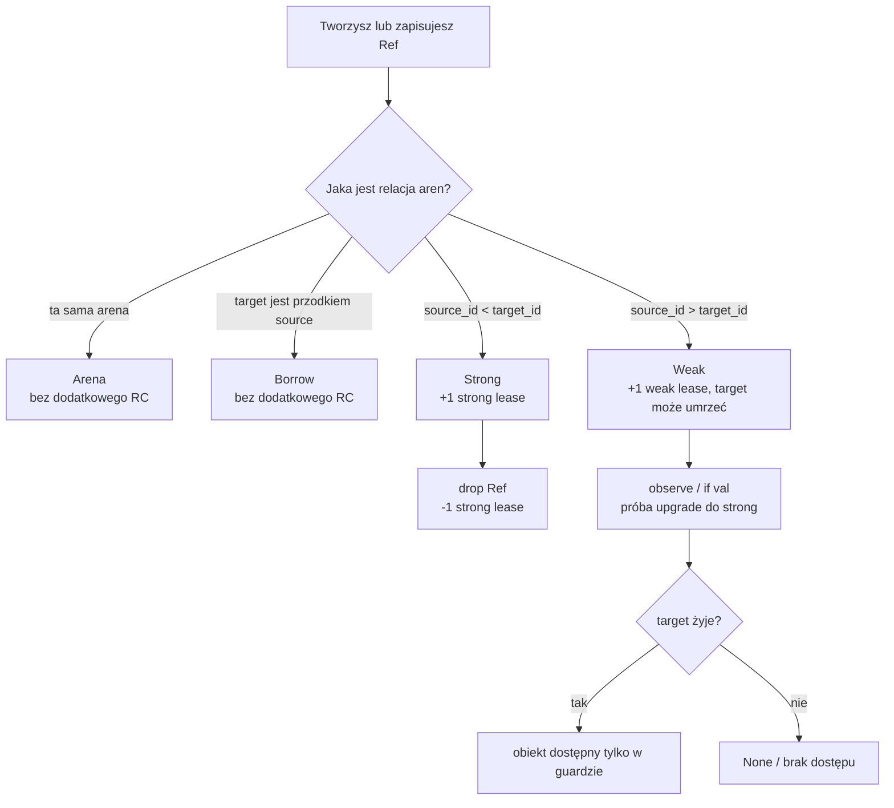
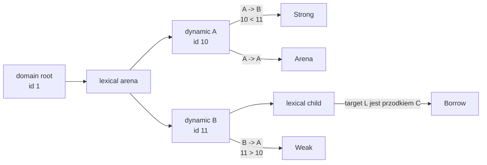
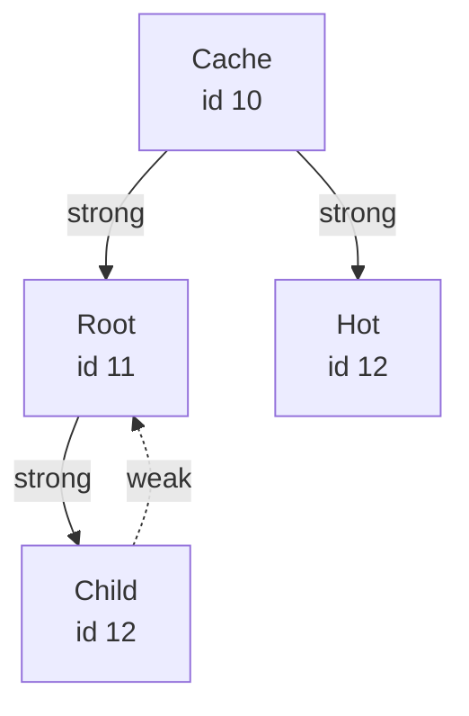
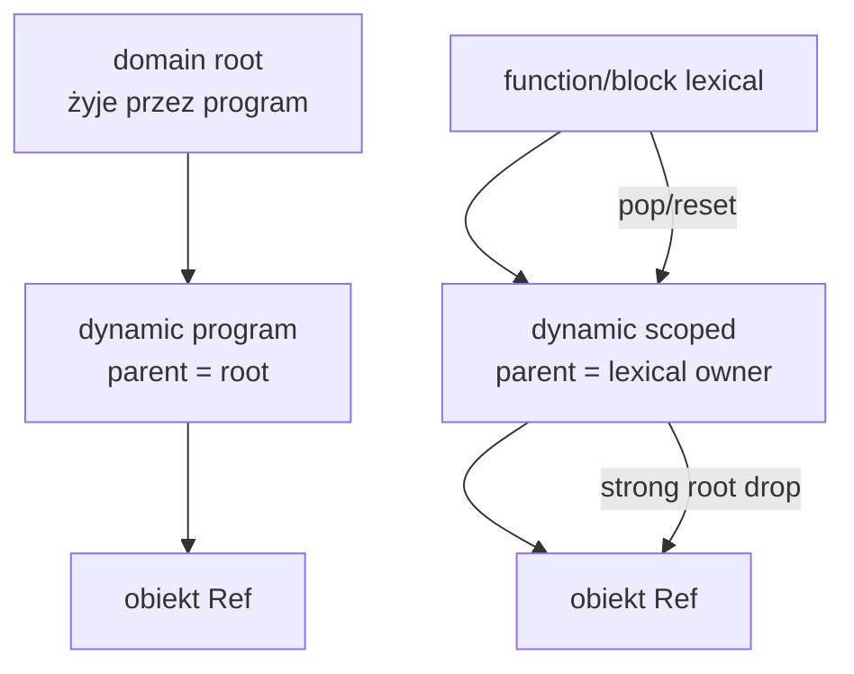
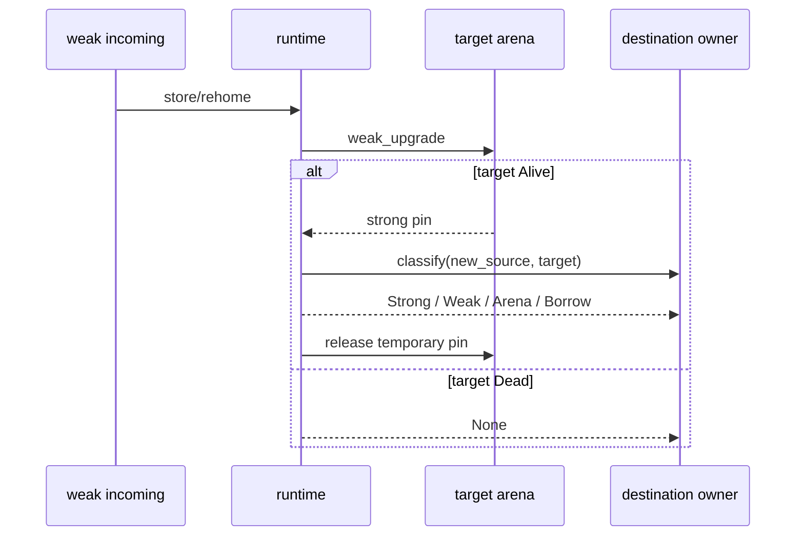
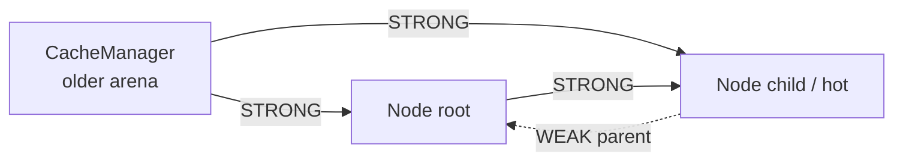
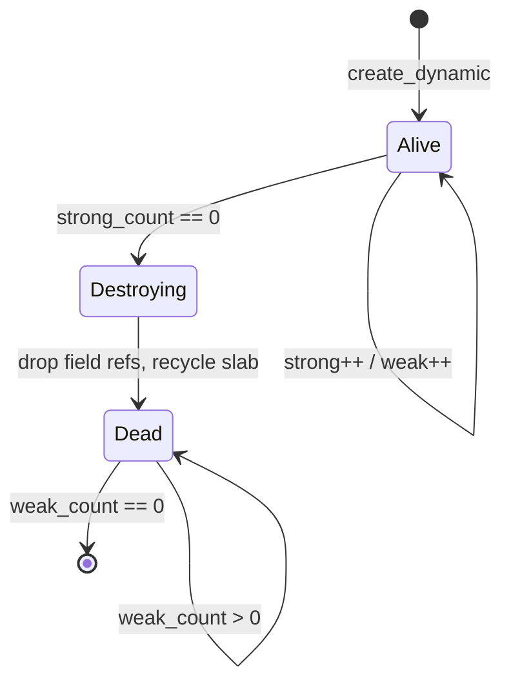

# Referencje w Borku

Ten dokument opisuje dwa różne mechanizmy, które w kodzie Borka wyglądają
podobnie, ale rozwiązują inne problemy:

- `Ref<T>` — zarządzany uchwyt do obiektu `class`, którego życie jest
  kontrolowane przez areny dynamiczne;
- `&T` — krótkotrwały borrow/view do wartości z zewnętrznej areny.

Najważniejsza zasada: `strong` i `weak` nie są osobnymi typami w składni
Borka. Są wynikiem klasyfikacji relacji między areną, z której tworzony jest
uchwyt, i areną, w której żyje obiekt docelowy.

Komentarze `// STRONG`, `// WEAK`, `// ARENA` i `// BORROW` w przykładach są
adnotacjami dokumentacyjnymi. Nie są dyrektywami kompilatora.

## Szybka mapa



W praktyce:

| Co chcesz osiągnąć | Użyj |
|---|---|
| Obiekt może żyć dłużej niż lokalny blok | `Ref<T>` i arena dynamiczna |
| Rodzic trzyma dziecko | zwykle krawędź `Strong` |
| Dziecko wskazuje rodzica bez cyklu | zwykle krawędź `Weak` |
| Krótki odczyt wartości z rodzica | `&T` albo `if val` dla `Ref<T>` |
| Brak obiektu | `None` w `Ref<T>` |

## `Ref<T>` a `&T`

| Właściwość | `Ref<T>` | `&T` |
|---|---|---|
| Cel | obiekt `class` | dowolna dozwolona wartość non-Copy |
| Czy może być `None` | tak | nie jako `&T?` — nullable borrow jest odrzucony |
| Życie | może przeżyć blok dzięki arenie dynamicznej | tylko bieżący region/wywołanie |
| Odczyt | przez `if val`, `when`, `?.` | bezpośrednio jak view |
| Kopiowanie | kopiuje uchwyt i aktualizuje lease | tworzy/reborrowuje view |
| `move` | przenosi uchwyt, źródło staje się `None` | borrow nie można przenieść jako własności |
| `strong/weak` | tak, runtime klasyfikuje areny | nie — to inny mechanizm |

`Ref<T>` jest dozwolone tylko dla nie-nullowalnej klasy:

```bork
class Node { value: i32 }

fun main() {
    val node = Node(7)
    val live: Ref<Node> = node
    val empty: Ref<Node> = None
}
```

Następujące typy są odrzucane jako cel `Ref<T>`:

```bork
fun bad() {
    val text: Ref<String> = None       // błąd: String nie jest class
    val number: Ref<i32> = None        // błąd: typ prymitywny
    val values: Ref<[i32; 2]> = None  // błąd: tablica
}

class MaybeNode { value: i32 }

fun also_bad() {
    val nullable: Ref<MaybeNode?> = None // błąd: cel musi być non-nullable
    val nested: Ref<Ref<MaybeNode>> = None // błąd: Ref<Ref<T>> nie jest wspierane
}
```

## Co naprawdę przechowuje `RefHandle`

W runtime uchwyt ma trzy informacje:

```text
control -> identyfikator areny docelowej
object  -> adres obiektu w payloadzie tej areny
kind    -> None | Arena | Borrow | Strong | Weak
```

`control` nie jest dereferencjonowanym wskaźnikiem do obiektu. Jest stabilnym
tokenem metadanych areny. Payload może wrócić do poola po zniszczeniu areny,
ale słaby uchwyt zachowuje metadane wystarczająco długo, aby bezpiecznie
stwierdzić, że target wygasł.

## Dokładny algorytm klasyfikacji

Runtime wykonuje te testy w tej kolejności:

```text
if source == target:
    Arena
else if target jest ścisłym przodkiem source:
    Borrow
else if source_id < target_id:
    Strong
else:
    Weak
```

Sprawdzenie przodka jest przed porównaniem ID. To ważne: `Borrow` nie jest
„słabym strongiem”, tylko bezkosztowym odwołaniem, którego bezpieczeństwo
wynika z hierarchii życia aren.

ID aren są monotoniczne w obrębie wątku runtime. Nie należy porównywać
adresów obiektów, kolejności deklaracji pól ani adresów slabów. Liczy się
`arena_id` kontrolki.



## Wszystkie wartości `RefKind`

### `None`

`None` nie wskazuje obiektu i nie ma kontroli ani payloadu:

```bork
class Node { value: i32 }

fun main(): i32 {
    val missing: Ref<Node> = None
    if val node = missing {
        return node.value
    }
    return 0
}
```

`None` powstaje także po `move` z lokalnego slotu albo po nieudanym
`rehome` wygasłego weak refa. `bork_ref_is_none` traktuje wygasły `Weak` jak
brak, chociaż sam slot może nadal mieć wewnętrzny tag `Weak` do czasu dropu.

### `Arena`

`Arena` oznacza, że source i target są w tej samej arenie. Nie ma dodatkowego
strong ani weak lease. Ważność uchwytu wynika wyłącznie z życia tej jednej
areny.

Najczęściej powstaje przy self-reference w obiekcie dynamicznym:

```bork
class Node { next: Ref<Node> }

fun main() {
    val node = Node(None)
    node.next = node
    // ARENA: owner pola i target są w tej samej arenie obiektu.
}
```

To nie jest cykl RC: arena niszczy wszystkie swoje sloty razem. Nie należy
jednak używać takiego uchwytu po zakończeniu życia areny.

### `Borrow`

`Borrow` oznacza, że target jest ścisłym przodkiem source w drzewie aren.
Source może bezpiecznie patrzeć w górę, bo rodzic musi przeżyć dziecko.
Runtime nie zwiększa liczników.

Jest to klasyfikacja na poziomie aren zarządzanego `Ref`, a nie synonim
składniowego `&T`. Powiązany przypadek runtime wygląda tak:

```text
parent arena (target)  ───────────────┐
                                      │ target żyje dłużej
child arena (source)  ── Ref ────────┘
                                      => Borrow
```

W zwykłej składni Borka `&T` jest jawnie krótkim view i nie powinien być
opisywany jako `RefKind::Borrow`. `&T` nie tworzy managed handle.

### `Strong`

`Strong` powstaje, gdy source nie jest przodkiem targetu, source i target są
różne, a `source_id < target_id`. Utworzenie uchwytu zwiększa `strong_count`
areny docelowej. Dopóki istnieje strong lease, target nie może przejść do
`Dead`.

```bork
class Node {
    id: i32
    child: Ref<Node>
}

class CacheManager {
    root: Ref<Node>
}

fun main() {
    // Cache jest planowany jako pierwszy dynamiczny obiekt.
    val cache = CacheManager(None)
    val root = Node(1, None)
    cache.root = root
    val cache_ref: Ref<CacheManager> = cache

    if val manager = cache_ref {
        if val node = manager.root {
            // STRONG: arena cache ma starsze ID niż arena root.
            println(node.id)
        }
    }
}
```

`Strong` jest właściwy dla właściciela i dziecka. W grafie własności strzałka
strong powinna iść „na zewnątrz” do nowszego obiektu.

### `Weak`

`Weak` powstaje, gdy source ma nowsze ID niż target i nie zachodzi przypadek
`Borrow`. Utworzenie uchwytu zwiększa tylko `weak_count` metadanych targetu.
Payload targetu może zostać zniszczony.

```bork
class Node {
    id: i32
    parent: Ref<Node> // WEAK, gdy Node jest back-edge do starszego parenta
    child: Ref<Node>
}

fun main() {
    val parent = Node(1, None, None)
    val child = Node(2, parent, None)

    parent.child = child
    // STRONG: parent -> child, bo parent arena jest starsza.
    // WEAK: child -> parent, bo child arena jest nowsza.

    if val live_child = parent.child {
        if val live_parent = live_child.parent {
            println(live_parent.id)
        }
    }
}
```

Weak ref jest bezpiecznym obserwatorem, nie właścicielem. Po śmierci targetu
`if val`, `when Some` i `?.` zachowują się jak dostęp do `None`.

## Dlaczego strong/weak nie tworzą cyklu

Dla różnych aren każda krawędź `Strong` idzie od mniejszego ID do większego:



Nie da się zbudować cyklu wyłącznie z krawędzi strong między różnymi arenami,
bo ID musiałoby jednocześnie rosnąć i wrócić do mniejszej wartości. Krawędź
powrotna staje się weak. Self-reference w jednej arenie ma `Arena`, a nie
strong RC.

Praktyczny wzorzec grafu:

```text
owner/cache --strong--> root --strong--> child
                              ^           |
                              |--- weak --|
```

Nie należy próbować wymuszać cyklu „dwoma strongami”. Jeśli struktura ma
relację rodzic-dziecko, właściciel trzyma dziecko strong, a dziecko wskazuje
rodzica weak.

## Kiedy obiekt dostaje arenę dynamiczną

Obiekt `class` zaczyna jako zwykła alokacja w bieżącej arenie leksykalnej.
Planner pamięci promuje jego alokację do areny dynamicznej, gdy widzi, że
obiekt może być użyty przez managed `Ref` albo musi przeżyć bieżący region.

Najważniejsze źródła takiej promocji:

| Sytuacja | Skutek planera |
|---|---|
| `val r: Ref<Node> = node` | target `node` staje się dynamiczny |
| zapis do pola `Ref<T>` | target wartości staje się dynamiczny i powstaje edge |
| `[Ref<T>; N]` | źródła elementów są konserwatywnie promowane |
| `return Ref<T>` | target trafia do domeny programu |
| przekazanie `Ref<T>` do wywołania | obecnie konserwatywnie domena programu |
| zwykły lokal bez escape | arena leksykalna |

Planner robi to **przed** wygenerowaniem alokacji. Runtime nie próbuje
ratować wskaźnika do zwykłej areny po jej `pop`.

### Dynamic scoped i dynamic program



- **Program dynamic** może przeżyć wiele bloków i jest podpięty do domenowego
  rootu.
- **Scoped dynamic** ma lexical parenta. Musi zostać zniszczony zanim parent
  zostanie zresetowany.
- Każda dynamic arena zaczyna z jednym ukrytym strong rootem. Compiler
  rejestruje drop tego roota w właścicielu lexical.

Poniższy program pokazuje różnicę między obiektem lokalnym a obiektem w domenie
programu. `shared` jest używany w dwóch niezależnych blokach, a następnie po
ich zakończeniu — nadal wskazuje ten sam żywy obiekt:

```bork
// exit: 42
class Box { value: i32 }

fun make_shared(): Ref<Box> {
    // Zwracany Ref<T> powoduje, że Box trafia do dynamic program,
    // podpiętej do domain root, zamiast do areny tego wywołania.
    return Box(40)
}

fun main(): i32 {
    val shared = make_shared()
    var total = 0

    {
        val local = Box(1)
        if val live = shared {
            // `live` jest deklarowane przez `if val`: tutaj ma typ `&Box`.
            // To krótka obserwacja; slot `shared` pozostaje w zakresie main.
            total = total + live.value + local.value // 41
        }
    }
    // local i arena pierwszego bloku mogą zostać zresetowane.
    // Obiekt wskazywany przez shared nie znika, bo żyje w dynamic program.

    {
        val local = Box(1)
        if val live = shared {
            // To nowy blok i nowa lokalna arena, ale ten sam shared.
            total = total + local.value + (live.value - 40) // 42
        }
    }
    // Drugi blok również się kończy; shared nadal jest dostępny.

    if val live = shared {
        // Trzeci odczyt po obu blokach dowodzi, że target przeżył ich reset.
        return total + (live.value - 40)
    }
    return total
}
```

## Odczyt managed `Ref<T>`

### Gdy weak rzeczywiście wygasa

Kod odbiorcy nie musi wiedzieć, czy `None` pochodziło z pustego pola, czy z
weak refa, którego target właśnie przeszedł do `Dead`. W obu przypadkach
`if val` po prostu nie wchodzi do gałęzi `Some`:

```bork
class Node {
    id: i32
    parent: Ref<Node>
    child: Ref<Node>
}

fun read_parent(child: Ref<Node>): i32 {
    if val live_child = child {
        if val parent = live_child.parent {
            // WEAK back-edge -> target jeszcze żyje; parent ma typ &Node.
            return parent.id
        }
    }
    // WEAK -> target wygasł (albo pole było od początku None).
    return 0
}

fun main(): i32 {
    val parent = Node(1, None, None)
    val child = Node(2, parent, None)

    parent.child = child
    // parent -> child: STRONG (starsza arena wskazuje nowszą).
    // child -> parent: WEAK (młodsza arena wskazuje starszą; to back-edge).

    val child_ref: Ref<Node> = child
    // Parametr read_parent dostaje ten sam managed handle.
    // Samo przekazanie jako parametr nie zmienia go w Strong ani Weak.
    return read_parent(child_ref) // parent jest jeszcze żywy, więc wynik to 1.
}
```

To jest świadoma reguła języka, a nie brakująca funkcja: Bork nie udostępnia i
nie planuje udostępniać jawnego typu `Weak<T>` ani kwalifikatorów `strong` /
`weak`. Weak back-edge powstaje automatycznie z kolejności niezależnych aren,
a compiler dobiera lease na podstawie regionów i escape. Użytkownik widzi tylko
`Ref<T>` oraz bezpieczną obserwację; przykład poniżej pokazuje wynik tej reguły.

### Wygasły weak z obecnej składni

Tutaj `child` ucieka z bloku przez `saved`, ale `parent` nie ma żadnego
strong ownera poza tym blokiem:

```bork
class Node {
    id: i32
    parent: Ref<Node>
}

fun main(): i32 {
    var saved: Ref<Node> = None

    {
        val parent = Node(1, None)
        val child = Node(2, parent)

        // child powstał później niż parent, więc child.parent jest WEAK.
        // saved tworzy strong edge, który utrzyma child po wyjściu z bloku.
        saved = child
    }
    // Strong root parenta należał do wewnętrznego bloku i właśnie zniknął.
    // child nadal żyje przez saved, a child.parent wskazuje na Dead parent.

    if val live_child = saved {
        if val live_parent = live_child.parent {
            // Ta gałąź się nie wykona: wygasły WEAK obserwuje się jako None.
            return live_parent.id
        }
    }
    return 0
}
```

To jest rzeczywisty przypadek `Weak`, nie tylko adnotacja w komentarzu. Test
[`expired_weak_back_edge.bork`](../programs/build/managed_refs/expired_weak_back_edge.bork)
uruchamia ten program i oczekuje kodu wyjścia `0`.

To samo wygaśnięcie jest dodatkowo sprawdzone na granicy runtime/ABI w
[`expired_weak_observes_as_none_and_live_observation_pins_payload`](../crates/bork_runtime/src/lib.rs:197):

```rust
// crates/bork_runtime/src/lib.rs — skrót testu runtime.
let weak = bork_ref_create(newer_source, target, object); // WEAK
bork_arena_release_strong(target); // usunięcie ostatniego strong lease'a

let observation = bork_ref_observe(weak);
assert!(observation.object.is_null()); // wygasły Weak zachowuje się jak None
```

Sam `weak` nadal utrzymuje metadane kontroli, więc można go bezpiecznie
odrzucić. Nie wolno natomiast dereferencjonować `object` po nieudanej obserwacji.

### Model powierzchniowy: bez jawnego `Weak<T>`

`Strong`, `Weak`, `Arena` i `Borrow` są szczegółami planera oraz runtime, a nie
typami, które użytkownik musi wybierać. W kodzie Borka istnieje tylko `Ref<T>`:

- `Ref<T>` może zawierać żywy obiekt, `None` albo wygasły target;
- `if val`, `when` i `?.` wykonują bezpieczną obserwację i udostępniają
  krótkotrwałe `&T` tylko wtedy, gdy obiekt faktycznie żyje;
- compiler sam dobiera arenę, lease i kierunek krawędzi na podstawie escape oraz
  układu regionów;
- wyjście z regionu zwalnia obiekty, których żaden żywy strong owner już nie
  potrzebuje — bez ręcznego `drop`, `upgrade` ani oznaczania pól jako weak.

To daje ergonomię języka z GC, ale bez garbage collectora: użytkownik nie śledzi
liczników referencji ani cykli, a runtime nadal może deterministycznie zwolnić
całą arenę. Diagramy i etykiety `STRONG`/`WEAK` w tym dokumencie opisują tylko
to, co robi implementacja pod spodem.

Bezpośrednie pole na managed refie jest błędem:

```bork
class Box { value: i32 }

fun bad(reference: Ref<Box>): i32 {
    return reference.value // błąd: najpierw trzeba sprawdzić obecność
}
```

Dozwolone są trzy formy:

```bork
fun read_all(reference: Ref<Box>): i32 {
    if val box = reference {
        return box.value
    }

    when reference {
        Some(box) => { return box.value }
        None => { return 0 }
    }
}

fun read_safe(reference: Ref<Box>): i32 {
    val value: i32? = reference?.value
    return value ?: 0
}
```

W `if val` i `when Some` compiler tworzy krótką obserwację/pin targetu.
Strong i weak są na czas guarda dostępne; po wyjściu z guarda observation jest
zwalniana. Dla `Weak`, którego target już umarł, gałąź `Some` się nie wykona.

`?.` ma dwie różne reguły:

```bork
class Parent { child: Ref<Box> }

fun navigate(parent: Ref<Parent>): i32 {
    val nested: Ref<Box> = parent?.child
    return nested?.value ?: 0
}
```

- zwykłe pole `i32`, `String` lub tablica daje nullable wynik;
- pole `Ref<U>` daje płaski `Ref<U>`, a nie `Ref<Ref<U>>`;
- `?:` na `Ref<U>` wybiera uchwyt, nie rozpakowuje go do obiektu.

## Kopiowanie, move, field store i rehome

### Kopia uchwytu

`Ref<T>` nie kopiuje obiektu. Kopiuje handle:

```bork
class Box { value: i32 }

fun main(): i32 {
    val object = Box(7)
    val first: Ref<Box> = object
    val second = first
    // kopia strong/weak aktualizuje odpowiedni lease;
    // oba uchwyty wskazują ten sam obiekt.
    if val live = second {
        return live.value
    }
    return 0
}
```

### `move`

```bork
fun move_ref(): Ref<Box> {
    val object = Box(7)
    var slot: Ref<Box> = object
    val moved = move slot
    // slot jest teraz None/moved; licznik nie jest zwiększany drugi raz.
    return moved
}
```

`move` przenosi istniejący handle i wyzerowuje źródłowy slot. Nie jest to
deep-copy payloadu.

### Zapis do pola

Pola `Ref<T>` są własnością areny obiektu. Przy zapisie runtime:

1. tworzy/rehome'uje nowy handle względem areny właściciela pola;
2. zastępuje stary handle;
3. dropuje stary handle;
4. rejestruje drop pola, aby wykonać go przed recyklingiem payloadu.

```bork
class Holder { target: Ref<Box> }

fun main() {
    val holder = Holder(None)
    val box = Box(7)
    holder.target = box
    // target zostaje zrehome'owany względem areny holdera.
}
```

Nie można przypisywać pola przez sam managed handle:

```bork
fun bad(holder: Ref<Holder>, box: Ref<Box>) {
    holder.target = box // błąd: Ref musi być najpierw unwrapped
}
```

Trzeba ustawić pola na wartości klasy przed zamianą jej w `Ref`, albo użyć
dozwolonego bound/reference API:

```bork
fun build_cache(): Ref<Holder> {
    val holder = Holder(None)
    val box = Box(7)
    holder.target = box
    return holder
}
```

### Rehome weak handle

Gdy weak handle jest zapisywany do innego właściciela, runtime tymczasowo
próbuje go upgrade'ować do strong. Jeśli target żyje, tworzy nowy handle według
nowego source i zwalnia tymczasowy pin. Jeśli target umarł, wynik to `None`.



To zabezpiecza self-assignment i zapis ostatniego właściciela: nowa wartość
jest utrzymywana zanim stara zostanie zwolniona.

## Tablice referencji

`[Ref<T>; N]` przechowuje N handle’i, nie surową kopię bajtów obiektów:

```bork
class Node { value: i32 }
class Index { entries: [Ref<Node>; 2] }

fun main(): i32 {
    val first = Node(10)
    val second = Node(20)
    val index = Index([first, second])

    if val node = index.entries[1] {
        return node.value
    }
    return 0
}
```

Każdy element jest kopiowany/rehome'owany osobno i dostaje własny drop. Nie
wolno traktować tablicy `Ref` jak zwykłego `memcpy`.

Planner jest obecnie konserwatywny dla tablic: źródła refów przechowywanych w
tablicy mogą zostać promowane do domeny programu, bo analiza nie ma jeszcze
pełnych summary dla wszystkich indeksów.

## Strong/weak w CacheManagerze

To jest kompletny wzorzec używany w corpusie Borka:

```bork
class Node {
    id: i32
    value: i32
    parent: Ref<Node>
    child: Ref<Node>
}

class CacheManager {
    root: Ref<Node>
    hot: Ref<Node>
}

fun main(): i32 {
    var answer = 0
    {
        val cache = CacheManager(None, None)
        val root = Node(1, 10, None, None)
        val child = Node(2, 20, root, None)

        root.child = child
        cache.root = root
        cache.hot = child
        val cache_ref: Ref<CacheManager> = cache

        if val manager = cache_ref {
            if val root_live = manager.root {
                if val child_live = root_live.child {
                    if val parent = child_live.parent {
                        if val hot = manager.hot {
                            // root -> child: STRONG
                            // child -> parent: WEAK
                            // cache -> root/hot: STRONG
                            answer = root_live.id + child_live.value
                                + parent.id + hot.value
                        }
                    }
                }
            }
        }
    }
    // Wyjście z bloku dropuje cache i node'y.
    // Domena główna runtime pozostaje Alive.
    return answer
}
```

Kolejność alokacji jest częścią przykładu:



Gdyby `child` trzymał rodzica strong, powstałaby logiczna krawędź zwrotna.
W tym modelu poprawna krawędź zwrotna jest weak, więc po dropie ostatnich
strong lease'ów targety przechodzą w `Dead`.

## Cykl życia i cleanup

Dynamic arena ma osobne liczniki dla payloadu i metadanych:



Kolejność zniszczenia:

1. `strong_count` spada do zera;
2. arena przechodzi w `Destroying`;
3. wykonywane są zarejestrowane dropy pól i tablic;
4. payload slab wraca do `ArenaPool` i jest resetowany;
5. arena jest `Dead`;
6. control metadata znika, gdy nie ma już weak lease'ów ani lease'a rodzica.

Domain root jest wyjątkiem: pozostaje przez cały proces i nie może zostać
zwolniony. Sam pool slabów również celowo przechowuje wolne bufory do reuse —
to cache pamięci, nie wyciek obiektów.

## Co sprawdzać podczas review

Przy każdej nowej krawędzi `Ref<T>` zadaj te pytania:

1. W jakiej arenie powstaje source?
2. W jakiej arenie alokowany jest target?
3. Czy target jest dynamiczny, jeśli relacja może być `Strong` albo `Weak`?
4. Czy `source_id < target_id` daje pożądaną własność strong?
5. Czy krawędź powrotna jest weak?
6. Czy odczyt jest chroniony przez `if val`, `when` albo `?.`?
7. Czy zapis pola/array ma zarejestrowany drop?
8. Czy `return` albo call nie promuje niechcący całego grafu do domeny programu?
9. Co stanie się po dropie ostatniego strong ownera?
10. Czy wygasły weak ref daje `None`, zamiast dotykać payloadu po recyklingu?

Najprostszy bezpieczny graf ma tę postać:

```text
starszy owner  --Strong-->  młodsze dziecko
młodsze dziecko --Weak----> starszy owner
```

## Częste błędy

### Próba użycia `Ref` jak zwykłego obiektu

```bork
fun bad(r: Ref<Box>): i32 {
    return r.value // błąd
}
```

Poprawnie:

```bork
fun good(r: Ref<Box>): i32 {
    return r?.value ?: 0
}
```

### Próba przechowania obiektu z lexical arena po jej końcu

```bork
fun bad(): Ref<Box> {
    {
        val box = Box(7)
        // Planner musi wykryć escape i zrobić target dynamiczny.
        return box
    }
}
```

W aktualnym codegen return `Ref<T>` promuje target do domeny programu. Nie
wolno ręcznie omijać planera przez surowy wskaźnik.

### Strong back-edge

```bork
class Node { parent: Ref<Node> child: Ref<Node> }

// Zła intuicja: oba pola „na wszelki wypadek” jako strong.
// W Borku nie wybierasz tego keywordem; kolejność aren wymusza weak back-edge.
```

Jeśli analiza pokazuje, że targety są program-lived, sprawdź, czy krawędź nie
została niepotrzebnie wypromowana przez return, call albo tablicę.

### Weak ref używany bez sprawdzenia obecności

```bork
fun bad(r: Ref<Box>): i32 {
    // r może być wygasłym weak refem.
    return r.value // błąd: Ref<T> wymaga if val, when albo ?.
}
```

`!!` służy do nullable `T?`; nie jest skrótem do rozpakowania `Ref<T>`. Dla
ścieżki, na której target może umrzeć, użyj `if val`, `when` lub `?.`.

## Ograniczenia obecnej implementacji

- `Ref<T>` działa tylko dla nie-nullowalnych klas.
- `Ref<Ref<T>>` nie jest wspierane.
- Bork świadomie nie ma osobnego typu `Weak<T>` — weak back-edges wybiera
  compiler automatycznie.
- Nie ma cycle collectora — bezpieczeństwo opiera się na kolejności aren i
  weak back-edges.
- `&T` nie może być polem ani typem zwracanym.
- Nie można przechowywać borrows z child arena w parent field.
- Analiza ucieczki przez zwykłe wywołania i ref-array jest konserwatywna i może
  utrzymać target do końca domeny programu.
- Arena pool przechowuje wolne slab'y do późniejszego użycia.

Powiązane opisy:

- [model pamięci i areny](memory-model.md),
- [składnia języka i `Ref<T>`](language.md),
- [przykład CacheManagera](../programs/build/managed_refs/cache_manager_graph.bork).

## Łańcuch `if val`

Zamiast zagnieżdżać guardy można zapisać niepustą listę bindingów:

```bork
if val (manager = cache_ref, root = manager.root, child = root.child,) {
    println(child.id)
} else {
    println(0)
}
```

RHS są obliczane od lewej do prawej, dokładnie raz, tylko do pierwszego
niepowodzenia. Każdy binding wymaga `Ref<T>` i udostępnia `&T` kolejnym RHS
oraz body. Lista może być wieloliniowa i kończyć się przecinkiem. Bindingi
mają jeden scope sukcesu; powtórzona nazwa w nagłówku jest błędem. Shadowing
nazwy zewnętrznej jest dozwolony, a RHS deklaracji widzi jej poprzednie znaczenie.
`else` i kod za konstrukcją widzą środowisko zewnętrzne.

Wszystkie obserwacje korzystają z jednej areny guarda. Niepowodzenie późniejszego
bindingu zwalnia dotychczasowe piny przed `else`, bez cofania efektów RHS.
Pożyczki nie mogą opuścić guarda; wyniki owned są materializowane przed cleanup.
Nie zmienia to reprezentacji strong/weak ani reguł nullable `T?`.

[Chained CacheManager](../programs/build/managed_refs/chained_cache_manager_graph.bork)
i dotychczasowy przykład zagnieżdżony zwracają 42.

Pole typu klasy odczytane przez borrow `&Parent` daje kolejny borrow `&Child`,
nie owned `Child`. Taki widok pozostaje w scope guarda: nie można go wynieść,
umieścić w owned obiekcie ani przekazać jako własności do funkcji. Można odczytać
jego pola i zbudować świeżą klasę albo utrwalić relację jako `Ref<T>`.
`move` i `promote` zwykłych klas nie są jeszcze obsługiwane przez codegen;
kompilator zgłasza diagnostykę. Wyniki String, array i managed `Ref` zachowują
obecne reguły materializacji.
