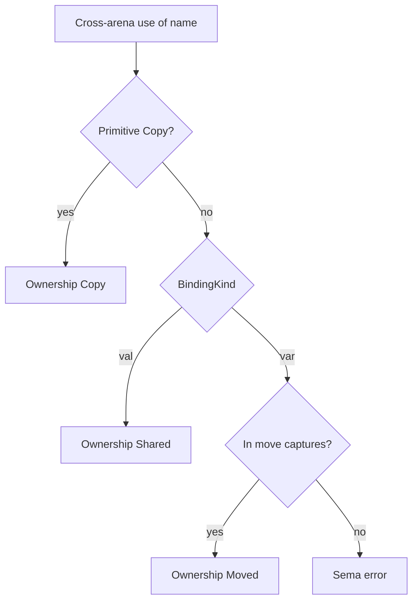

# Shared val reads across arenas

> **For agentic workers:** Use superpowers:executing-plans or subagent-driven-development task-by-task.

**Goal:** Allow cross-arena reads of parent `val` bindings as shared observation (no `move`); keep `move` required for non-Copy parent `var` (and explicit consume).

**Architecture:** Track `BindingKind` on env bindings. In `note_use`, non-Copy cross-arena access: `Val` → record `Ownership::Shared`; `Var` → error unless moved. Explicit `move` still works for both. Dump/docs/LSP hover show Shared.

**Tech stack:** Existing `sema` / `dump` / `docs/memory-model.md`.

## Locked decisions

- Nested arenas obey stack discipline (child dies first) → parent `val` may be read in place
- Primitives stay **Copy**
- Parent **`var`** non-Copy still requires **`move`**
- Explicit `move (x)` on a `val` remains legal (consume / relocate); marks parent Moved
- Escape-to-parent / escaping closures: document as future; no new analysis this change

## File map

| File | Change |
|------|--------|
| [src/sema.rs](src/sema.rs) | Store `kind` on `EnvBinding`; `Ownership::Shared { from }`; `note_use` branch |
| [src/dump.rs](src/dump.rs) | Render `[Shared ← …]` |
| [src/lsp.rs](src/lsp.rs) | Hover text for Shared |
| [docs/memory-model.md](docs/memory-model.md) | Val Shared vs Var Move |
| tests in `sema` / `lsp` | `val String` readable in child; `var` still errors; dump/hover |



## Tasks

### Task 1: Env + Ownership::Shared + note_use

**Files:** [src/sema.rs](src/sema.rs)

- Add `kind: BindingKind` to `EnvBinding` (set on `VarDecl` and params: params act as `Val` for Shared purposes — function params are immutable bindings in Bork MVP)
- Extend `Ownership` with `Shared { from: String }`
- `note_use`: if cross-arena and not Copy and not moved:
  - if `kind == Val` → push Shared binding on child node (dedupe by name), return
  - if `kind == Var` → existing “not Copy; move …” error
- Keep move-capture path unchanged (works for val and var)

- [ ] Test: `val s: String` used in nested `{ val t = s }` → no errors; child dump/bindings include Shared
- [ ] Test: `var s: String` used in nested block without move → error
- [ ] Test: `move (s)` on val still marks Moved + use-after-move

Run: `cargo test --lib sema`

### Task 2: Dump + LSP hover + docs

**Files:** [src/dump.rs](src/dump.rs), [src/lsp.rs](src/lsp.rs), [docs/memory-model.md](docs/memory-model.md)

- Dump: `[Shared ← {from}]`
- Hover: `Ownership: Shared ← …`
- Docs: table row for Shared val; note when move still applies (var, escape, explicit consume)

Run: `cargo test --quiet`

### Task 3: Commit (on feat branch or follow-up)

```bash
git commit -m "$(cat <<'EOF'
feat(sema): allow shared cross-arena reads of val bindings.

EOF
)"
```

## Non-goals

- Deep copy of non-primitive vals
- Escape analysis / return-path moves
- Mutable borrows of `var`
