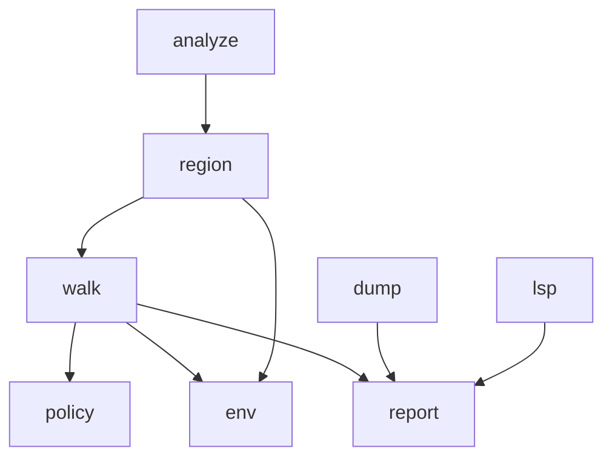

# Thermonuclear follow-up — BindingInfo / walk / if-merge Implementation Plan

> **For agentic workers:** REQUIRED SUB-SKILL: Use superpowers:executing-plans to implement this plan task-by-task.

**Goal:** Clear every thermonuclear blocker from the 2026-09-22 review, then deslop + re-review until push-ready.

**Architecture:** Split arena report into real `bindings` (decls/captures) vs `observations` (cross-arena dump lines + use sites for hover). Move the AST walker into `walk.rs` so region openers need no callback. Restore if-branch move flags without cloning the full env. Tighten `RegionParam`, drop dead APIs, finish `SourceMap`.

**Tech Stack:** Rust, existing `sema` / `lsp` / `dump`.

## Locked decisions

| Finding | Fix |
|---------|-----|
| `BindingRole` Decl=dump | Delete `BindingRole`. `ArenaNode.bindings` = decls/captures only. `ArenaNode.observations` = Copy/Shared (dump) + Local uses (hover). Dump emits `bindings` then non-Local observations. Hover searches both for span hits. |
| Full env clone on if | Snapshot/restore `moved` via `HashSet` only; no `env.clone()` |
| Walk `FnOnce` cycle | New `sema/walk.rs` with `walk_block`; region imports walk; analyze thin |
| Tuple `RegionParam` | `struct RegionParam { name, ty, span }` |
| Dead `collapse_block` | Remove public `collapse_block`; tests use `peel_blocks` only |
| Hover decl fallback | Delete `walk_local_decls`; hover = span hit only |
| `line_starts` unused | `offset_to_position` binary-search `line_starts` |

## File map

| File | Change |
|------|--------|
| [`src/sema/report.rs`](src/sema/report.rs) | Drop `BindingRole`; add `observations` on `ArenaNode` |
| [`src/sema/region.rs`](src/sema/region.rs) | `RegionParam` struct; shared `open_frame`; call `walk::walk_block` |
| [`src/sema/walk.rs`](src/sema/walk.rs) | **New.** `walk_block` / stmt / expr; if-merge; note_use → observations |
| [`src/sema/analyze.rs`](src/sema/analyze.rs) | `analyze` + `analyze_function` only |
| [`src/sema/env.rs`](src/sema/env.rs) | `restore_moved_flags` |
| [`src/sema/mod.rs`](src/sema/mod.rs) | `peel_blocks` only; drop `collapse_block` |
| [`src/dump.rs`](src/dump.rs) | Dump bindings + non-Local observations |
| [`src/lsp.rs`](src/lsp.rs) | Span-hit only; SourceMap binary search |
| tests | Update dump/hover/peel tests |

---

### Task 1: Report model — bindings vs observations

**Files:** `report.rs`, `dump.rs`, `region.rs`, walker, `lsp.rs`, tests

- [ ] Remove `BindingRole` from `BindingInfo` / re-exports
- [ ] Add `observations: Vec<BindingInfo>` to `ArenaNode`
- [ ] Decls/captures → `bindings`; uses and cross-arena Copy/Shared → `observations`
- [ ] Dump: bindings first, then observations where `!matches!(Local)`
- [ ] Hover: span-search bindings then observations; delete `walk_local_decls`
- [ ] Update `dump_skips_use_site_bindings` (Local uses in observations, absent from dump)
- [ ] `cargo test`
- [ ] Commit: `refactor(sema): split bindings from observations`

### Task 2: If-merge without env clone

**Files:** `env.rs`, walker

- [ ] `restore_moved_flags(env, &HashSet)` — set `moved = set.contains(name)` for all names
- [ ] If: `before = moved_names`; run then; `then = moved_names`; `restore_moved_flags(before)`; else…; merge sets into env
- [ ] Keep if-branch tests green
- [ ] Commit: `refactor(sema): restore if-branch moves without env clone`

### Task 3: `walk.rs` + `RegionParam` + shared open

**Files:** new `walk.rs`, `region.rs`, `analyze.rs`, `mod.rs`

- [ ] Move walk/note_use/infer/merge into `walk.rs`
- [ ] `pub(super) struct RegionParam { name: String, ty: Ty, span: Option }`
- [ ] Shared private open body; `open_ordinary` / `open_move` thin
- [ ] Delete walk callback
- [ ] `cargo test --lib`
- [ ] Commit: `refactor(sema): walk module and RegionParam struct`

### Task 4: Dead API + SourceMap

**Files:** `mod.rs`, `tests.rs`, `lsp.rs`

- [ ] Delete `collapse_block`; peel-only test
- [ ] `offset_to_position`: partition `line_starts` for line, then char scan on that slice
- [ ] `cargo test`
- [ ] Commit: `refactor: drop collapse_block; finish SourceMap line index`

### Task 5: Deslop + thermo loop

- [ ] Deslop diff vs main (comments / redundancy)
- [ ] Thermonuclear re-review; if blockers remain, fix and repeat
- [ ] Stop when review would approve; leave unpushed unless asked

## Verification

- [ ] `cargo test`
- [ ] Dump ASCII for MVP sample still shows Copy/Shared/Moved lines
- [ ] Hover on param + same-arena use still works
