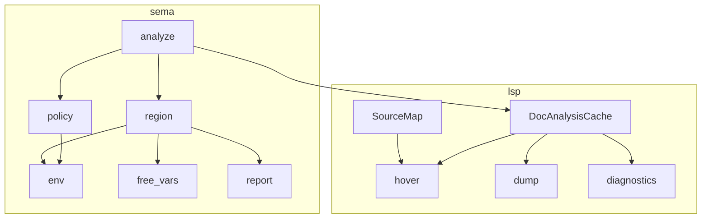

# Sema / LSP thermonuclear cleanup Implementation Plan

> **For agentic workers:** REQUIRED SUB-SKILL: Use superpowers:subagent-driven-development (recommended) or superpowers:executing-plans to implement this plan task-by-task. Steps use checkbox (`- [ ]`) syntax for tracking.

**Goal:** Fix every structural issue from the 2026-09-22 thermonuclear review of MVP 0.3 arenas — without changing ownership semantics users already rely on.

**Architecture:** Tighten the analyzer around a `RegionFrame` + explicit ownership policy, shrink if-branch merge to moved-name sets, make hover resolve from real occurrence spans (including same-arena uses and params), and stop the LSP from re-analyzing on every hover/dump via a per-document analysis cache plus a shared source map.

**Tech Stack:** Rust, existing `sema` module folder, tower-lsp backend in `src/bin/bork_lsp.rs`, LALRPOP for param spans.

## Global Constraints

- Preserve public `crate::sema::{analyze, collapse_block, Ownership, BindingInfo, ArenaNode, ArenaReport, SemaError}` names (fields may grow; do not rename).
- Preserve Copy / Shared / Move diagnostics and dump tags (string text stays stable unless a test forces a rename).
- No behavior change except: hover accuracy, LSP performance (cache), and param hover spans.
- Keep `cargo test` green after every task.
- Prefer deleting concepts over adding layers.

## Locked design decisions

| Issue | Decision |
|-------|----------|
| `open_region` kitchen-sink | Introduce `RegionFrame`; split `open_ordinary` / `open_move` |
| `note_use` if-ladder | `fn classify_use(...) -> UseOutcome` in `sema/policy.rs` |
| If-branch env clone | Snapshot only `moved` flags via `HashSet<String>` (names newly moved in branch); merge = intersection (+ if-without-else keeps pre-if) |
| `Option<Type>` unknown | `enum Ty { Known(Type), Unknown }` on `EnvBinding` / inference only; `BindingInfo.ty` stays `Option<Type>` (`None` = unknown) for dump/LSP stability |
| Hover / BindingInfo dual job | Record **same-arena Local uses** with span (no dump_tag change: skip adding them to dump by filtering `Ownership::Local` observations that are uses — or tag with a private flag). Simpler: add `BindingInfo.kind: BindingRole { Decl, Use }` defaulting Dump to Decl-only; hover searches both |
| Param spans | `Param { name: SpannedName, ty: Type }` (or add `name_span`); thread into Local `BindingInfo.span` |
| LSP re-analyze | Cache `Analysis` next to doc text in `Backend`; hover/dump consume cache |
| Position helpers | `SourceMap` in `lsp.rs` (line starts) shared by offset↔position and `word_at` |
| Dead `Arena`/`ArenaPool` | Keep module `arena`; module docs state “future runtime model, unused by sema”; no rename churn |
| `collapse_block` clone | Replace with `fn peel_blocks(block: &Block) -> (&Block, usize)` returning reference into deepest bare block |

## File map

| File | Role after plan |
|------|-----------------|
| [`src/sema/policy.rs`](src/sema/policy.rs) | **New.** `UseOutcome` + `classify_use` |
| [`src/sema/region.rs`](src/sema/region.rs) | **New.** `RegionFrame`, `open_ordinary`, `open_move`, peel+walk entry |
| [`src/sema/analyze.rs`](src/sema/analyze.rs) | Thin: `analyze`, walk_stmt/expr calling region/policy |
| [`src/sema/env.rs`](src/sema/env.rs) | `Ty`, env binding; moved-set helpers |
| [`src/sema/report.rs`](src/sema/report.rs) | `BindingRole` on `BindingInfo`; dump ignores `Use` |
| [`src/sema/mod.rs`](src/sema/mod.rs) | `peel_blocks` (replaces clone `collapse_block` or keeps wrapper) |
| [`src/dump.rs`](src/dump.rs) | Skip `BindingRole::Use` |
| [`src/ast.rs`](src/ast.rs) + [`src/parser.lalrpop`](src/parser.lalrpop) | Spanned function params |
| [`src/lsp.rs`](src/lsp.rs) | `SourceMap`; hover uses spans; optional `hover_for_analysis` |
| [`src/bin/bork_lsp.rs`](src/bin/bork_lsp.rs) | Doc cache stores `(text, Analysis)` |
| [`src/arena.rs`](src/arena.rs) | Doc-only clarification |
| [`src/sema/tests.rs`](src/sema/tests.rs) + lsp tests | New coverage listed per task |



---

### Task 1: `peel_blocks` without cloning

**Files:** `src/sema/mod.rs`, `src/sema/analyze.rs` (or `region.rs` once created), `src/sema/tests.rs`

- [ ] Add failing test: `peel_blocks` returns same stmt identity depth as today for nested bare blocks (compare compacted count + innermost stmt kind).
- [ ] Implement `pub fn peel_blocks(block: &Block) -> (&Block, usize)` walking `&[Stmt::Block(inner)]` by reference.
- [ ] Keep `collapse_block(block: Block) -> (Block, usize)` as a thin wrapper that clones once at the end **or** delete it and update the single test to use `peel_blocks` + clone only if needed. Prefer **delete `collapse_block` public API only if nothing external uses it** — today only sema tests; switch tests to `peel_blocks` and stop exporting `collapse_block` if unused outside. If `collapse_block` is part of the public crate surface already, keep a deprecated wrapper: `(peel.0.clone(), peel.1)`.
- [ ] Point region open path at `peel_blocks`.
- [ ] `cargo test peel` / `cargo test collapses_nested`
- [ ] Commit: `refactor(sema): peel bare blocks by reference`

---

### Task 2: `RegionFrame` + `open_ordinary` / `open_move`

**Files:** new `src/sema/region.rs`, `src/sema/analyze.rs`, `src/sema/mod.rs`

- [ ] Add tests that ordinary nested `{ }` and `move (x) { }` still produce the same dump labels / ownership (existing tests already cover; run them as the gate).
- [ ] Create `RegionFrame { shadows, moved_parents, node }` with `bind_param`, `bind_capture`, `finish(az) -> ArenaNode` (restore shadows, mark moved parents).
- [ ] Implement `open_ordinary(az, label, body, params)` and `open_move(az, label, body, captures, params)` — **delete `RegionKind`**.
- [ ] Move `resolve_move_captures` next to `open_move` only.
- [ ] Update all call sites in the walker.
- [ ] `cargo test --lib`
- [ ] Commit: `refactor(sema): RegionFrame with ordinary vs move entry`

---

### Task 3: Ownership policy function

**Files:** new `src/sema/policy.rs`, walker in `analyze.rs`

- [ ] Add unit tests for classify outcomes: same-arena → ignore; moved → error; copy → Copy; val non-copy → Shared; var non-copy → error.
- [ ] Implement:

```rust
enum UseOutcome {
    Ignore,
    Observe(Ownership),
    Error { message: String },
}

fn classify_use(binding: &EnvBinding, current_arena: usize, current_label: &str, name: &str) -> UseOutcome
```

- [ ] Replace `note_use` body with classify + record/error.
- [ ] `cargo test`
- [ ] Commit: `refactor(sema): extract cross-arena use policy`

---

### Task 4: If-branch moved-set merge (no full env clone)

**Files:** `src/sema/env.rs`, `src/sema/analyze.rs`, `src/sema/tests.rs`

- [ ] Extend existing `if_branches_do_not_share_move_state` if needed; add:
  - both branches move → after if, use is use-after-move
  - only then moves, no else → binding not moved after if
- [ ] Add `fn moved_names(env: &HashMap<String, EnvBinding>) -> HashSet<String>` (or track deltas: names where `moved == true`).
- [ ] If analysis:
  1. `before = snapshot of which names are already moved` (HashSet)
  2. run then; `then_new = moved_names(env) - before`; restore env moved flags from `before` (or restore full env from clone **of flags only**)
  3. Prefer: clone env once into `env_before`, run then on `az.env`, compute `then_moved`, set `az.env = env_before.clone()`, run else, compute `else_moved`, set `az.env = env_before`, then for each name `moved = before || (then && else)` (if else) / `before` (if no else, ignore then_new).

  **Locked simplification vs review:** one clone of env for restore is OK if we **stop triple-cloning for merge**; minimum is: clone once for `env_before`, run then, save `then_moved` set, restore, run else, save `else_moved`, restore, apply merge sets. Delete the third “after_else full map” retention beyond the set.

- [ ] `cargo test if_branches`
- [ ] Commit: `refactor(sema): merge if-branch moves via name sets`

---

### Task 5: Explicit `Ty` for env inference

**Files:** `src/sema/env.rs`, `analyze.rs` infer/note paths, tests

- [ ] Add `enum Ty { Known(Type), Unknown }` on `EnvBinding`.
- [ ] Map `BindingInfo.ty: Option<Type>` via `Known => Some`, `Unknown => None`.
- [ ] `is_copy` only true for `Ty::Known(t) if t.is_copy()`; `Unknown` ⇒ non-Copy (keep current policy).
- [ ] Update `unknown_type_is_not_treated_as_copy` still passes.
- [ ] Commit: `refactor(sema): explicit Ty::Unknown in env`

---

### Task 6: Hover-accurate bindings (Decl vs Use + same-arena spans)

**Files:** `src/sema/report.rs`, `src/dump.rs`, `src/sema/analyze.rs` / policy, `src/lsp.rs`, tests

- [ ] Add `BindingRole { Decl, Use }` to `BindingInfo` (default `Decl` for locals/params/captures).
- [ ] On **every** `note_use` that resolves (including same-arena), record `BindingRole::Use` with the use span and current ownership label (Local for same-arena, else Copy/Shared). Dedup key: `(name, span)` or allow multiple Uses.
- [ ] Dump: only emit `BindingRole::Decl` (and Moved capture decls).
- [ ] Hover: prefer span hit on any role; remove “nearest Local decl” fallback once Uses cover same-arena (keep fallback for params until Task 7).
- [ ] Test: hover/diagnostic position test; new test that dump text does not duplicate use lines.
- [ ] Commit: `feat(sema): record use-site bindings for hover`

---

### Task 7: Spanned function parameters

**Files:** `src/ast.rs`, `src/parser.lalrpop`, `tests/parser.rs`, region bind path

- [ ] Change `Param` to carry `SpannedName` (or `name` + `name_span`).
- [ ] Parser: use `SpannedIdent` for param names.
- [ ] Pass param span into `BindingInfo` Local decls.
- [ ] Test: parse param span non-empty; hover on param name resolves (lsp unit test with source snippet).
- [ ] Commit: `feat(ast): spanned function parameters`

---

### Task 8: `SourceMap` in LSP

**Files:** `src/lsp.rs`

- [ ] Introduce `struct SourceMap<'a> { source: &'a str, line_starts: Vec<usize> }`.
- [ ] Implement `offset_to_position`, `position_to_offset`, `word_at` on it.
- [ ] Replace free functions; keep `byte_offset_to_position` as thin wrapper for existing tests.
- [ ] Commit: `refactor(lsp): SourceMap for positions`

---

### Task 9: Per-document analysis cache in LSP server

**Files:** `src/bin/bork_lsp.rs`, `src/lsp.rs`

- [ ] Change docs map to `HashMap<Url, DocState { text: String, analysis: Analysis }>`.
- [ ] On open/change: analyze once, store, publish diagnostics from cache.
- [ ] Hover / dump command: read cache; if missing, analyze once and store.
- [ ] Add `hover_for_analysis(report, source, position)` / `dump_from_analysis` so helpers do not re-parse when analysis is provided.
- [ ] Test: unit-test that `analyze_source` call count is 1 when using cached path — easiest via pure helpers: `hover_for_analysis` does not call parse. Optional counter not required if API split makes re-analyze impossible.
- [ ] Commit: `perf(lsp): cache analysis per document`

---

### Task 10: Clarify `arena` as future runtime model

**Files:** `src/arena.rs`, optionally one line in `docs/memory-model.md`

- [ ] Module docs: “Bump arena model for future LLVM runtime. Not used by compile-time `sema`.”
- [ ] No API move/rename.
- [ ] Commit: `docs(arena): clarify runtime-only role`

---

## Verification (final)

- [ ] `cargo test`
- [ ] Manual smoke: `bork --help`, `bork --dump-arenas` on MVP sample, LSP hover on shadowed name + param
- [ ] Confirm dump ASCII unchanged aside from intentional non-duplication of use bindings
- [ ] Do not push unless asked

## Out of scope

- LLVM / executing arenas
- Full type inference beyond env `Ty`
- Parallelizing analysis
- Renaming `crate::arena` module
